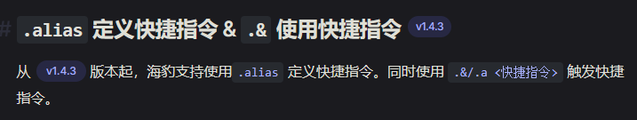

# sealdice-manual-next

VitePress 驱动的海豹骰官方使用手册。

当前手册预览可见 [海豹手册](https://sealdice.github.io/sealdice-manual-next/)。

## 编写文档

文档写在 `docs` 下的 `.md` 文件中，按文件夹分组。

如需调整导航栏和侧边栏，则涉及到修改 `docs/.vitepress/theme.ts` 和 `docs/.vitepress/catalogue.ts` 中的配置。

## 安装依赖

编写文档原则上不需要安装任何依赖。但是，如果希望利用 linter 自检或本地运行预览效果，则需要执行以下指令安装依赖。

```shell
pnpm install
```

## Markdown 格式规范

提交前请务必使用 markdownlint 进行检查，不满足格式要求的修改无法合并入主仓库。

```shell
pnpm run lint:md
pnpm run lint:md:fix # 检查并进行部分自动修复
```

对于 VS Code 用户，请使用 [markdownlint](https://marketplace.visualstudio.com/items?itemName=DavidAnson.vscode-markdownlint) 插件获取编辑器警告。这一插件已经被添加到本项目的推荐插件中，只需在打开本项目时按 VS Code 的提示安装即可。

## 排版规范

文档排版应当遵循 [中文文案排版指北](https://github.com/sparanoid/chinese-copywriting-guidelines) 的规范。

项目集成了自动检查和修复插件，可以通过以下指令调用。

```shell
pnpm run lint:autocorrect
pnpm run lint:autocorrect:fix # 检查并进行部分自动修复
```

使用 AutoCorrect 插件可以提供编辑器集成的提示。这一插件已经被添加到本项目的推荐插件中，只需在打开本项目时按 VS Code 的提示安装即可。

- [VS Code](https://marketplace.visualstudio.com/items?itemName=huacnlee.autocorrect)
- [JetBrains](https://plugins.jetbrains.com/plugin/20244-autocorrect)

## 标注功能版本

对于新加入的功能，需要在标题和正文开头都注明加入的版本。

段落标题的标签应当加在尽可能高等级的标题上，使用以下标签附在标题末尾：

```markdown
## 新加入的功能 <Badge type="tip" text="vA.B.C"/>
```

在紧随以上标题的第一段正文开头，也应该做出文字叙述，例如：

```markdown
从 <Badge type="tip" text="vA.B.C"/> 起，海豹支持某新加入的功能……
```

最终的效果应当类似下图：



### 开发版中的新功能

如果是为当前开发版中的新功能编写文档，而不能确定下一个正式版的版本号，使用以下标签：

```markdown
<Badge type="tip" text="NextVersion"/>
```

这样做的好处是：在确定版本号后，方便通过文本替换批量修改。

## 归档警告

对于弃用的功能，需要在正文开头注明弃用的版本和归档的时间。

在第一段正文开头，做出以下文字叙述：

```markdown
::: warning 注意：海豹已于 <Badge type="warning" text="vA.B.C"/> 版本弃用此方案，以下内容归档于 xxxx 年 xx 月 xx 日。

:::
```

最终的效果应当类似下图：


### 开发版中弃用的功能

对于在当前开发版中弃用，即将于下一个正式版中去除的功能，**不要**在正式版发布前移动原始文本。

如果不能确定新版本的版本号，使用以下标签和类似文案：

```markdown
::: warning 注意：海豹将于 <Badge type="warning" text="NextVersion"/> 版本弃用此功能。
:::
```

如果能确定版本号但尚未发布，将以上标签中的 `NextVersion` 替换为确定的版本号。

在正式版发布后应尽快将原始文本移动到归档路径。

## 本地调试

```bash
pnpm install
pnpm run docs:dev
```

运行以上命令启动本地文档服务便于调试。

## 将自己的分支发布为 GitHub Pages

[主仓库](https://github.com/sealdice/sealdice-manual-next) 的 [Pages](https://sealdice.github.io/sealdice-manual-next/) 自动追踪主仓库的 main 分支。

如果你希望请其他人预览修改的效果，或者有其他需求，需要将自己的分支也发布为 GitHub Pages。

我们已经为 fork 仓库配置了 GitHub Actions 自动部署，在你启用后，会将最新推送的 commit 进行部署。如果你是首次使用，请参考以下步骤：

1. 在你的 fork 仓库，进入 Actions 选项卡，你需要点击一个绿色的「I understand my workflows, go ahead and enable them」按钮；
   - 如果你没有看到这个按钮，而是列出了一些 workflow，这说明你已启用过 Actions，可以跳过下面的步骤；
2. 在左侧边栏选择 docs；
3. 在 runs 列表的上方应有一个 banner，内容为「This workflow has a workflow_dispatch event trigger」，选择它右边的「Run workflow」；
4. 在弹出的下拉菜单中选择你的分支，运行 workflow；
5. 等待 workflow 完成，这时你的仓库应多出一个 gh-pages 分支；
6. 进入 Settings 选项卡，左边栏选择 Code and automation 下的 Pages；
7. Source 选择「Deploy from a branch」，Branch 选择「gh-pages」，点击保存；
   - 如果需要，你可在下方的 Custom domain 填写一个自定义的域名，否则，你的 GitHub 用户名将出现在域名中；
8. 回到 Actions，应有一个新的名为 pages-build-deployment 的 workflow 正在运行；
9. 等待 workflow 完成，左边栏选择 Deployments，应能看到一个对应你分支的 Pages 链接；
10. 完成以上步骤后，你每次推送新的 commit 到自己的 fork 仓库，都会自动执行构建和部署，**无需再次手动操作**。

## VitePress

手册使用 VitePress 驱动，文档见 [VitePress](https://vitepress.dev/zh/)。
