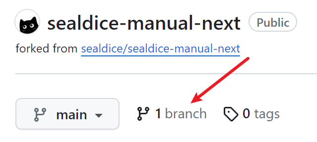
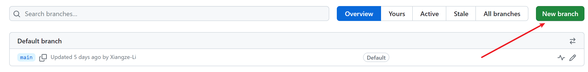
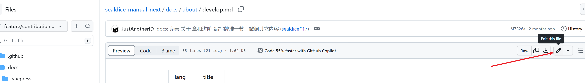
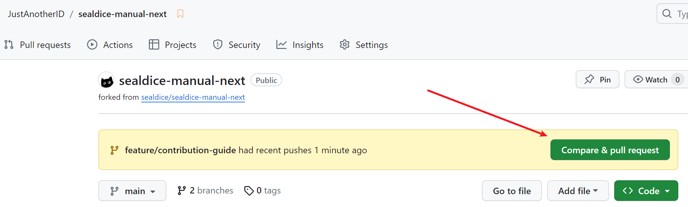
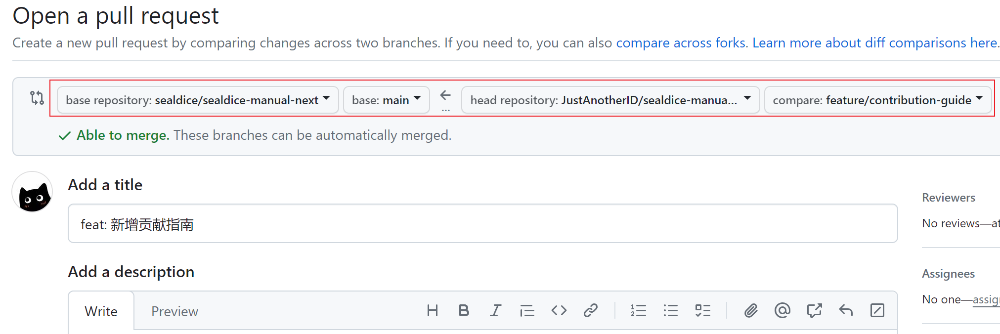

# 参与项目

无论是普通用户还是开发者，我们都非常欢迎你参与海豹的开发，一起努力让海豹变得更好。

海豹的所有源代码都托管在 [海豹开源组织 GitHub](https://github.com/sealdice) 下，每个模块都存放在对应的仓库中，可阅读对应仓库的 Readme 获取更多信息。

几个比较重要的仓库：

- [核心](https://github.com/sealdice/sealdice-core)：海豹的 Go 后端代码仓库，这个仓库也作为海豹的主仓库，Bug 可反馈在该仓库的 issue 中；
- [UI](https://github.com/sealdice/sealdice-ui)：海豹的前端代码，基于 Vue3 + ElementPlus 开发；
- [手册（新）](https://github.com/sealdice/sealdice-manual-next)：海豹新版官方手册（即当前的手册）的源码，如对手册有什么改进内容可以在该项目提交 pr；
- [构建](https://github.com/sealdice/sealdice-build)：海豹的自动构建仓库，用于自动化发布海豹的每日构建包与 Release；
- ……

## 如何参与项目？

### Bug 反馈、功能建议

所有的 Bug 和功能建议都可反馈在 [核心](https://github.com/sealdice/sealdice-core) 仓库的 issue 中，按照模板填写可方便开发组快速定位问题。

::: tip 提示：无法访问 GitHub？

受限于各种原因，不是所有人都能顺利访问 GitHub，如有 Bug 可以加入官方群进行反馈。但如果有条件，我们还是建议在 GitHub 向开发组反馈问题。

:::

### 提交修改

欢迎各种类型的 pr 提交，可以帮助改进代码，增加功能，也可以是完善文档等等。向对应仓库发起 pr 即可。

## 贡献指南

::: info 贡献指南

下面将以提交对手册的改进为示例，为还不清楚怎么在 GitHub 上提 Pull Request 的准贡献者做个示范。

:::

### 整体流程

1. 首先 fork 对应想要修改的仓库，后续所有操作均在 fork 之后的仓库上执行；
2. 从主分支（通常是 `main` 或 `master`）切出一个新分支作为工作分支；
3. 在新工作分支上提交修改。如果是对代码仓库进行修改，务必在本地测试通过；
4. 将修改后的内容提交到远程后，在 GitHub 发起 Pull Request 请求，描述修改内容并确认自动测试流程通过；
5. 等待开发组 review 后合并你的代码。

### 对目标仓库进行 fork

首先 fork 对应想要修改的仓库，此处以手册仓库 [sealdice-manual-next](https://github.com/sealdice/sealdice-manual-next) 为例：

点击 `Create a new fork` 按钮，如果此处已经有 fork 过仓库，可以直接进行后续步骤无需再次 fork。

点击按钮后进入如下页面：

可不做任何修改，直接点击 `Create fork` 按钮，等待 fork 进度条完成，此时你应当自动跳转到了 fork 出的新仓库。

### 切出工作分支

::: tip 提示：假如你熟悉 Git 操作

如果你熟悉 Git 操作，可以自行 clone 仓库到本地后进行修改。

:::

::: warning 注意：不要修改主分支

如果 clone 到本地操作，建议不要在主分支操作，而是新切分支进行编辑。

原因见 [保持和上游同步](#保持-fork-仓库与上游同步-可选)。

:::

切换到新仓库的分支页面，创建分支：

填写新分支名，建议为形如 `feature/xxx` 的有意义的英文。确认前请务必保证是从主分支切出的。

创建完毕后点击分支名切换到对应分支页面：

点击你想要修改的文件，进行在线编辑：

修改完成后点击右上角提交变更，填写变更内容信息：

### 发起 Pull Request 请求

你的修改完成后，在你 fork 的新仓库向主仓库发起 Pull Request：

提交时间很近的时候，GitHub 会提示快捷发起 PR 的操作按钮：

进入 PR 编辑页填写信息，请确认是从你的仓库的新分支，提向主仓库的主分支的：

`主仓库 主分支 <- fork仓库 功能分支`

填写完成后，等待开发组进行 review，有时会给你提出一些修改建议。在你的 PR review 通过并合并后，功能分支就可以被删除了。

### 保持 fork 仓库与上游同步（可选）

如果之后还要提交新的 PR，建议先同步上游的主分支，再从同步后的主分支再新切分支进行操作。

如果你曾经修改了主分支，此处很可能会出现和上游分支有冲突的问题，需要你先手动解决冲突。

点击 `Sync fork` 进行同步。

