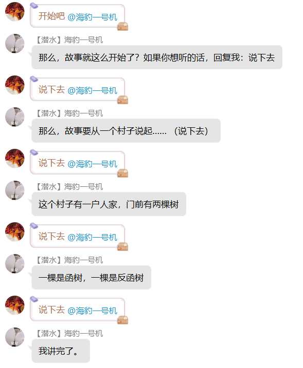

# 编写自定义回复

::: info 本节内容

本节将展示自定义回复编写的进阶部分，请善用侧边栏和搜索，按需阅读文档。

在部分内容中，我们假定你了解海豹变量机制和正则表达式。如果你对正则表达式还很陌生，可以参考以下材料，或在互联网自行搜索学习。

- [正则表达式 - 菜鸟教程](https://www.runoob.com/regexp/regexp-tutorial.html)
- [Regex 101](https://regex101.com/)，提供正则表达式在线解析和验证，并且为表达式中不同元素给出解释

海豹核心跟随 Go 语言，采用 [RE2](https://github.com/google/re2/wiki/Syntax) 规范。该规范与其他规范在个别扩展语法上存在细微差别，请注意辨析。

在使用 Regex 101 网站时，请注意在左侧的「FLAVOR」栏选中「Golang」，以确保正则表达式的表现一致。

:::

## 第一个自定义回复

首先我们打开「自定义回复」页，新建一项自定义回复。

::: tip 提示：使用 .text 帮助测试

`.text <文本>` 将是你的一大助力，它会输出后面文本的执行结果，你可以将它看成不需要触发词的自定义回复。

当然，在采用 `.text` 指令进行 debug 时，可能出现因为测试的内容对变量造成影响，而不得不频繁复制黏贴清空指令的情况。此时建议专门开一个一两个字即可触发的自定义回复，用来测试。

:::

::: tip 提示：嵌入 CQ 码

返回内容可以嵌入 CQ 码。CQ 码文档见 [CQ 码列表](https://docs.go-cqhttp.org/cqcode)。

:::

自定义回复中分「条件」和「结果」两个部分。在 [配置 - 自定义回复](../config/reply.md) 中，我们已经了解了一些简单的回复编写，下面将补充介绍进阶内容。

## 触发条件

### 文本匹配：模糊匹配

模糊匹配将比较收到的消息与指定文本，内容相似时触发。

比较定义在 `dice/ext_reply_logic.go` 中，内容 jaro 和 hamming 平均值高于阈值（0.7）被认为是相似：

```go
func strCompare(a string, b string) float64 {
	va := strsim.Compare(a, b, strsim.Jaro())
	vb := strsim.Compare(a, b, strsim.Hamming())
	return (va + vb) / 2
}
```

::: tip 提示：模糊匹配未命中

模糊匹配可能出现感觉能匹配上，但实际上没办法匹配上的情况。我们更建议你使用「包含文本」或「正则匹配」。

:::

### 文本匹配：正则匹配

使用正则匹配时，直接在要匹配的文本一栏中写入正则表达式即可。当正则表达式获得匹配时，该条件得到满足。

对于正则表达式中的捕获组，海豹遵循命令行脚本的通行做法，将其按顺序存储于多个变量 `$t1` `$t2` 等。

```text
正则匹配：^购买(.+)
输出文本：{$t玩家}购买了{$t1}
```

::: info 示例

<ChatBox :messages="[
{content: '购买猫粮', send: true},
{username: '海豹牌猫粮店', content: '<木落>购买了猫粮'},
]" />

:::

可以发现第 1 捕获组命中的字符串 `猫粮`，被存储于变量 `$t1` 中。

此外，对于正则表达式匹配的完整内容将被存储于变量 `$t0`。如果捕获组存在命名，如命名为 `A` 的捕获组 `(?P<A>cc)`，命中的字符串也将额外存入变量 `$tA`。

::: warning 注意：不要使用某些前缀！

由于 `.` `。` `/` `!` 等符号会作为海豹中指令的前缀，因此作为前缀时可能导致将其识别为指令而非自定义回复的情况，建议换成别的前缀。

:::

::: tip 提示：正则中匹配 CQ 码

海豹支持用正则匹配 CQ 码。但是，由于 `[` `]` 符号在正则表达式中含有特殊含义，如果你这么做了，请对它们进行转义。

示例：`^\[CQ:xxx,xx=xxx\]`

:::

### 表达式为真

在「表达式为真」匹配中，只需要直接在匹配文本中写出形如 `变量名 == 需要的值` 的形式即可，不需要使用任何 `{}` 。

## 回复结果

在回复文本中，可以调用一些 [变量](./script.md#变量)，也可以嵌入 [内置脚本语言](./script.md)。

### 嵌入脚本语言

::: info 示例

<ChatBox :messages="[
{content: '.text {$t玩家}进行测试', send: true},
{content: '<木落>进行测试'},
{content: '.text {d100}', send: true},
{content: '1'},
]" />

:::

::: tip 提示：未赋值的变量

所有变量在未被赋值时被调用的值都为 0。

:::

### 执行块

`` 被称为执行块。由 `` 括起来的部分会被作为代码执行，输出最后一个语句的结果。执行块中的两个语句之间要使用 `;` 隔开。

如果想要输出字符串，则应该用 ``` ` ``` / `"` / `'` 括上。

- 例：形如 `` 的式子会输出 `114514`。

::: tip 提示：结果中调用变量

若想在结果中调用变量，请用反引号。目前海豹只支持在反引号中调用变量。

:::

下面是一个简单的示例，这里的第一句也是最后一句，所以它的结果会被输出。

```text
.text 
```

#### 示例：使用 `if`

```text

{$t输出}
```

首先给 `$t测试`赋值为 1，然后进入判断：

1. 如果 `$t测试` 等于 1，则变量 `$t输出` 等于 `"赞美木落"`；
2. 如果 `$t测试` 等于 2，则变量 `$t输出` 等于 `"快点更新"`；
3. 如果 `$t测试` 既不等于 2 也不等于 1，则变量 `$t输出` 等于 `"群主女装"`;

最后，输出变量 `$t输出`。

::: tip 提示：容易误解的 if 使用

目前海豹语并不支持 `else if`，`if` 和 `else` 是一对一匹配的。所以当形如：

```text
if xxx {xxx};
if xxx {xxx}
else {xxx}
```

的语句出现时，并不是 `if elseif elseif else` 的关系！即使满足了第一个 `if`，其结果也是执行 `else` 中的内容！

:::

#### 示例：变量运算

```text

{$t0}
```

在这个例子里，我们先给 `$t0` 赋值为 1，然后判断 `$t0` 是否等于 1，若通过则 `$t0` 的值增加 1d6，最后输出结果。

## 更多示例片段

### 牌堆与自定义回复的结合

以养猫功能中猫好感度为例：

```text

```

在这一脚本中，根据猫好感度 `$mCatFavor`不同，需要输出不同回复的机制。

::: details 补充：其它写法

除了形如

```text

```

的写法外，还可以使用：

```text

```

实质上没有太大区别，可根据喜好选择。

:::

### 多回复行的错误使用

以踢海豹为例，这一自定义回复的多行输出实现上并不是：

```text
{$t输出0}
{$t输出1}
{$t输出2}
{$t输出3}
```

而是在为四个 `$t输出` 变量赋值时，于内部写上 `\n`，采用 `{$t输出0}{$t输出1}{$t输出2}{$t输出3}` 的形式。

这是因为如果某一变量可能为空时，如果采用第一种分行的写法，会出现这样的效果：

::: info 示例

<ChatBox :messages="[
{content: '踢海豹', send: true},
{content: '<木落>一脚踢向海豹，踢了3格。\n海豹现在离终点还有37格。\n\n海豹的逃走骰：1d100=60，海豹没能逃脱凶猛恶汉们的掌控！'},
]" />

:::

可以看见，在中间会出现突兀的空行。这是因为虽然并没有在变量内部赋值 `\n`，但是由于海豹读取时会按照写的格式读取，因此在应当是 `$t输出2` 的一行中，会照样调用 `{$t输出2}`，照常空行。

所以，如果想要某个变量为空时，看不出来这里应该存在什么，就最好多做几次实验，好好规划一下换行符 `\n` 的位置。

### 限定每人/每群每天一次

海豹提供了一系列时间变量来调用，以打卡指令为例，可以采用如下两种写法中的一种（示例为每人每天一次，如要每群自行将 `$m` 换成 `$g`）：

**写法 1**
文本匹配：你需要的文本
表达式为真：`$m变量 != $tDate`
回复：`{if 1 {$m变量=$tDate}}你需要的回复文本`

- `$m变量` 作为标记变量，用 `if` 是防止它出现在回复文本中。

文本匹配：你需要的文本
表达式为真：`$m变量==$tDate`

- 可以不写在另一条里，选择放到相较于上一条的后面，利用海豹从上往下逐个匹配的机制达成相同效果

回复：`在一天触发多次时的回复`

**写法 2**
文本匹配：你需要的文本
回复：

```text

{$t输出}
```

以上两种写法实现效果没有差别，具体使用哪种请自行决断。

### 条件语句嵌套条件算符，多条件条件语句

以石头剪刀布为例，为了实现骰子随机出招的效果，令 `$tRand=d3`，然后根据 `$tRand` 的情况赋值 `$tDicePlay`。通过骰子出招和玩家出招两个变量判断，输出游戏结果，并记录场次。

为了防止直接使用 `` 进行赋值导致的变量显示，需要在最外面写 `if 1` ，则在生成 `$tRand`之后再次判断的时候，可以使用 `$tDicePlay=条件算符`，或是再新开一行用条件算符或者条件语句实现。

以下给出在同一个 `if` 内直接赋值的写法和新开一行使用条件语句的写法：

```text



```

两种写法实现效果相同，石头剪刀布内在这里采用了第一种，实际上没有差别。

生成骰子出招并获取玩家出招之后，就开始判断。这里除了平局可以使用 `$tDicePlay==$t0` 省事之外，其他的都需要在条件中用多个进行嵌套。

::: warning 注意：条件判断

豹语语法中，判断时条件中的 `||` 和 `&&` 是从左往右计算的，如果后面有需要优先计算与或的东西，请加好括号。

:::

```text
if $t0==$tDicePlay {
    $t输出=`那我出{$tDicePlay}！{$t玩家}出的是{$t0}啊，我们平局了。`;
    $mPlayerTime=$mPlayerTime+1
    };
if $t0=="剪刀"&&$tDicePlay=="石头"||($t0=="石头"&&$tDicePlay=="布")||($t0=="布"&&$tDicePlay=="剪刀") {
     //后两个与需要单独计算，加上括号
    $t输出=`那我出{$tDicePlay}！{$t玩家}出的是{$t0}啊，我赢了。`;
    $mPlayerTime=$mPlayerTime+1;
    $mPlayerLose=$mPlayerLose+1
    };
if $t0=="石头"&&$tDicePlay=="剪刀"||($t0=="布"&&$tDicePlay=="石头")||($t0=="剪刀"&&$tDicePlay=="布") {
    $t输出=`那我出{$tDicePlay}！{$t玩家}出的是{$t0}啊，你赢了。`;
    $mPlayerTime=$mPlayerTime+1;
    $mPlayerWin=$mPlayerWin+1
    }
```

### 同时使用前缀和后缀匹配，以匹配 `AxxxxxxxB` 型文本

前缀匹配：`A`
后缀匹配：`B`
回复：`怎么辉石呢`

:::: info 示例

::: tabs

== 输入：AB

<ChatBox :messages="[
{content: 'AB', send: true},
{content: '怎么辉石呢'},
]" />

== 输入：A间隔B

<ChatBox :messages="[
{content: 'A间隔B', send: true},
{content: '怎么辉石呢'},
]" />

== 输入：A（无回复）

<ChatBox :messages="[
{content: 'A', send: true}
]" />

== 输入：B（无回复）

<ChatBox :messages="[
{content: 'B', send: true}
]" />

:::

::::

### 随机看图


### 单人模组

<!--  -->

::: info 示例

<ChatBox :messages="[
{content: '开始吧 @海豹核心', send: true},
{content: '那么，故事就这么开始了？如果你想听的话，回复我：说下去'},
{content: '说下去 @海豹核心', send: true},
{content: '那么，故事要从一个村子说起……（说下去）'},
{content: '说下去 @海豹核心', send: true},
{content: '这个村子有一户人家，门前有两棵树'},
{content: '说下去 @海豹核心', send: true},
{content: '一棵是函树，一棵是反函树'},
{content: '说下去 @海豹核心', send: true},
{content: '我讲完了。'},
]" />

:::

具体实现，第一段


第二段


这两段较为常规，第三段开始变形了：


```text



```
