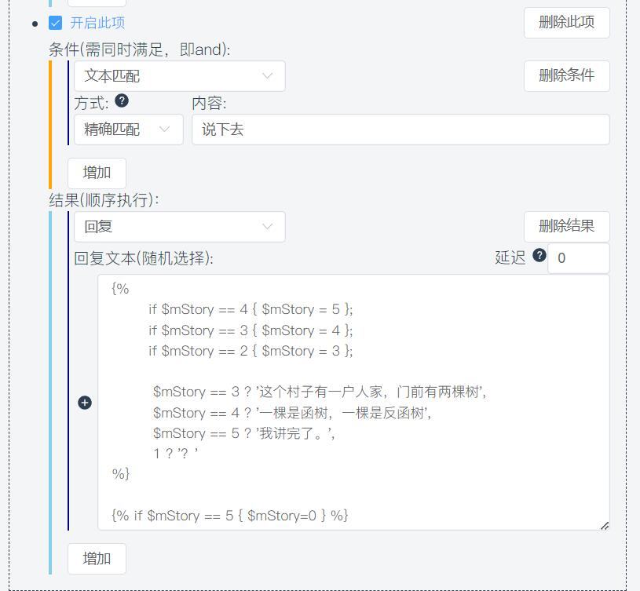
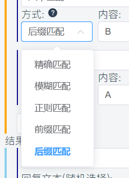

# 编写自定义回复

::: info 本节内容

本节将展示自定义回复的编写，请善用侧边栏和搜索，按需阅读文档。

:::


## 自定义回复  

仓库：https://github.com/sealdice/reply

***其实写这篇教程的原因是，群文件里大佬的教程对一些人（比如笔者）来说太过高冷，后来跌跌撞撞地才学会了一点，我不想因为这些吓退他们，或者让他们觉得这很难……***  
***所以如果看到了熟悉的地方，请不要怀疑，没错，是我从大佬的教程上摘抄的……***  
***请不要忽视注意，注意中都是新手（笔者）常犯且犯过的错误，避免踩坑！***
***总之，先感谢<于言诺>大佬的教程，让我们开始！***

### 0.如何优雅地偷懒

`.text`将是你的一大助力。他会输出他后面的执行结果，这和自定义回复中的“回复”长得一模一样，因此你不必新建回复，设置触发，最后不厌其烦地输入触发词。你可以将他看成不需要触发词的自定义回复。  


当然，在采用 `.text` 指令进行debug时，可能出现因为测试的内容对变量造成影响，而不得不频繁复制黏贴清空指令的情况。因此，在debug到烦的时候，相当建议专门开一个一两个字即可触发的自定义回复，用来节省你的剪贴板。

### 1.创建一个自定义回复

首先我们打开“自定义回复”一项，可以看到默认的reply.yaml应该是一片空白。让我们新建一项自定义回复。


### 2.触发条件

你应该可以看到，新建的自定义回复中分“条件”和“结果”两个部分。我们先说说条件。  
条件的最上方有一个“文本匹配”，点击他，展开下拉菜单，你可以发现还有“文本长度”和“表达式为真”两项，一共三项。我们接下来就按顺序，逐个讲解。  
条件可以有多个，但是必须同时满足，即“and”。
海豹接收到以后就会返回你给定的内容。注意，在这里，是可以嵌入CQ码的，任何特殊消息类型都会被解析为CQ码。  
[CQ码列表](https://docs.go-cqhttp.org/cqcode)  
这里有些复杂，本人完全照搬（不是）大量借鉴了群友<于言诺>的描述：  


当前版本的海豹提供如下几种匹配方式：

- 文本匹配  
  - 精确匹配
  - 包含文本
  - 不包含文本
  - 模糊匹配
  - 正则匹配
  - 前缀匹配
  - 后缀匹配
  - 任意相符
- 文本长度匹配   
  - 大于等于
  - 小于等于
- 表达式为真  

在这里，需要着重指出几处可能导致匹配结果不符合预期的情况：

1. 模糊匹配中，是按照特殊算法进行匹配的，因此可能出现感觉能匹配上，实际上没办法匹配上的情况。如果想要某段文本出现就被回复，请使用包含文本匹配或正则匹配。
2. 使用正则匹配时，直接在要匹配的文本一栏中写入正则表达式即可。正则表达式可以参照<https://www.runoob.com/regexp/regexp-tutorial.html> 在这里给出一个示例： `^测试(.+)吗$` 这一正则表达式将会匹配所有开头是 `测试` 而结尾是 `吗` 的回复，但中间如果存在换行则不匹配。如果没有 `^` `$` 两个符号，则会是同时包含 `测试`  `吗`的任何发言。此乃贪婪匹配是也，所以请注意做好限定。
3. 在文本长度匹配中，需要注意的是，一个汉字算作两个字符。如 `你好` 两字可以触发大于等于4的文本长度匹配。
4. 在表达式为真匹配中，只需要直接在匹配文本中写出形如 `变量名==需要的值` 的形式即可，不需要使用任何 `{}` 。

**在这里说一下新增的“任意相符”条件：**  
任意相符，顾名思义，只要符合了几个中的任意一个，就能触发回复。  
例子：

```
设置：任意相符，文本a|b，回复c；  
输入：a  
回复：c  
输入：b  
回复：c  
输入：ab  
回复：不回复  
输入：a|b  
回复：不回复
输入：其他  
回复：不回复
```


正则匹配和精确匹配可能是自定义回复中使用最多的匹配。对于正则匹配而言，通过恰当的分组，可以做到将回复中的一部分存入变量中以备调用。


```
正则匹配：^购买(.+)
输出文本：{$t玩家}购买了{$t1}

购买猫粮
Dice: <于言诺>购买了猫粮
```

在一些官方教程中也有提到过，对于匹配到的自定义回复整条消息，会将其存入 `$t0` ，而正则分组会存入 `$t1` 中。在如上例子中，就是将 `购买` 后用括号括起来的部分存入了 `$t1` 中，从而可以进行调用。如果有多组正则分组，则会按顺序存入 `$t1`  `$t2`  `$t3` 中。如果额外存在组名，如 `(?P<A>cc)` ，将会额外存入 `$tA` 。

在使用正则回复时请注意，由于 `. 。 / !` 等符号会作为海豹中指令的前缀，因此作为前缀时可能导致将其识别为指令而非自定义回复的情况，建议换成别的前缀。

*注意：海豹支持用正则匹配CQ码，但是如果你这么做了，请在[]前面放反斜杠(\\)转义。  
示例：`^\[CQ:xxx,xx=xxx\]`

### 3.返回结果

#### (1)回复方式

你应该可以看到，结果一栏的左上角有一个默认为“回复”的下拉框。点击它，会展开三个回复方式。其中”回复“就是回复，而”私聊回复“可以做到类似暗骰的效果，“群内回复”则是在群里回复。

#### (2)高阶玩法

看到这里，你肯定想问：  
就这？没有更复杂一些的？没有能挑战自己的？  
别急，这就到了。  
在回复文本中，可以调用一些[变量](#变量机制)，也可以嵌入[内置脚本语言](#内置脚本语言)。

##### 调用变量

对海豹输入`.text {$t玩家}进行测试`  
返回则是`<流溪>进行测试`（流溪是我的qq昵称/我在海豹那里。nn的名字）

##### 嵌入脚本语言

`.text {d100}`
输出的是掷一个d100的结果（只有数字）。详情见[脚本语言](#内置脚本语言)。

##### 变量赋值

所有变量在未被赋值时被调用的值都为0，而不是什么“空白”或者报错。
一般来说，直接使用"变量=值"是最常用的。当然，变量也可以等于[骰子算符](#骰子算符)。
详细内容参见[内置脚本语言](#内置脚本语言)。


*注意：如果用作判断（多用于[if](#if语法)），则是"变量==值"。

##### 执行块

被称为执行块。  
由括起来的部分会被作为代码执行，然后输出最后一个语句的结果。  


如果想要输出字符串，则应该用反引号/双引号/单引号括上。（例：形如的式子会输出114514）。  
另：若想在结果中调用变量，请用反引号。目前海豹只支持在反引号中调用变量。  


执行块中的两个语句之间要使用分号(;)隔开。  
只要有一点点编程基础应该都能理解这个地方的语法。下面让我们看一个简单的示例：  
`.text `  
这是一个最简单的示例。这里的第一句，也是最后一句，所以他的结果会作为“最后一句的结果”被输出。

##### if语法

if的使用很简单：  
`if 条件 {结果}; if 条件 {结果} else {结果}`  
这里举一个简单且有趣的例子:  

```
  
{$t输出}  
```

（当然我为了看着方便进行了适当格式化）  
如果你可以看懂这段代码，你就可以出师了（笑）。  
看不懂也没关系，我们逐行解析：  

首先，给\$t测试赋值为1。  
然后进入if判断：  
1.如果\$t测试等于1 则变量\$t输出等于"赞美木落"；  
2.如果\$t测试等于2 则变量\$t输出等于"快点更新"；  
3.如果\$t测试既不等于2也不等于1 则变量\$t输出等于"群主女装";  
3.最后，输出变量\$t输出。  
（关于我为什么不用else，请看[这里](#注意)）  
在这个例子里，我们一开始就对\$t测试进行了赋值为1，而且直到if前都没有变过，所以，\$t输出就是"赞美木落"，而最终输出的也是这个。  


接下来是一个简单的变量综合运算示例: 

``` 
  
{$t0}
```

在这个例子里，我们先给t0赋值为1，然后判断t0是否等于1，若通过则t0的值增加1d6，最后输出结果。  
这就像一种简单的编程语言，不是吗？

##### 注意：

当形如：

```
if xxx {xxx};  
if xxx {xxx}  
else {xxx}  
```

的式子出现以后，第二个if实质上是和else配对的，而不是`if elseif elseif else`的关系！即使满足了第一个if，其结果也是执行else中的内容！  
所以，如果将上文的`if $t测试!=2&&$t测试!=1 {$t输出="群主女装"}`更换为`else {$t输出="群主女装"}`的话，逻辑如下：  
1.判断第一个if，判断通过，\$t测试被赋值"赞美木落"  
2.判断一对if……else，if不成立，所以运行else的结果，最终$t测试被赋值为"群主女装"。  
如果想实现`if elseif elseif else`的逻辑，有一种笨方法，像前文示例一样，用`if xxx&&xxx {xxx}`来代替。  


#### (3)我们还有不足之处……

##### 目前已知的bug有：

1.形如`xxx{{$t1=xx};{$t2=xx}}`的回复会输出格式错误，但实际上已经执行了；  
 注：该问题已确认，会在未来版本进行修复，如果你发现了其他bug，欢迎在 https://github.com/sealdice/sealdice 中提交issue

#### (4)紧张刺激的实战例子！


1.养猫，撸它，随机反应（牌堆与自定义回复的结合）

```

```

以上是一段来自于我自己写的养猫玩玩.yaml的脚本。在养猫玩玩这一脚本中，我采用的是根据猫好感度 `$mCatFavor` 不同，需要输出不同回复的机制。因此，为了实现这一想法， 可以采用形如：

```

```

的写法。这样的写法可以极大降低自定义回复中代码过于冗长的情况，或者你想要写这种？

```

//顺带一提，这还是通过在赋值中使用条件算符，降低了代码行数的情况。
```

就，对自己好一点吧。

2.海豹，重命名，踹！（注意自定义回复输出格式；多个条件时如何处理）

可能有人思考过，为什么我的踢海豹.yaml中， `踢海豹` 这一自定义回复的输出并不是：

```
{$t输出0}
{$t输出1}
{$t输出2}
{$t输出3}
```

的形式，而是在为四个 `$t输出` 变量赋值时在内部写上\n，并采用 `{$t输出0}{$t输出1}{$t输出2}{$t输出3}` 的形式。

实际上，因为 `$t输出2` 这一变量仅在触发上行的梯子事件或下行的滑道事件时不为空，因此在一般情况下，如果采用第一种分行的写法，会出现这样的效果：

```
踢海豹
Dice: <于言诺>一脚踢向海豹，踢了3格。
海豹现在离终点还有37格。

海豹的逃走骰：1d100=60，海豹没能逃脱凶猛恶汉们的掌控！
```

中间会出现突兀的空行。这是因为虽然并没有在变量内部赋值 `\n` ，但是由于海豹读取时会按照写的格式读取，因此在应当是 `$t输出2` 的一行中，会照样调用 `{$t输出2}` ，并且照常空行。

所以，如果想要某个变量为空时，看不出来这里应该存在什么，就最好多做几次实验，好好规划一下换行符 `\n` 这些应该搁哪。

还有一个同样也是 `$t输出2` 部分的问题。实际上，现在发布版本中的判断并不是最简写法，不过这个打算等木落发布数组、函数和循环的写法之后一并优化。

对于类似踢海豹中判断是否触发事件这类在多个前提分别有对应的回复之后，需要为剩余情况统一输出一个结果的写法，实际上可以采用多重条件算符或条件语句实现。多重条件算符的问题是无法在结果中对多个变量进行赋值，只能直接输出；而在条件语句中，由于海豹当前不支持 `if……else if……else` 的写法，所以可以采用如下写法：

```

```

通过在最开始令所有情况下的输出值变为其他情况下需要的回复，而在之后拣出需要特殊回复的情况的方式，可以达成类似于 `if……else if……else` 的效果。当然，如果不嫌麻烦，也可以参考踢海豹里面的使用标记变量的方式，但还是那句话，没必要折磨自己。

3.打卡，攒钱并购买（如何限定每人/每群每天一次）

其实写这个主要是因为有人问了怎么限定每人每天一次，刚好我写过类似的东西，所以顺便写一下。

海豹提供了一系列时间变量来调用，虽然对于V1.0.2 v20220820之前的版本而言，这一系列变量存在在条件中不会刷新从而导致错误判断的bug，但是对于这及之后的版本而言，这一问题不存在。因此，在新版本中，可以采用如下两种写法中的一种（示例为每人每天一次，如要每群自行将 `$m` 换成 `$g` ）：

```
//写法1：
文本匹配:你需要的文本
表达式为真：$m变量!=$tDate
回复：{if 1 {$m变量=$tDate}}你需要的回复文本//使 $m变量 作为标记变量，用if套娃是防止它出现在回复文本中。

文本匹配:你需要的文本
表达式为真：$m变量==$tDate //也可以不写然后放到相较于上一条的后面，利用海豹从上往下逐个匹配的机制达成相同效果
回复：在一天触发多次时的回复

//写法2：
文本匹配：你需要的文本
回复：

{$t输出}
```

以上两种写法实现效果没有差别，具体使用哪种请自行决断。

4.石头剪刀布，判断？（条件语句嵌套条件算符；多条件条件语句）

>其实直接复制黏贴了我自己写的石头剪刀布编写中的思路和解释中的一部分*樂

为了实现骰子随机出招的效果，令 `$tRand=d3` ，然后根据 `$tRand`的情况赋值 `$tDicePlay` ；通过骰子出招和玩家出招两个变量判断，输出游戏结果，并记录场次。

为了防止直接使用 `` 进行赋值导致的变量显示，需要在最外面写 `if 1` ，则在生成 `$tRand`之后再次判断的时候，可以使用 `$tDicePlay=条件算符` ，或是再新开一行用条件算符或者条件语句实现。以下给出在同一个if内直接赋值的写法和新开一行使用条件语句的写法：

```



```

两种写法实现效果相同，石头剪刀布内在这里采用了第一种，实际上没有差别。

生成骰子出招并获取玩家出招之后，就开始判断。这里除了平局可以使用 `$tDicePlay==$t0` 省事之外，其他的都需要在条件中用多个进行嵌套。提醒，豹骰语法中，判断时条件中的 `||` 和 `&&` 是从左往右计算的，如果后面有需要优先计算与或的东西，请加好括号！！！

```
if $t0==$tDicePlay {
    $t输出=`那我出{$tDicePlay}！{$t玩家}出的是{$t0}啊，我们平局了。`;
    $mPlayerTime=$mPlayerTime+1
    };
if $t0=="剪刀"&&$tDicePlay=="石头"||($t0=="石头"&&$tDicePlay=="布")||($t0=="布"&&$tDicePlay=="剪刀") {
     //后两个与需要单独计算，加上括号
    $t输出=`那我出{$tDicePlay}！{$t玩家}出的是{$t0}啊，我赢了。`;
    $mPlayerTime=$mPlayerTime+1;
    $mPlayerLose=$mPlayerLose+1
    };
if $t0=="石头"&&$tDicePlay=="剪刀"||($t0=="布"&&$tDicePlay=="石头")||($t0=="剪刀"&&$tDicePlay=="布") {
    $t输出=`那我出{$tDicePlay}！{$t玩家}出的是{$t0}啊，你赢了。`;
    $mPlayerTime=$mPlayerTime+1;
    $mPlayerWin=$mPlayerWin+1
    }
```


***另，海豹将在未来实现 [dicescript](https://github.com/sealdice/dicescript)，介时文档会有较大变动***  

## 案例

### 案例：前缀+后缀，匹配AxxxxxxxB类型文本


### 应用案例：随机看图


### 应用案例：单人模组


具体实现，第一段


第二段


这两段较为常规，第三段开始变形了！




```



```


匹配条件



### 自定义脚本指令

用户可通过自定义回复实现组合掷骰，例如手册中，text写的coc属性投掷部分，可以通过复制进自定义回复后，设置关键词的方式实现自定义指令。执行效果如下:

```
自定义
Dice:
力量:55敏捷:60意志:45体质:60外貌:50教育:50体型:55智力:60幸运:60生命值:11总数:435
```

