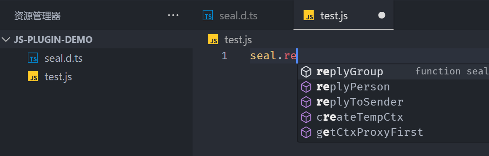

# 前言

::: info 本节内容

本节将介绍 JavaScript 脚本的编写的前置知识，更多内容请看 [API 列表](./js_api_list.md) 和 [常见用法示例](./js_example.md)，请善用侧边栏和搜索，按需阅读文档。

我们假定你熟悉 JavaScript / TypeScript，编程语言的教学超出了本文档的目的，如果你还不熟悉它们，可以从互联网上寻找到很多优秀的教程。如：

- [MDN | JavaScript](https://developer.mozilla.org/zh-CN/docs/Web/JavaScript)
- [现代 JavaScript 教程](https://zh.javascript.info)
- [JavaScript 教程 - 廖雪峰](https://www.liaoxuefeng.com/wiki/1022910821149312)
- [JavaScript - 菜鸟教程](https://www.runoob.com/js/js-tutorial.html)

注意：你只需要学习 JavaScript 语言本身，不包括 WebAPI。

:::

## 快速开始

> **JavaScript**（**JS**）虽然作为 Web 页面中的脚本语言被人所熟知，但是它也被用到了很多 [非浏览器环境](https://zh.wikipedia.org/wiki/JavaScript#其他) 中，例如 [Node.js](https://developer.mozilla.org/zh-CN/docs/Glossary/Node.js)、[Apache CouchDB](https://couchdb.apache.org/)、[Adobe Acrobat](https://opensource.adobe.com/dc-acrobat-sdk-docs/acrobatsdk/) 等。
<!-- > <p style="text-align:right"><i>—— 来自 MDN 文档</i></p> -->

海豹的 JS 插件就是运行在一个非浏览器环境中—— [goja](https://github.com/dop251/goja) 作为 JS 脚本引擎所提供的环境，该环境目前支持了 ES6 基本上全部的特性，包括 `async/await`、`promise` 和 `generator` 等异步编程友好的特性。

除了 JS 语言规范所提供的 [内置对象](https://developer.mozilla.org/zh-CN/docs/Web/JavaScript/Reference/Global_Objects)，海豹额外在环境中提供了如下全局对象：

- `seal` 用于自定义扩展、增加指令、管理黑白名单……几乎所有与海豹本体有关的 API 都挂载在这个内置对象上。
- `console` 专门与海豹的日志模块进行交互。
- `setTimeout/setInterval` 等与事件循环相关的函数。
- `fetch` 用于网络请求。
- `atob/btoa` 用于 base64 编解码。

::: warning 警告

需要注意引擎的整型为 32 位，请小心溢出问题。

:::

现在，让我们从最简单的扩展开始，这个扩展只会在日志中打印一条 `Hello World!`。

新建一个 JS 文件，写入如下内容，然后通过海豹的 WebUI 上传并重载 JS 环境（或是直接复制到海豹 WebUI 的调试控制台中运行）。

```javascript
// ==UserScript==
// @name         示例：如何开始
// @author       木落
// @version      1.0.0
// @description  这是一个演示脚本，并没有任何实际作用。
// @timestamp    1671368035
// 2022-12-18
// @license      Apache-2
// @homepageURL  https://github.com/sealdice/javascript
// ==/UserScript==

console.log('Hello World!');
```

你应当能在控制台中观察到一条 Hello World 的日志。

::: tip 提示：打印日志

console 打印出来的东西不仅会在控制台中出现，在日志中也会显示。

涉及网络请求或延迟执行的内容，有时候不会在控制台调试面板上显示出来，而在日志中能看到。

:::

### 插件元数据

每个 JS 扩展需要在开头以固定格式注释的形式留下信息，以便使用和分享，这些信息通常被称为「插件元数据」：

```javascript
// ==UserScript==
// @name         脚本的名字
// @author       木落
// @version      1.0.0
// @description  这是一个演示脚本，并没有任何实际作用。
// @timestamp    1672066028
// @license      Apache-2
// @homepageURL  https://github.com/sealdice/javascript
// @depends      SzzRain:demo:1.0.0
// @sealVersion  1.4.5
// ==/UserScript==
```

| 属性                                                               | 含义                                                                                |
|------------------------------------------------------------------|-----------------------------------------------------------------------------------|
| @name                                                            | 必填，JS 扩展的名称，会展示在插件列表页面                                                            |
| @author                                                          | 必填，作者名                                                                            |
| @version                                                         | 必填，版本号，可以自己定义，但建议遵循 [语义版本控制（Semantic Versioning）](https://semver.org/lang/zh-CN/) |
| @description                                                     | 可选，对扩展的功能的描述                                                                      |
| @timestamp                                                       | 可选，最后更新时间，以秒为单位的 unix 时间戳，新版本支持了直接使用时间字符串，如 `2023-10-30`。                         |
| @license                                                         | 可选，开源协议，示例中的 Apache-2 是一个比较自由的协议，允许任意使用和分发（包括商用），当然你也可以使用其它协议（MIT GPL 等）          |
| @homepageURL                                                     | 可选，你的扩展的主页链接，有 GitHub 仓库可以填仓库链接，没有则可以填海豹官方插件仓库                                    |
| @depends <Badge type="tip" text="v1.4.4"/>     | 可选，从 <Badge type="tip" text="v1.4.4"/> 加入，指定你的扩展依赖的其他扩展，**可以不含此行或含有多行**。详见 [依赖其他扩展](#依赖其他扩展)               |
| @sealVersion <Badge type="tip" text="v1.4.5"/> | 可选，从 <Badge type="tip" text="v1.4.5"/> 加入，指定你的扩展的目标海豹版本。详见 [目标海豹版本](#目标海豹版本)                               |

## 单 JS 文件编写插件

我们更推荐使用 TypeScript 来编写插件，编译到 ES6 后使用即可。不过先从 JavaScript 开始也是没有任何问题的。

编写插件时，可以下载海豹提供的 [seal.d.ts](https://raw.githubusercontent.com/sealdice/sealdice-js-ext-template/master/types/seal.d.ts) 文件，将其保存在和你要编写的 JS 文件同级的目录下。

`seal.d.ts` 支持了在使用 vscode 等工具编写时，对海豹提供的 API 的代码补全。



::: tip

`seal.d.ts` 文件随时可能会有更新，如果你需要的 API 没有提示，可以检查一下是否是最新版本。

:::

## 插件的工程化编写

如果你打算使用 TypeScript，或者需要编写大型插件，希望更加工程化以方便维护，见 [插件的工程化编写](./js_template.md)。

::: tip 插件的工程化编写

插件的工程化编写是 **为有一定经验的开发者准备的**。相关文档默认你了解如何使用前端工具链，你应当具备诸如命令行、Node.js、npm/pnpm 等工具的使用知识。

如果你对上面的内容感到陌生，请自行了解或放弃使用，手册不会介绍相关内容。

使用单 JS 文件编写插件与使用模板工程编写本质上是没有区别的，并不会出现某些功能无法使用的差异。

:::

### 扩展依赖

#### 依赖其他扩展 <Badge type="tip" text="v1.4.4"/>

有些时候，你的扩展依赖于另一个扩展提供的功能，希望在缺失对应扩展时不进行这个插件的加载。

例如，「SzzRain:每日新闻」依赖于「SzzRain:定时任务」，我们希望在骰主仅安装了「SzzRain:每日新闻」时，提示需要安装其依赖的「SzzRain:定时任务」扩展。

从 <Badge type="tip" text="v1.4.4"/> 开始，你可以在 [插件元数据](#填写插件信息) 中通过 `@depends` 来指定扩展依赖的其他扩展。

#### 指定依赖的格式

指定依赖的格式为 `作者:插件名[:SemVer版本约束，可选]`，其中 `:` 是分隔符，注意必须是半角符号。

例如，使用 `@depends SzzRain:定时任务`，这意味着该插件需要同时安装一个名为 `定时任务`，作者名为 `SzzRain` 的插件才可正常工作。

::: tabs

== SzzRain:每日新闻

```javascript
// ==UserScript==
// @name         每日新闻
// @author       SzzRain
// @version      2.0.0
// ...
// @depends      SzzRain:定时任务:>=2.0.0
```

== SzzRain:定时任务

```javascript
// ==UserScript==
// @name         定时任务
// @author       SzzRain
// @version      2.0.0
```

:::

在上面的示例中，可以看见「SzzRain:每日新闻」通过 `@depends` 指明了其依赖 `SzzRain:定时任务:>=2.0.0`。

版本限制是可选的，比如上面示例中的 `>=2.0.0`，这表示 `SzzRain:每日新闻` 依赖于 `SzzRain:定时任务`，且后者的版本必须大于等于 `2.0.0`。这在你需要依赖高版本插件的情况下很有用。

::: info 插件名、作者、版本号

指定依赖插件涉及到对应的插件名、作者名和版本号，其为插件元数据中的 `@name`、`@author` 和 `@version`。

:::

::: info 有更复杂的指定依赖版本需求？

除了上面提到的 `>=2.0.0` 之外，你还可以参阅海豹所使用的 [go-semver](https://github.com/Masterminds/semver) 库的文档，来进行更复杂的限制。

比如 `1.1.4-5.1.4` 意味着指定的依赖版本需要在 `1.1.4` 和 `5.1.4` 之间。

但是，目标依赖的版本号需要符合 [SemVer](https://semver.org/lang/zh-CN/) 才能更好的支持你进行版本限制。

:::

##### 依赖多个扩展

依赖可以是多个，每一行指定一个 `@depends`，这意味着这个插件需要同时满足所有的依赖才能工作。

例如我们给上面的「SzzRain:每日新闻」增加一个新的依赖：

```javascript
// ==UserScript==
// @name         每日新闻
// @author       SzzRain
// @version      2.0.0
// ...
// @depends      SzzRain:定时任务:>=2.0.0
// @depends      sealdice:强制依赖
```

此时，这个插件需要同时安装 `SzzRain:定时任务`（且版本大于等于 `2.0.0`）和 `sealdice:强制依赖` 这两个插件时，才能正常加载。

#### 目标海豹版本 <Badge type="tip" text="v1.4.5"/>

新版本的海豹有时会增加更多插件可以调用的 API，但会出现使用旧版本海豹的骰主，去尝试加载使用了新 API 的插件而出错的情况。

为了让插件作者无需反复说明，也更好地提示使用插件的骰主，从 <Badge type="tip" text="v1.4.5"/> 开始，你可以在 [插件元数据](#插件元数据) 中通过 `@sealVersion` 来指定插件的目标海豹版本。

例如，当插件使用了在 `1.4.6` 新增的 API，可以指定目标海豹版本 `@sealVersion 1.4.6`。而当加载该插件的海豹版本为 `1.4.5` 时，会向骰主提示海豹版本不兼容而拒绝加载。

::: info 兼容的海豹版本

插件作者只需要指定目标海豹版本即可，如 `1.4.5` 新增的 API 则指定 `@sealVersion 1.4.5`。

海豹会尝试在兼容的情况下尽可能地加载插件，这是由海豹核心自动处理的。

:::

## 一些有帮助的资源

VS Code 可以安装 [SealDice Snippets](https://marketplace.visualstudio.com/items?itemName=yxChangingSelf.sealdice-snippets) 插件，提供了一些常见代码片段，帮助快速生成模板代码。
