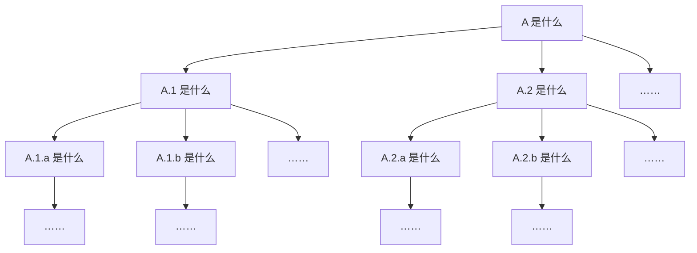

# 计算机基础知识

## 计算机小白常见问题

::: info 本节内容

本节旨在帮助先前未曾接触过计算机以及服务器，或者对计算机及服务器知之甚少的用户快速查询一些常见问题以及对应的答案。本节不能代替权威解释或各项目的官方文档。

关于如何正确地提问，请看 [如何正确提问](#如何正确提问)；关于如何快速学习相关背景知识，请看 [如何高效学习](#如何高效学习)；关于特定的名词术语解释，请看 [名词/术语速查表](../archive/archive-terms)。

:::

### 部署海豹核心为什么要解压压缩包？怎么样解压压缩包？

如果直接在解压缩应用（如 `7zip`、`WinRar` 等）中双击运行压缩包内的 `sealdice-core.exe` 文件，意味着只有 `sealdice-core.exe` 这一个文件被解压出来了，而其他文件仍然在压缩包之中。海豹核心检测不到其他必要的文件，那么，就无法正常运行。因此，需要把压缩包解压之后再双击运行海豹核心。

解压压缩包需要解压缩的应用，上面已经陈述了一些应用，使用百度搜索一下，下载安装就可以了。

一般而言，用鼠标右击压缩包，再用鼠标左键单击弹出菜单中带有`解压到`字样的选项就能解压这个压缩包。

::: tip 一个建议

解压缩软件时常不会自动帮你创建文件夹，你可能需要自己新建文件夹。这个操作非常简单。

在希望解压的文件夹下单击鼠标右键，在弹出的菜单中找到`新建文件夹`这个选项，左键单击它，然后输入你想要的文件夹名字，再按下键盘上的`Enter`，就新建了一个文件夹。

:::

而如果你想要指定这个压缩包解压到指定的文件夹，你可以右键单击压缩包后选择`解压到…`，在弹出的界面上找到你希望压缩包解压到那里的文件夹，之后双击那个文件夹，最后点击确定，压缩包便解压到了你指定的文件夹。

### 内存不足到底指的是哪里的内存不足？如何解决内存不足？

对于内存不足的情况，需要**具体问题具体分析**。

### 对于海豹核心的日志界面中「There is not enough space on the disk」的报错

翻译一下这里的报错：「在磁盘中没有足够的空间」。

很显然，这里的内存不足代指的是**磁盘可存储的空间不足**，这时候通常通过删除磁盘内部分不需要的文件，腾出空间就可以解决。

### 如果出现莫名其妙的程序中断……

如果你在资源有限的小型计算机/服务器上部署海豹，并且你的海豹是公骰（存在大量用户）或加载了大量牌堆、自定义回复和/或插件，那么有可能出现海豹核心突然中断运行的情况。如果通过日志，排除了程序内部错误的可能性，那就有可能是由内存不足引起的。此处，内存指代的是「运行内存」。

可以在海豹运行时，通过 WebUI「日志」导航栏顶部的内存占用、Windows 平台下的任务管理器、Linux 平台下的 `htop` 等工具对海豹核心的内存使用量和占用比例进行监测，如果确实存在占用过高的情况，可以考虑减少用户群体、移除不常用的自定义回复/牌堆/插件、关闭其他未在使用的进程或更换资源更为充足的平台来解决问题。

::: warning 注意：不要随意关闭你不认识的进程

只有在你完全确定某进程的用途与功能时，才能尝试关闭此进程。失误中断系统进程可能导致系统崩溃或其他隐患。

:::

### 什么是开源，什么是开源程序？

开源，即 Open Source，简言之，就是把程序的源代码放在公共平台（如 GitHub 等）并附加开源许可协议的行为，任何人都可以在开源许可协议允许的范围内下载、修改以及使用这份源代码。

开源程序，顾名思义就是开放了源代码在公共平台的程序。SealDice 就作为一个开源程序活动在大家的视线中。

### 为什么我在 SealDice 用户群问问题会被要求发送截图？为什么不能拍屏？

所有 SealDice 用户群的群员、管理、甚至是开发者，都不具备未卜先知的能力，要求你发送截图也只是为了更好地了解你的问题究竟出在哪里。知道问题出在哪里之后，排查问题或复现 bug 就会更简单。这不仅方便了群员和管理回答你的问题，也有助于你**更快地**解决问题。

不提倡拍屏而是提倡截图的原因是，拍摄屏幕时会出现各种各样的问题：因拍摄角度而看不到部分信息、屏幕因反射光线而不能让摄像头拍到真正的图片（俗称反光），而截图能避免这些问题，给解决带来更高的效率。

::: warning 注意：请做好截图保护！

如果需要发送截图，请在没有**必须要展示**的情况下隐藏好截图内可能存在的敏感信息，比如：IP 地址、端口号、文件夹内布局、密码/auth/key/salt 等。

最好的方式是通过在图片上加马赛克进行遮挡（俗称打码），不建议进行剪裁，除非敏感信息的范围过大。

:::

### 什么是 GitHub？怎么提 issue？

GitHub 是多数开源程序发布代码的地方，SealDice 开发者们平时也通过 GitHub 查看用户的需求和 bug 反馈，同时对程序进行修改，并且在 GitHub 上同步发布更新。

所以，我们希望你如果真的非常需要加入功能、或者反馈 bug，可以自己试试看除了在 SealDice 用户群中向管理说明以外，额外地再提交一份 issue 到海豹的 GitHub 的代码仓库中，这会让开发者们可能记住这个问题，同时在程序中修复它。

对于如何提 issue、怎么样提 issue 不会被关闭，以及如何在 GitHub 上下载文件之类的问题，百度应该是你更好的选择。

## 如何高效学习

::: warning 注意：海豹手册已于 2024 年 8 月 7 日停止维护以下内容，以下内容归档于 2024 年 8 月 7 日。

:::

::: info 归档原因：海豹开发组认为，这样的页面与 SealDice 完全没有关系。教授如何高效学习亦不是海豹手册应该去做的事。

:::

::: info 本节内容

本节为计算机小白指南中的第二部分。

本节旨在帮助先前未曾接触过计算机以及服务器，或者对计算机及服务器知之甚少的用户在遇到不理解的教程、名词或操作时，能够高效学习上手相关知识。

关于如何正确地提问，请看 [如何正确提问](#如何正确提问)；关于一些小白常见的问题，请看 [计算机小白常见问题](#计算机小白常见问题)；关于特定的名词术语解释，请看 [名词/术语速查表](../archive/archive-terms)。

:::

### 前言

如果你从未接触过计算机以及服务器，那么不免会对本手册中的大量概念感到陌生。一些看起来详尽的指导细细读来却可能完全看不懂。我们不希望你就此放弃，以至于错失了一个全新的、有趣的世界；我们也不希望你放弃自己思考的权利，将一切不明了的问题诉诸他人的帮助。因此，我们撰写了本篇文档，希望能够帮助你掌握一些快速学习新知识的小技巧。

### 掌握语言

无论是帮助文档、程序日志还是网络资源，英语目前是，并且在未来很长一段时间里仍将是，主流的语言。因此，提高你的英文水平，不仅可以帮助你看懂程序日志上的故障原因（这样你就能自己解决问题），还可以让你看到更高效地获取那些有用的信息（比如下文里写到的那些）。

因此，如果你仍在上学，英语学习得再努力一点，终将有所回报。如果你不得不在短时间内理解特定的英文内容，那常备翻译器显然是一个好选择。

### 寻求资源

当遇到不理解的概念时，我们的第一反应往往是去搜索引擎寻求答案。但是，如果你正在解决特定项目中遇到的问题，不妨先看看此项目的帮助文档、常见问题（FAQ）和 GitHub 上的 [Issue](../archive/archive-terms#issue)。

一个合理的开源项目，往往都具备相对详尽的帮助文档，描述了使用这个项目的过程中可能涉及的方方面面。例如，你正在阅读的就是海豹骰点核心的用户手册，亦即帮助文档。帮助文档通常包含了各个项目从部署到使用的一系列教程，在你具备相关背景的情况下，阅读帮助文档远比直接使用搜素引擎高效得多，因为帮助文档中提供的信息都是服务于特定项目的，而搜索引擎往往只能找到泛化的知识。

常见问题也是众多开源项目都拥有的页面，例如本手册中的 [计算机小白常见问题](#计算机小白常见问题) 和 [常见问题](../use/faq.md) 两个页面。这些页面中，通常包含使用此项目的用户高频提出的问题，而你遇到的情况，很有可能在其中就有所描述。因此，如果在手册的一般教程中没能找到答案，访问常见问题页面或许可以解决你的问题。

如果你不知道 Issue 是什么，可以点击本部分第一段中的超链接查看。Issue 通常包含了此开源项目的用户所遇到的问题、发现的可能的 Bug 和提出的功能请求。Issue 页面就像一个讨论区，你很可能找到一些使用上的问题，大多数情况下都会有热心的网友在页面下方给出他们的解决方案。如果你发现你的问题在 Issue 列表中存在，并且存在 Bug 的字样，那么很有可能你遇到的是此项目的已知问题。安心等待开发者解决就好，或者你也可以学习编程，为修复此 Bug 做出贡献。如果你发现你的问题在 Issue 列表中存在，并且存在 Feature Request 或 Enahncement 的字样，那么说明你需要的功能目前尚未实现，并且已经有其他用户向开发者请求加入此功能。你可以给此 Issue 点赞或评论，或许可以增加此功能的优先级，但切忌评论轰炸。在 Issue 中反复刷屏同样的内容只会带来负面后果。同样地，或许你也可以学习编程，为提供此功能做出贡献。

另外，你可能已经注意到了，本手册特别提供了 [名词/术语速查表](../archive/archive-terms)。在求助搜索引擎或用户群之前，可以看看里面是否已经包含了你想了解的概念。在速查表中，我们尽力提供了深度恰到好处的知识，不至于过于专业，但又足够你解决问题。如果你想改进速查表的内容，你可以提出一个 PR。如果你不知道 PR 是什么，那么可以按照本页后续的内容，将这作为你的第一个新知识开始学习。

### 高效搜索

如果你知道如何访问 Google，那么请使用 Google 进行搜索。如果你英文足够熟练，那么请使用英文进行搜索。

百度（还有 CSDN）永远不会是你学习计算机领域知识的最佳选择。一个更高效、搜索结果偏见更少的搜索引擎能显著提高你的信息获取效率。当然，如果你无法访问 Google，那么必应（Bing）**海外版**或许是一个尚可接受的选择。

如果你无法访问上述资源，那么在国内众多的内容平台中，学会筛选更可靠的平台也将大大提高你的知识获取效率。通常来说，技术型的个人博客和知乎平台具有相对优质的内容。如果你发现某个页面包含你需要的信息，但排版混乱或内容过于老旧已经不再适用，你可以尝试在内容的开头和结尾去寻找原文链接。通常这类文章是搬运而来，而其出处往往具有更优质的排版，有时原作者也会对其进行更新。

另一方面，互联网上的英文内容数量是具有压倒性的优势的，如果你能用英文提出问题，那么就有更大的概率直接检索到问题的解决方案。从类似 Stack Overflow 的问答网站到个人博客，你在中文互联网上找到的技术性信息，许多都源于对这些外文内容的翻译和多次搬运。因此，与其拾人牙慧，不如直抵源头。

随着大语言模型的兴起，AI 也可以是你「搜索」的对象。它们往往能比传统搜索更快地获得信息。但是，你应该永远对 AI 生成的内容心存警惕。在「幻觉」问题尚未得到有效解决之前，AI 的每一个回复都有可能是真材实料的信息，也有可能是胡编乱造。因此，在严肃场合，你不应该不加校验地使用 AI 生成的内容。

### 实践学习

#### 深度优先学习

在学习新概念的过程中，我们很可能遇到用于解释新概念的描述中，也包含着我们不理解的知识的情况。如图所示，深度优先的学习即是每遇到一个新概念，都重新去查找学习这个概念所包含的下属知识，直到对每一个细节再无疑惑的方式。

例如：

::: info 一个小例子

你可能想编写一个能够在用户发出符合某种规则的消息时，针对性地进行自定义回复的功能。通过搜素自定义回复，你找到了海豹手册的 [自定义回复教程](../advanced/edit_reply)。

在触发条件部分，你发现你可能需要学习正则表达式，于是你访问了教程开头的链接，或者在搜索引擎中查找了正则表达式教程。

在正则表达式教程中，你发现 `\s` 可以用于匹配 whitespace，于是你搜索引擎中开始查找 what does whitespace mean……

:::

如果你只使用深度优先的方式学习知识，那么当你最终回到一开始的目的（比如写一个自定义回复）时，你应该已经掌握了隐藏在触发条件与回复结果背后的全部知识，从此只要是自定义回复能实现的功能，对你来说都不再有任何困难。

然而，可以预见的，随着学习的不断深入，你需要学习的内容会爆炸式增长。所以，皓首穷经地学习每一个细节真的值得么……？

#### 广度优先学习

与深度优先学习相反，广度优先的学习即是在遇到新概念时，大致了解其含义，便开始学习下一项内容。

例如：

::: info 又一个小例子

你遇到了一些故障，在用户群里有人和你说

> 你在运行海豹的终端把日志截图一下。

你不知道终端是什么意思，于是你在 [名词/术语速查表](../archive/archive-terms) 中翻阅了一下。虽然你对什么是 Shell、什么是命令行一知半解，但是你差不多知道他指的是那个在电脑上弹出来的黑框框。

于是你又看了一眼日志是什么意思。虽让你搞不懂什么 Warning 与 Error，但你知道黑框框里那堆文字就是日志。

最后，因为你从没在电脑上截屏过，你去搜索了一下，找到了 Snipaste 这一截图工具。把黑框框里的文字截图发了出去。

:::

如果你只使用广度优先的方式学习知识，那么可能你很快就能达成一开始的目的。

然而，你对所有涉及的概念都一知半解。如果再遇到类似的问题，尽管可能只需要你做相似的操作，由于你并没有领会每一个细节，你依然不得不求助于人。所以，这样草草浏览知识真的正确么……？

#### 所以……

在实际学习新知的过程中，两种方法往往是相辅相成的，另外，实践永远是学习的最佳方法。

你通常需要以深度优先的方式，了解一个概念背后的一些细节，直到这些细节足够你应对眼前的问题和未来可能遇到的相似的问题，然后转向下一个概念进行学习。执着于过于深入的细节只会拖慢你的学习速度，因此，在合适的位置停下是最为高效的方案。

同时，在脑海中思考千遍，不如把手放在键盘上，尝试敲出你理解的方案。程序实际运行时给出的反馈，会大大帮助你找到正确的方向，而闭门造车只会延长你设计方案到发现错误的时间

### 结语

以上就是我们总结出的，要在使用 SealDice 时**更快地学习新概念**的办法。希望通过这样的办法，能让你更有效率地解决在部署 SealDice 的过程中遇到的问题。

**也希望你通过本系列科普有所收获。**

## 如何正确提问

::: warning 注意：海豹手册已于 2024 年 8 月 7 日停止维护以下内容，以下内容归档于 2024 年 8 月 7 日。

:::

::: info 归档原因：海豹开发组认为，`提问的智慧`一书中已经写明该如何提问，海豹手册不应该分走大部分篇幅去讲述应该如何提问。
:::

::: info 本节内容

本节为计算机小白指南中的第一部分。

本节旨在帮助先前未曾接触过计算机以及服务器，或者对计算机及服务器知之甚少的用户问出更加明晰高效的问题，减少因沟通产生的不必要的麻烦。

关于如何快速学习相关背景知识，请看 [如何高效学习](#如何高效学习)；关于一些小白常见的问题，请看 [计算机小白常见问题](#计算机小白常见问题)；关于特定的名词术语解释，请看 [名词/术语速查表](../archive/archive-terms)。

:::

### 前言

自近期用户量剧增后，SealDice 用户群的社区氛围似乎又有些不尽如人意，预料之中而情理之外的事情又再次发生了，我们觉得，用户需要这样一个科普性质的界面。**如果在不知道如何在用户群提问能尽量干脆利落，或者不清楚某些术语该怎么说的情况下，能想到这个系列就最好了**。

当然，我们没有资格教屏幕前的你如何做人，这篇科普也一样，只是给你一个或许更好的建议，是否跟着这么做，取决于你。

### 提问的智慧

在计算机技术领域内，[《提问的智慧》](https://github.com/ryanhanwu/How-To-Ask-Questions-The-Smart-Way/blob/main/README-zh_CN.md)一文广为流传。如果你想认真地学习如何问出一个好问题，强烈建议全文阅读此文章。在用户群的群文件中，也提供了此文章的文件。

当然，海豹用户群的群员们并不会如此严苛，如果你暂时没有时间完整地阅读上述文章，那么认真读完本节也足够你在海豹用户群中问出一个好问题。

### 提问前，你该这样做

#### 尝试自行排查问题

对于屏幕前或许没有编程经验的你，可以通过平日里学的「五要素」法则来思考遇到的程序错误问题。下面是一个可行的思考过程。

- **Where**
- 我是在哪里做了一些事情让我的骰子出现问题了？是在服务器还是在我自己的电脑上？
- **When**
- 我在什么时候做了这些事情让骰子出现问题了？
- **What**
- 我做了什么让我的骰子出现了问题？
- **Why**
- 为什么我这么做会让骰子出现问题？
- **How**
- 我怎么做才能去修复这个问题？

通过这样的思考过程，你即使猜测不出问题所在，也可以很好地根据这五个要素的思考过程组织问题，让回答者清晰地知道你的操作流程，更快地找到问题所在，为你解决问题。

#### 尝试阅读本手册以找到答案

阅读本手册，尤其是 [计算机小白常见问题](#计算机小白常见问题) 和 [常见问题](../use/faq.md) 两个页面。使用页面左上角的搜索按钮有助于提高你的信息效率。

#### 尝试浏览用户群内的信息以找到答案

用户群的群公告、群精华消息和历史聊天记录中，有可能找到你问题的答案。

#### 尝试上网搜索以找到答案

关于如何高效地进行搜索可以参考 [如何高效学习](#如何高效学习) 一节中，[高效搜索](#高效搜索) 小节。

#### 记住你做了什么

你在解决问题时所做的努力——无论仅仅是搜索还是尝试了具体的操作、无论是有效的还是无效的，都将帮助回答者更有效地了解你的背景信息。因此，记住你所做的，并按照下文中的指导，附加在问题中。

### 提问时，你该这样做

本部分中将会为一些涉及的要素提供正例与反例，**正例并不意味着一个好问题（它是一个好问题的一部分）**，但反例显然不应该出现在你的问题里。另一方面，如果你的问题并不涉及某个的要素，那就不要强行加入这个要素。

#### 清晰说明你的意图和/或困难

如果你想要让海豹实现某些功能，那么请尽可能清晰完整地描述你想实现的功能。如果你在实现某功能的过程中遇到了麻烦，或者一些你认为本该正常运行的功能表现得不正常，那么请尽可能详细地描述你遇到的困境。

以下是一些合适的措辞：

> 我希望写一个插件，在用户不使用指令前缀的情况下，也能正常响应用户的命令，并实现接入 ChatGPT API 的功能。
> - - -
> 我的骰子突然不响应指令了，具体来说，在我的 xxx 群里可以正常使用，但是我私聊它就不行。

以下是一些典型的反例：

> 呜呜我的骰子怎么不能用了——
> - - -
> 很急！来个大佬救救！

#### 描述问题发生前，你做了什么

一个问题可能是也可能不是由用户错误的操作引起的，所以，为了帮助回答者分析定位问题，你应该描述在问题发生之前你做了什么。

以下是一些合适的措辞：

> 我在本地的 Windows 上通过 WinSCP 使用 SSH 协议连接到了我在腾讯云的服务器上，服务器运行的是 Ubuntu 系统。我直接把 data 文件夹拖到了 sealdice-core 同一个目录内，然而在服务器无法启动海豹。
> - - -
> 我在群里 xx 写的 xx 牌堆的基础上修改了牌堆。原本的文件上传到海豹后，可以正确识别。但是我修改之后，上传到海豹，牌堆列表里并没有出现那个文件。我修改的部分是这样的：<屏幕截图>

反例：不提供此类信息。

::: warning 注意：在提供代码相关的信息时，请使用屏幕截图

通常来说，代码都遵守着相应的格式规范。直接将代码复制到聊天窗口中会极大地破坏这种代码规范，严重影响代码的可读性。因此，不要将代码内容复制到聊天窗口中，请使用屏幕截图。

[为什么我在 SealDice 用户群问问题会被要求发送截图？为什么不能拍屏？](#为什么我在-sealdice-用户群问问题会被要求发送截图为什么不能拍屏)

:::

#### 提供问题发生时，程序的日志

如果你不清楚什么是日志，请看 [名词/术语速查表](../archive/archive-terms) 中的 [日志](../archive/archive-terms#日志) 部分。海豹的日志中包含了大量的有效信息，许多问题的直接原因本身就记录在日志中。即使你不能完全理解日志的内容，它也将极大地帮助回答者排查你所遇到的问题。因此，除非你非常确定你遇到的问题与海豹本身的运行无关，或未反映在日志中，请务必提供日志截图。

每行日志的开头都带有时间戳，请确保你发送的日志是问题发生那一刻前后一段时间内的日志。例如，你在 WebUI 查看日志，而你一遇到问题就立刻开始写求助消息，那么此时问题所对应的日志通常位于页面底端，你应该下拉页面，确保截图中呈现了对应的日志。

以下是一些合适的措辞：

> 我发出指令但是骰子在私聊中没有回复我，日志是这样的：<日志截图>
> - - -
> 我修改过的牌堆上传到海豹之后，点击重载牌堆，日志是这样显示的：<日志截图>

反例：不提供日志。

::: warning 注意：在提供日志时，请使用屏幕截图

通常来说，日志中每条记录都相对较长。在一些情况下，日志还会使用特定格式输出堆栈信息。直接将日志复制到聊天窗口中会严重影响日志的可读性。因此，不要将日志内容复制到聊天窗口中，请使用屏幕截图。

[为什么我在 SealDice 用户群问问题会被要求发送截图？为什么不能拍屏？](#为什么我在-sealdice-用户群问问题会被要求发送截图为什么不能拍屏)

:::

#### 描述问题发生后，你尝试过的解决方案

正如上文中提到的，无论是试图实现一个功能，还是在使用中遇到了不符合预期的事件，你都应该尝试根据参考信息自行解决问题。在提问时，即使你的尝试没有效果，也应该把你尝试过的方法描述出来。你尝试过的方法可能就是排查问题的手段之一，通过你提供的这些信息，回答者可以更加高效的帮助你定位问题。

以下是一些合适的措辞：

> 我试过对我的海豹骰进行重启，还有撤去一些自定义回复文件以及 JSON 牌堆文件，但是基本对数据库文件夹的异常磁盘占用问题没有效果。
> - - -
> 我试过重启海豹（但是没有重启分离部署的 Lagrange），海豹依然不会在私聊中回复我。

反例：不提供此类信息。

#### 提供其他有价值的背景信息

海豹核心的版本号、连接的社交平台、连接 QQ 平台时使用的连接方式（内置客户端或分离部署）以及你的操作系统等，都有可能和你所遇到的问题有关。因此，与其提问后再被要求补充这些信息，不如一开始就将它们包含在你的问题之中。

以下是一些合适的措辞：

> 我使用的是 <Badge type="tip" text="vA.B.C" /> 版本的海豹骰，部署在 Windows 11 系统上。私聊不回复的问题是在 QQ 平台发生的。我是通过分离部署连接的 QQ，使用的 QQ 后端是 NapCat。

反例：不提供此类信息。

### 提问后，你该这样做

#### 如果问题解决了……

如果回答者提供的解决方案解决了你的问题，你应该做出反馈。

首先，一个有效的问题解决方案可以扩充海豹社区对问题的经验。通过明确地告诉大家问题已经解决，你正在为建设海豹社区做出有力的贡献。

另外，对回答者表示感谢是最基本的礼貌，也是维护海豹社区良好氛围的行为。

#### 如果问题没能解决……

问出下一个问题吧。别忘了回顾一遍本节内容，你的追问同样应该是一个良好的问题，这样才有助于问题的快速解决。

当然，那些已经描述过的且未发生改变的信息没有必要再重复一遍。如果你不确定某些信息是否应该重新描述，那就再说一遍，啰嗦总好过一个信息不完整的问题。

另一方面，你也应该额外补充一些信息，尤其是用你自己的话描述一遍你是如何执行回答者所给出的解决方案的。很多时候一个解决方案是有效的，但由于沟通上的歧义或误解，导致它没能被正确执行。因此，再和大家说说你是怎么做的吧。

### 其他事项

#### 保持耐心，对回答问题者表现出友善和配合的态度

群员、管理和开发者们都有自己的生活，SealDice 也只是兴趣的一部分。所以，在你的问题看起来没有获得回答的时候，保持耐心。当有群员或管理进一步地询问相关问题，也希望你能友善且相对客观地叙述问题，而不是对他们发泄自己的主观情绪，同时，配合他们进行操作，这样，问题才能更快速地解决。

#### 如果有需要，可以去 GitHub 代码仓库上提交 issue

如果你想要问的问题是新的、程序上的需求（例如希望加入一个新的接口），或者你的问题明确了是一个 bug，你希望 SealDice 开发组尽快满足这个需求或修复这个 bug，你可以通过在 GitHub 的 [sealdice/sealdice-core](https://github.com/sealdice/sealdice-core) 仓库中提交一个 issue，开发组的开发者们会通过讨论进行回复，并且，如果确定需要通过你的反馈对程序进行改动，也会更方便开发者们归档问题和修改程序。

### 结语

以上就是提问的智慧中我们总结出的，要在 SealDice 用户社区里**更快地解决问题**，**应该怎么做**的办法。希望通过这样的办法，能让你更有效率地解决在部署 SealDice 的过程中遇到的问题。

**也希望你通过本系列科普有所收获。**
