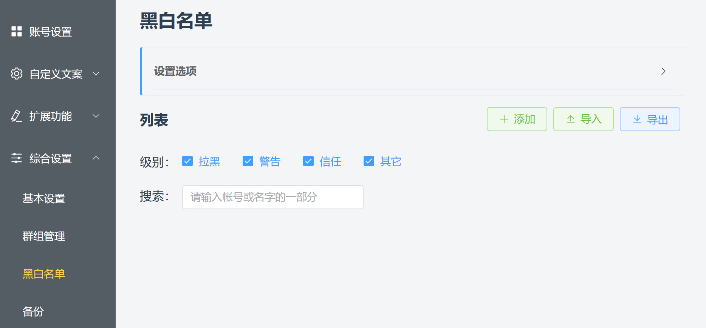
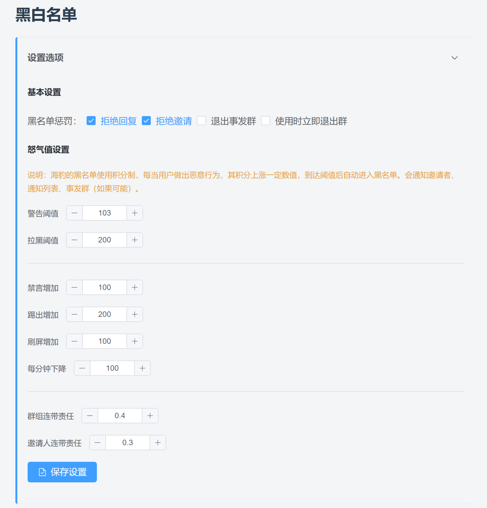

# 黑白名单

::: info 本节内容

本节将介绍黑白名单的设置，请善用侧边栏和搜索，按需阅读文档。

:::

## 如何设置黑白名单？

黑白名单是骰子拉黑/豁免的用户/群的列表。来源可能是骰主在后台设置的，也可能是因为触发了某些自动规则添加的。

点击海豹 UI 界面的「综合设置 - 黑白名单」选项，你就可以进入黑白名单管理页面。

## 添加黑白名单

### UI 手动添加

点击「添加」按钮，可在后台手动添加黑（白）名单。

### 指令添加

见 [使用 - 核心指令](../use/core.md)。

### 自动添加

触发某些自动规则时，可能会自动添加用户进黑名单，如：

- 刷屏、禁言骰子、踢骰等
- [触发敏感词拦截](./censor.md)
- 怒气值超过拉黑阈值

## 黑白名单设置

点开「设置选项」，可以对黑白名单进行一些设置。

黑名单惩罚：

- 拒绝回复：骰子不回复黑名单用户；
- 拒绝邀请：骰子自动拒绝黑名单用户的邀请；
- 退出事发群：比如禁言骰子触发了黑名单事件，会退出禁言的事发群；
- 使用时立即退出群：有黑名单用户在其他群尝试使用骰子时，骰子会立即退群。
<!-- TODO 增加 1.4.1 新增的 若发送者为管理员退群，非管理员通告 模式 -->

连带责任：当有用户触发黑名单事件时，对应的群组和邀请人会按 **设置的比例** 增加怒气值。
