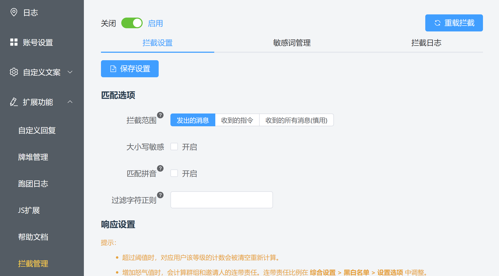
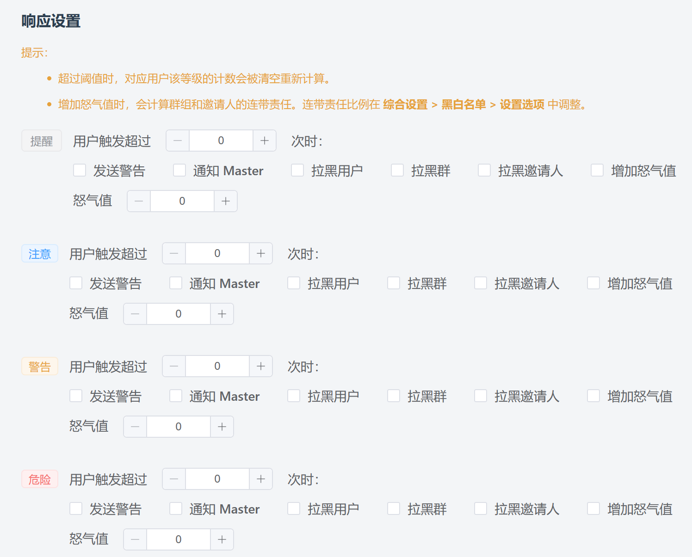
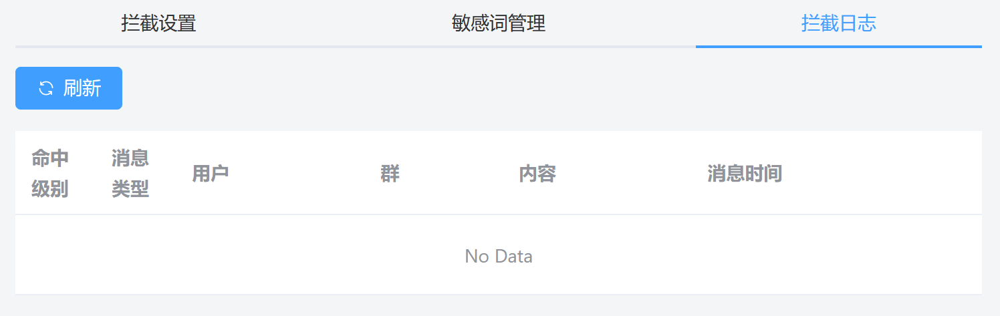

# 拦截

::: info 本节内容

本节将介绍拦截功能和相关设置，请善用侧边栏和搜索，按需阅读文档。

:::

## 什么是拦截功能？

> - 我不希望我的骰子被用来跑粉红团，如何避免？
>
> - 发生了超过普通人类认知的离谱事情，如何设置骰子收到了某些词语时自动拦截掉这些用户？
>
> - ……

「拦截管理」提供检查骰子收到的消息内容中是否有敏感词汇，命中时进行相应处理的能力。

点击海豹 UI 界面的「扩展功能 - 拦截管理」选项，你就可以进入拦截管理页面。

如果显示未启用的话，点击左上角开关来启用拦截。

## 配置拦截

拦截设置主要分为两部分：「匹配选项」，即设置拦截什么样的消息；「响应设置」，即命中敏感词后要如何处理。下面我们将一一介绍。

### 匹配选项

匹配选项中最重要的设置就是 **「拦截范围」**，这个选项决定了什么范围的内容会进行拦截检查。

- 发出的消息：拦截骰子发出的消息文本（包括指令回复和自定义回复，总之所有骰子发的内容）进行检查
- 收到的指令：拦截骰子收到的命令文本进行检查，如收到「.rd 进行一次骰点」时，会检查其中的「进行一次骰点」，不受 bot off 影响
- 收到的所有消息：拦截骰子收到的所有消息进行检查，包括不以 `.` 等开头的消息，不受 bot off 影响

其余选项可以参看对应的提示，悬浮在问号上即可看见对应帮助。

### 响应设置

海豹核心的敏感词主要分为四个等级：`提醒` `注意` `警告` `危险`，程度依次升高。你可以对不同等级的处理方式做不同的设置。

当消息命中敏感词的时候，将取命中词汇中的 **最高等级** 作为处理等级。当同一个用户触发同一等级的次数超过对应设置时，将进行对应等级配置的操作，同时清空用户该等级的计数，重新计算。

- 发送警告：会向触发用户发送警告信息；
- 通知 Master：会通知骰主；
- 拉黑用户/群/邀请人，增加怒气值：拉黑和怒气值机制，见 [黑白名单](./ban.md)。

## 敏感词管理

将标签页切换到「敏感词管理」，可以看到如下的两个列表：「词库列表」和「敏感词列表」。

页面中也提供了相应的帮助信息，可以点开查看。

敏感词库通常为 `txt` 或 `toml` 格式的文件，通过「导入」按钮可以导入多个词库，词库同时生效，其中重复的词取设置的最高等级。导入后点击「重载拦截」按钮以生效变更。

::: tip 为什么没有默认的敏感词库？

> *「当你在凝视深渊的时候，深渊也正在凝视着你。」*

敏感词库本身属于敏感信息，故海豹官方不提供默认的敏感词库。

:::

下方的敏感词列表会展示当前加载的敏感词，如果设置中勾选了「匹配拼音」，也会将实际去匹配的拼音展示出来。

## 查看拦截日志

在「拦截日志」标签页，你可以看到在何时、何地、哪个用户触发了什么等级的敏感词，具体的内容是什么。

## 如何让用户/群豁免检查？

给用户/群配置白名单，即可豁免检查。设置白名单见 [黑白名单](./ban.md)。

## 如何编写敏感词库？

在「敏感词管理」标签页，提供了词库模板的下载。

具体的编写帮助见 [进阶 - 编写敏感词库](../advanced/edit_sensitive_words.md)。