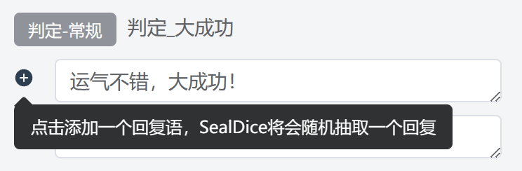
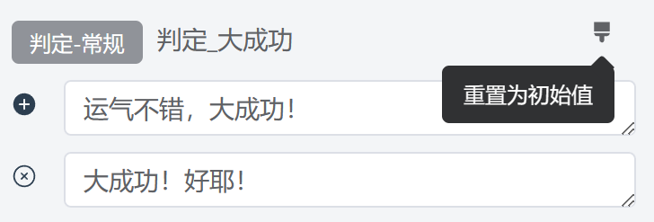
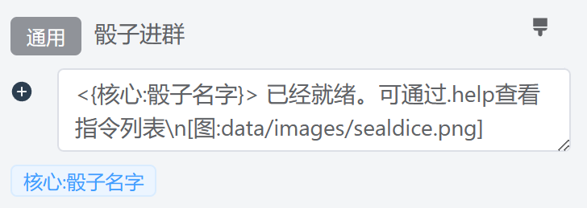
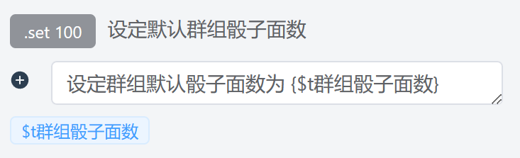

# 自定义文案

::: info 本节内容

本节将介绍自定义文案的设置，请善用侧边栏和搜索，按需阅读文档。

:::

## 什么是自定义文案？

> - 骰子的回复内容太过单调，要怎样让它丰富起来呢？
>
> - 骰子的回复内容太过繁琐，要怎样让它简洁起来呢？
>
> - 我的骰子有自己的人设，怎么修改那些固定的回复词，让 TA 符合人设呢？
>
> - ……

如果你想要修改骰子向用户回复的提示词，那么你就需要修改自定义文案。

海豹骰子的回复内容几乎可以进行完全的自定义，绝大部分指令的文案都可以进行修改。修改的文案内容还支持插入图片和 CQ 码。

## 如何修改文案？

在海豹 UI 界面的「自定义文案」选项中，你可以看见文案被按照几个大类放置在一起。


左侧是分类，可以看见，文案目前被分为以下几个大类：

- CoC：内置的 CoC 支持相关的文案；
- DND：内置的 DND 支持相关的文案；
- 其它：一些杂项文案设置；
- 功能：内置 [功能](../use/fun.md) 的相关文案，如 `.jrrp` 的文案；
- 日志：[跑团日志](../use/log.md) 功能相关的文案;
- 核心：海豹核心功能的文案。

在每一个分类中，都可以在右侧看见当前分类的「文案列表」与上方的「筛选」，接下来将依次介绍它们。

### 文案列表

在「文案列表」中，每一个文案都以类似下图的格式展示，我们以「大成功」的文案来举例：


可以看见，对于「大成功」文案，它归属于 `判定-常规` 这个小类中，结果有两行文案，这意味着骰子会 **随机抽取** 其中的一行文案来使用。例如：

::: info 示例

<ChatBox :messages="[
{content: '.ra 力量', send: true},
{content: '<木落>的力量检定结果为:D100=3/30=([1d100=3]) 大成功！'},
{content: '.ra 力量', send: true},
{content: '<木落>的力量检定结果为:D100=2/30=([1d100=3]) 运气不错，大成功！'}
]"/>

:::

如果想要添加一行，那么点击左侧「加号」按钮：



如果你觉得某一行不满意，点左侧「删除」按钮。当然，至少需要保留一个选项。


修改好之后，不要忘记保存！


::: warning 注意：尽早保存！

对文案的修改建议及时保存，同时注意 **保存前不要切换左侧的分类**，否则未保存的修改将丢失！

:::

最后，如果你想回到初始设置，点击右上角的「刷子」图标。



随后会弹出确认框，点击确定后，一切就是刚开始的样子了。

### 筛选文案

我们可以看见，为了方便在本组中查找到对应的条目，在文案列表的上方都有着对应的「筛选」功能。


- 搜索：搜索文案的小类和具体文案名。
- 指定类别：
  - 全部：显示全部文案；
  - 默认文案：显示当前大类下未修改过的文案；
  - 修改过：已修改过的文案；
  - 指定分组：选中后会多出一个「分组」下拉框，用于筛选出指定小类下的文案条目；
  - 旧版文案：海豹的更新有时会调整和删除部分文案条目，但旧的数据不会删除。海豹从旧版升级后，可以通过此项筛选出那些不用的条目。

### 文案的导入/导出

> - 我不想自己一条条修改文案，如何快速导入？
>
> - 我想给我的小伙伴分享我的文案，他们要如何导入进去？

如果需要导入/导出文案内容，可以点击右上角的「导入/导出」按钮进入页面复制粘贴，就能快速分享相关设置了。

::: warning 注意：确认内容完整再导入

粘贴文案内容时，注意检查自己导入的内容是不是完整复制进来的。

请不要在新版本导入旧版本的文案，这种做法会绕过文案版本的迁移变更，导致缺少条目，并且很难处理。

:::

## 自定义文案组合

在「自定义文案」中你可以经常看见一个文案调用其他文案的情况，下面将简单介绍他们之间的关系。

### COC

以下为 COC 扩展的文案介绍。

#### `.ra/rc` 检定

`检定` 中的 `{$t结果文本}` 即调用 `检定_单项结果文本`。

`检定_多轮` 中的 `{$t结果文本}` 即调用 n 次 `检定_单项结果文本`。

`检定_单项结果文本` 中的 `{$t判定结果}` 即调用 `判定-常规` 对应的回复词，当你的检定为多轮检定时，将调用 `判定-简短`。

对于 `判定_必须_困难_失败` 此类必须判定的回复词，使用于指定检定难度的情况，如 `.ra 困难侦察`。

`检定_暗中_群内` 即进行暗骰时发在群里的回复词。

`检定_暗中_私聊_前缀` 即进行暗骰时发送到私聊的回复词的前缀，实际发送内容为**前缀 + `射击检定`**。

#### `.st` 属性设置

`属性设置_增减` 中的 `{$t变更列表}` 即调用 `属性设置_增减_单项`，当你的增减表达式错误时，则调用 `属性设置_增减_错误的值`。

#### `.sc` 理智检定

`理智检定` 中的 `{$t结果文本}`  即调用 `理智检定_单项结果文本`；`{$t附加语}` 即调用 `理智检定_附加语_大失败` 等对应的回复词；`{$t提示_角色疯狂}` 即调用 `提示_临时疯狂`，当理智归零时则调用 `提示_永久疯狂`。

#### `.en` 技能成长

`技能成长中` 的 `{$t结果文本}`  即调用 `技能成长_结果_成功`，当成长失败且没有失败成长值时则调用 `技能成长_结果_失败`，当成长失败且有失败成长值时则调用 `技能成长_结果_失败变更`。

`技能成长_批量` 中的 `{$t总结果文本}`  即调用 n 次 `技能成长_批量_单条`，`技能成长_批量_分隔符` 为每一单条中间的分隔符。

`技能成长_批量_单条` 中的 `{$t结果文本}` 即调用 `技能成长_结果_成功_无后缀`，当成长失败且没有失败成长值时则调用 `技能成长_结果_失败_无后缀`，当成长失败且有失败成长值时则调用 `技能成长_结果_失败变更_无后缀`。

对于 `技能成长_属性未录入` 等回复语，你可以参考上面的内容自行对比理解。

::: warning 注意：无前缀/无后缀

此处内容较为复杂，你可以看出很多回复语都有**普通**和**无前缀/无后缀**两条区分，这主要是为了批量成长时便于引用**无前缀/无后缀**的回复，使前缀/后缀不会反复出现在批量成长中。

:::

### 核心

#### `.r` 骰点

`暗骰_群内` 为暗骰时发送到群内的回复语，`暗骰_私聊_前缀` 为私聊发指令者的回复语的前缀，实际内容为 `暗骰_私聊_前缀` + `骰点`。

`骰点` 中 `{$t原因句子}` 即调用 `骰点_原因`，`{$t结果文本}` 即调用 `骰点_单项结果文本`。

进行多轮骰点时 `骰点_多轮` 将替换 `骰点` 进行回复，`{$t结果文本}` 即调用 n 条 `骰点_单项结果文本`。

#### `.alias` 快捷指令

`快捷指令_列表` 中的 `{$t列表内容}` 即调用 `快捷指令_列表_单行`，当有多条指令时以 `快捷指令_列表_分隔符` 为分隔符，若没有快捷指令则调用 `快捷指令_列表_空`。

`快捷指令触发_前缀` 中的 `{$t指令来源}` 即 `群/个人`， `{$t目标指令}` 即快捷指令指向的原指令。

## 文案插入图片和 CQ 码

将图片放在骰子的适当目录（建议放在 `data/images`），再按照相应图片的路径插入这样一段文本即可。以图片 `data/images/sealdice.png` 为例：

插入文本为 **`[图:data/images/sealdice.png]`**。

例如修改骰子进群的文案：



全文案为：

```text
<{核心:骰子名字}> 已经就绪。可通过.help 查看指令列表\n[图:data/images/sealdice.png]
```

效果如下：


<!-- 有无可能替换成ChatBox？ -->

## 文案变量标签

你可能注意到，有些词条下面有这样的内容，如下图的 `$t群组骰子面数`：



文案下方的标签代表了被默认文案所使用的特殊变量，你可以使用 `{变量名}` 来插入他们，例如 `{$t群组骰子面数}`。

除此之外，有些变量可以在所有文案中使用，具体列表可以见 [进阶 - 内置脚本语言](../advanced/script.md#变量)。

## 在一个文案中使用另一个文案

所有的自定义文案都可以嵌套使用，例如：

```text
这里是{核心：骰子名字}，我是一个示例
```

默认会被解析为：

```text
这里是海豹，我是一个示例
```

::: danger 危险：禁止递归嵌套！

千万不要递归嵌套，会发生很糟糕的事情！

:::

## 文案常见问题

### 骰子进群和成为好友的问候语是哪个？

`核心:骰子进群`

`核心:骰子成为好友`

## 更复杂的文案设置

> - 我希望能根据骰点结果显示不同的文案，要怎么实现？
>
> - 我希望骰子能有多套回复词，要如何设置？
>
> - ……

更复杂的文案设置涉及到逻辑的编写，见 [进阶 - 编写复杂文案](../advanced/edit_complex_custom_text.md)。
