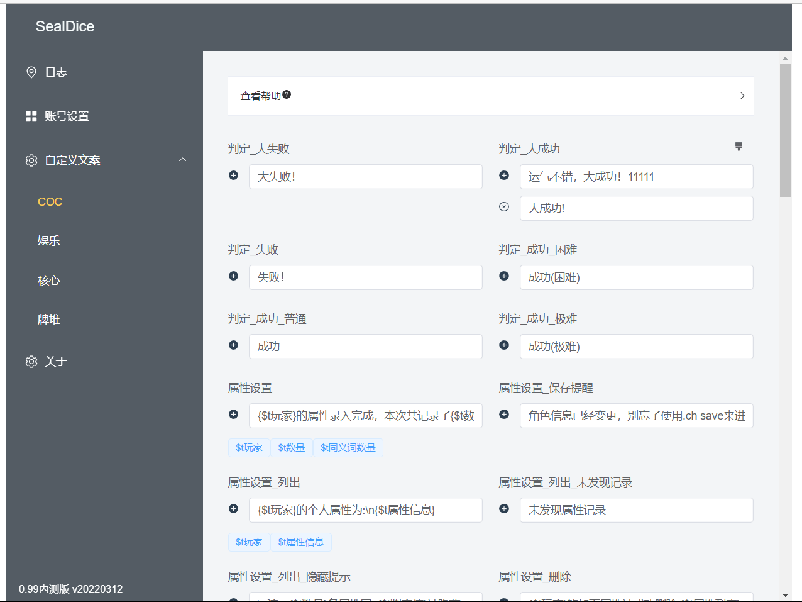
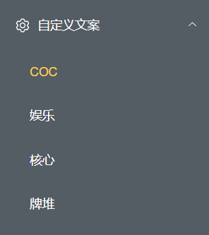
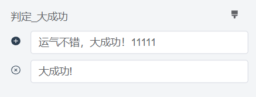
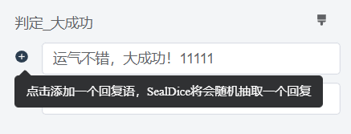
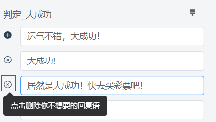
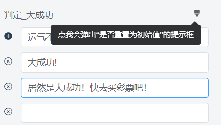
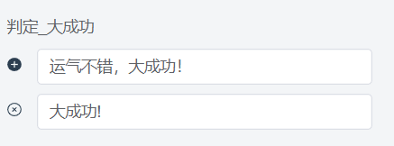
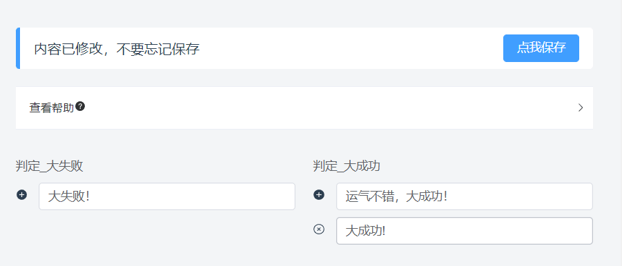
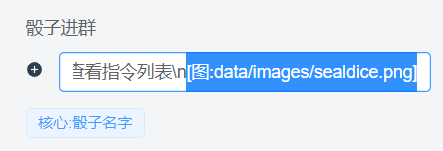
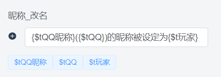

# 自定义文本

::: info 本节内容

本节将介绍自定义文本的设置，请善用侧边栏和搜索，按需阅读文档。

:::

SealDice 可以对骰子进行几乎完全的自定义，绝大部分指令的文本都可以进行修改。

同时还支持插入图片和CQ码。

## 界面概览

一图胜千言：



这是SealDice的自定义文案界面，左侧是分类：



右侧是具体的文本，我们以“大成功”文本来举例：



这里有两行文本，骰子会随机抽取其中的一行文本来使用。例如：

```
.ra 力量
Dice: <木落>的力量检定结果为:D100=3/30=([1d100=3]) 大成功!

.ra 力量
Dice: <木落>的力量检定结果为:D100=2/30=([1d100=3]) 运气不错，大成功！11111
```

如果想要添加一行，那么点击左侧加号按钮：



如果你觉得某一行不满意，点左侧删除按钮。



最后，如果你想回到初始设置，点击右上角的刷子图标。



随后会弹出确认框，点击确定后，一切就是刚开始的样子了。



此时，刷子图标也会消失。

当然，修改好之后，不要忘记保存！！**注意保存前不要切换左侧的分类！**



## 骰子进群和成为好友的问候语

这两个词条：

**核心:骰子进群**

**核心:骰子成为好友**


## 插入图片和CQ码

将图片放在骰子的适当目录（建议放在data/images），再写这样一句话即可:

**[图:data/images/sealdice.png]**

例如骰子进群的文本：



全文本为：

```
<{核心:骰子名字}> 已经就绪。可通过.help查看指令列表\n[图:data/images/sealdice.png]
```

效果如下：


## 变量标签

你可能注意到，有些词条下面有这样的内容：



文本下方的标签代表了被默认文本所使用的特殊变量，你可以使用 {变量名} 来插入他们，例如 `{$t判定值}`

除此之外，有些变量可以在所有文本中使用，具体列表可以见下方“变量机制”一节。


以及，所有的自定义文本都可以嵌套使用，例如：

```
这里是{核心:骰子名字}，我是一个示例
```

默认会被解析为:

``````
这里是海豹，我是一个示例
``````

注意！千万不要递归嵌套，会发生很糟糕的事情。