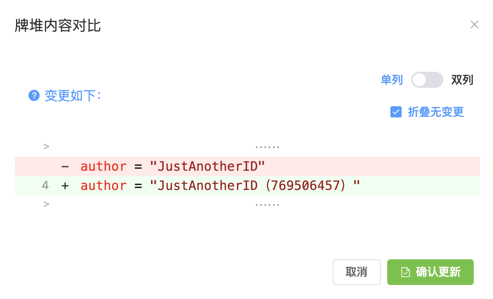

# 牌堆

::: info 本节内容

本节将介绍牌堆功能，请善用侧边栏和搜索，按需阅读文档。

:::

## 牌堆是什么？

「牌堆」是一组有名字的文本，你可以把它想象成一组扑克牌，通过 `.draw` 命令来随机抽取其中的内容发送。为了便于骰子读取增加相应的说明内容，牌堆以某种结构化的格式保存成文件。

::: tip 提示：牌堆

牌堆以 `json` `yaml` 或 `toml` 格式组织起来，但其本质只是一段文本，只是编写需要遵循对应的结构方便读取。

:::

## 获取牌堆

你可以在 [牌堆仓库](https://github.com/sealdice/draw) 或官方群的群文件中找到其他骰主分享的牌堆。

::: tip 提示：无法访问仓库？

仓库位于 GitHub，访问时请确认你的网络状况。

:::

## 怎么上传牌堆到骰子？怎么管理牌堆？

点击海豹 UI 界面的「扩展功能 - 牌堆管理」选项，你就可以进入牌堆的管理页面。


可以看见有一个「上传牌堆」按钮，点击它选择本地的牌堆文件上传后即可读取牌堆。

在上图中已经有一个名为「常规抽取与放回抽取示例」牌堆被读取到了，它的版本号是 1.1，格式是 `json`，其他信息也相应展示。

你可以通过「删除」按钮来删掉对应的牌堆。

::: tip 提示：重载牌堆

新增/删除牌堆通常会自动重载，但如果出现牌堆未更新等情况时，可以手动点击「重载牌堆」按钮进行刷新。

:::

## 怎么使用牌堆？

在上面的「常规抽取与放回抽取示例」中，我们可以看见有名为 `常规抽取` `放回抽取` 的两个牌组。可以使用 `.draw` 命令来抽取它们。

```text
.draw 常规抽取
.draw 放回抽取
```

更多牌堆命令，见 [使用 - 扩展：牌堆 自定义回复](../use/deck_and_reply.md)

## 牌堆更新与云牌堆

在加载某些牌堆之后，你可能会发现一些牌堆拥有特殊的功能：


### 牌堆更新

一些牌堆作者为牌堆提供了更新链接，方便你快速获取最新的牌堆内容。

点击「更新」按钮后会取获取最新的牌堆，随后弹出获取到的新牌堆与当前牌堆的对比：



对比弹窗的右上角可以控制显示的样式，如勾选「折叠无变更」可以收起过长的内容。

确认牌堆的更新内容之后，点击「确认更新」即可升级到最新的牌堆。

### 牌堆云端内容

一些牌堆作者为牌堆提供了云端内容，这意味着这个牌堆在抽取时，可能会去拉取远程内容作为牌堆项。

所有含有云端内容的牌堆，海豹 UI 都会给出「提供云端内容」的提示。

::: warning 注意：云端内容

牌堆作者可以实时调整云端内容，可能存在风险，请自行考虑是否使用这样的牌堆。

:::

## 如何编写牌堆？

见 [进阶 - 编写牌堆](../advanced/edit_deck.md)