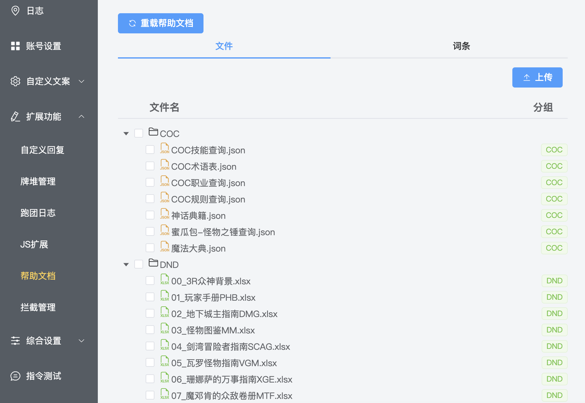
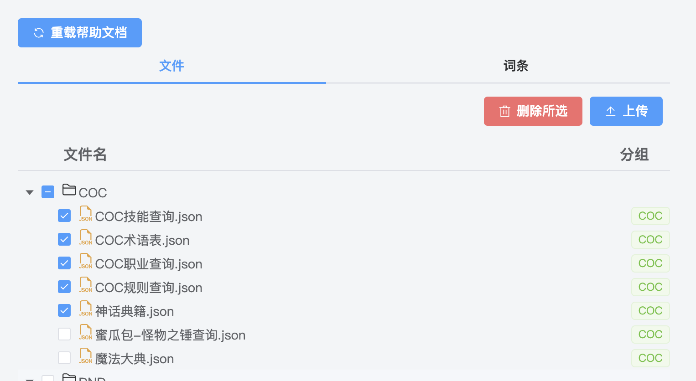
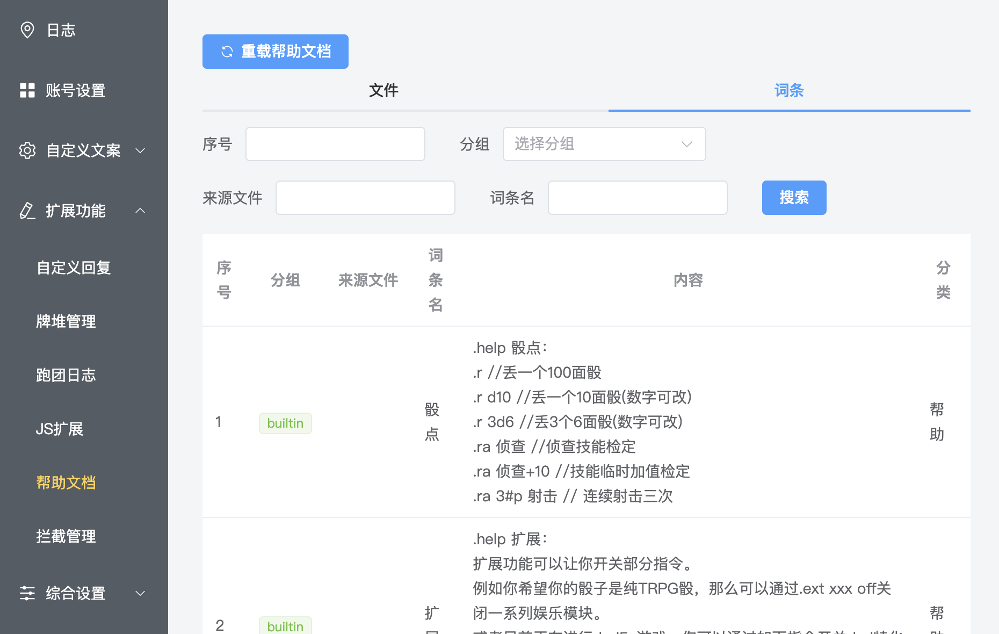

# 帮助文档

::: info 本节内容

本节将介绍帮助文档功能，请善用侧边栏和搜索，按需阅读文档。

:::

## 什么是帮助文档？

「帮助文档」是提供给骰子使用的查询资料，一般用于各种规则的资料查询，也可用于编写骰子的使用帮助。

## 获取帮助文档

你可以在 [帮助文档仓库](https://github.com/sealdice/helpdoc) 或官方群的群文件中找到其他骰主分享的帮助文档。

::: note 无法访问仓库？

仓库位于 GitHub，访问时请确认你的网络状况。

:::

海豹目前可以健康食用的 helpdoc 格式为 `json` 以及 `xslx`，其中更多使用后者来编写资料查询文档。

海豹官方安装包中也默认提供了 CoC 和 D&D 的资料查询文档，无需额外下载即可使用相关内容搜索。

## 如何使用帮助文档？

当你在帮助文档中写下 `词条A` 后，通过 `.help 词条A` 即可返回对应词条内容。

对于资料查询，更建议使用 `.find` 来搜索词条内容。

见 [使用 - 核心指令](../use/core.md#find查询-查询指令)。

## 如何管理帮助文档？

点击海豹 UI 界面的「扩展功能 - 帮助文档」选项，你就可以进入帮助文档的管理页面。

我们可以看到默认置入的 CoC 与 D&D 的资料文档已经在列表中展示出来了。

帮助文档列表以文件树的形式展示。文件夹内部的文档在一级文件夹下平铺展示，最外层的 **一级文件夹名将作为其中所有文档的分组名**，用于精确控制查询范围的分组。

修改帮助文档后，需要点击「重载帮助文档」来刷新。

::: warning 重载帮助文档

帮助文档的文本量较大，重载过程需要一定时间（通常为几分钟，与文档数量、机器性能有关）。在重载期间，搜索功能会暂时不可用，所以建议在骰子使用的低峰期进行重载。

:::

### 上传帮助文档

点击「上传」按钮，即可弹出帮助文档的上传框：

「分组」即是一级文件夹，可以选择已有的分组，也可手动填写新的分组名来创建文件夹。

选择分组和相应文档后，点击「上传」即可将文档上传至骰子。

::: warning 默认分组

分组选择中存在一个「默认」分组，代表位于文档根目录的帮助文档位置，和一级文件夹同级。

**非常不建议你将文档放在这个文件夹中进行管理。** 对指定分组的搜索需要有意义的分组名。

:::

### 删除帮助文档

如需删除某些帮助文档，勾选对应文档前的选框后点击「删除所选」，即可批量删除帮助文档。

### 查看帮助文档词条

切换标签页到「词条」，即可浏览当前已经加载的帮助文档词条。

通过筛选可以快速查找到相应的词条内容。

## 如何编写帮助文档？

见 [进阶 - 编写帮助文档](../advanced/edit_helpdoc.md)。
