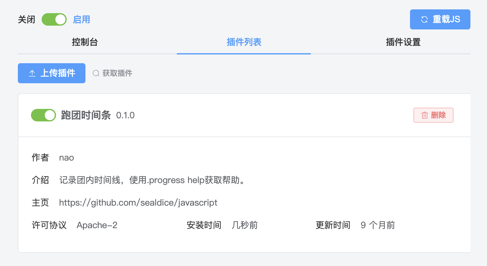

# JavaScript 插件

::: info 本节内容

本节将介绍 JavaScript 插件功能，请善用侧边栏和搜索，按需阅读文档。

:::

## JavaScript 插件是什么

为了给有能力的用户提供更大的自定义空间，海豹核心支持使用 `JavaScript` 语言编写扩展插件。

:::: tip JavaScript

JavaScript（JS）是一门基于原型和头等函数的多范式高级解释型编程语言，它支持面向对象程序设计、指令式编程和函数式编程。它提供方法来操控文本、数组、日期以及正则表达式等。

::: right
—— [WIKI](https://zh.wikipedia.org/wiki/JavaScript)
:::

::::

## 获取 JS 插件

你可以在 [JS 插件仓库](https://github.com/sealdice/javascript) 或官方群的群文件中找到其他骰主分享的 JS 插件。

::: note 无法访问仓库？

仓库位于 GitHub，访问时请确认你的网络状况。

:::

## 如何安装和管理 JS 插件？

点击海豹 UI 界面的「扩展功能-JS 扩展」选项，你就可以进入 JS 插件的管理页面。

如果左上角的开关未打开，可以点击启用 JS 插件的支持。可以看见，在管理界面中有多个标签页，下面将一一介绍。

### 插件列表

在「插件列表」页，可以查看当前的 JS 插件列表并进行管理。

在每一个插件名前都有一个开关，用来单独控制这个插件是否开启。

点击「上传插件」，选择获取的插件文件，即可上传到海豹核心。在插件的右侧有「删除」按钮来删除不想要的插件。

在对插件进行调整后，需要点击「重载 JS」来使修改生效。

### 插件的更新

一些插件作者为扩展提供了更新链接，方便你快速获取最新的插件。

点击「更新」按钮后会取获取最新的插件数据，随后弹出获取到的新数据与当前插件数据的对比：

对比弹窗的右上角可以控制显示的样式，如勾选「折叠无变更」可以收起过长的内容。

确认插件的更新内容之后，点击「确认更新」即可升级到最新。

### 控制台

为了方便插件作者编写插件，海豹核心提供了「控制台」，方便直接测试代码。

在代码框中编写代码，点击「执行代码」即可运行，运行结果将显示在下方。

### 插件设置

::: note 施工中……
:::

## 如何使用 JS 插件？

不同的 JS 插件的使用方法不同，不过一般都是提供了一些 `.` 开头的命令，可以查看相应扩展的说明来获取使用帮助。

## 如何编写 JS 插件？

见 [进阶 - 编写 JS 插件](../advanced/edit_jsscript.md)。