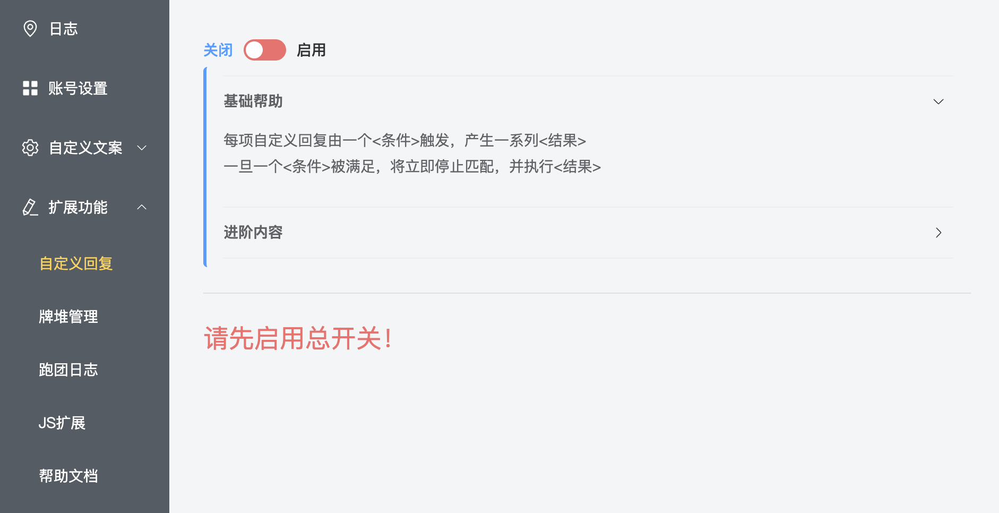
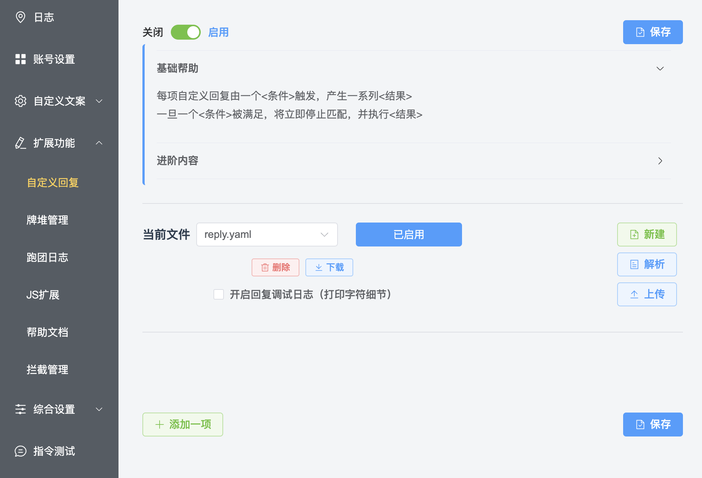
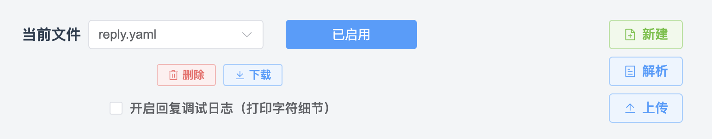
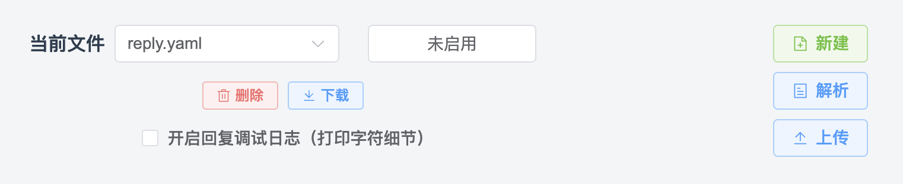

# 自定义回复

::: info 本节内容

本节将介绍自定义回复功能，请善用侧边栏和搜索，按需阅读文档。

:::

## 什么是自定义回复？

> - 我希望让骰子能回复用户发送的早安、午安、晚安，应该怎么做？
> - 我不会 JavaScript，有没有更简单的方式给骰子编写功能呢？
> - ……

如果希望骰子能对某些关键词做出响应，最简单的方式就是使用「自定义回复」功能。

::: info 示例

<ChatBox :messages="[
{content: 'v我50', send: true},
{content: '¥50'}
]"/>

:::

「自定义回复」是海豹核心提供的一种功能扩展方式。它能够在收到的消息符合一定条件时，做出灵活的回应。

自定义回复的形式自由，触发机制多样（关键字、正则表达式等），并且能配合海豹核心的变量系统与牌堆功能使用。无论你只是想增加简单的回复，还是需要复杂的判断和响应，都可以尝试使用自定义回复。

## 在哪编写自定义回复？

点击海豹 UI 界面的「扩展功能 - 自定义回复」选项，你就可以进入「自定义回复」的设置页面。

默认情况下，自定义回复功能是被关闭的，你可以点击 **页面左上角的开关** 打开这一功能，在同意许可协议后，你就可以看到自定义回复的设置页面，下面我们将一一介绍其中的功能。

在页面的上半部分，你可以看见一些帮助信息，阅读它们也能为编写自定义回复带来帮助。

### 当前回复文件

「自定义回复」支持多个设置文件，你可以在下拉框选择进行切换。默认状态下，会有一个名为 `reply.yaml` 的初始自定义回复文件，可以直接在该文件中进行自定义回复的编写。

你可以分别控制回复文件的启用与否。启用了的回复文件会显示「已启用」，如果显示「未启用」，可以点击它启用该文件。

对于每一个自定义回复文件，都可以进行「删除」和「下载」操作，方便你管理和分享它们。

在编写过程中，可以勾选「开启回复调试日志」项，来为你编写回复提供更多有用信息。

::: danger 危险：谨慎删除！

点击「删除」时，会弹出二次确认框。**一旦点击确认，删除的文件将无法找回**，务必在删除时小心确认。

可以选择点击「已启用」按钮禁用它来代替删除。

:::

### 新建/导入自定义回复文件

在当前文件的右侧有几个按钮，它们是快速创建新自定义回复的不同方式：

- 新建：创建一个新的自定义回复文件。在你想要将不同的回复区分开，方便管理的时候，可以新建一个文件；
- 上传：直接上传 `.yaml` 格式的自定义回复文件，通常来说这是其他人分享给你的。

### 获取自定义回复文件

你可以在 [自定义回复仓库](https://github.com/sealdice/reply) 或官方群的群文件中找到其他骰主分享的文件，使用「上传」功能导入它们。

::: tip 提示：无法访问仓库？

仓库位于 GitHub，访问时请确认你的网络状况。

:::

### 公共条件 <Badge type="tip" text="v1.4.6"/>

从 <Badge type="tip" text="v1.4.6"/> 版本开始，在当前文件信息的下面、本文件所有回复项目上方新增了「公共条件」选项。

公共条件属于当前自定义回复文件，而不属于任何一个回复项。每一项公共条件是一个逻辑判断，它的含义与 [单个回复项的条件](#回复项的条件) 相同。

在判定一个自定义回复是否能执行时，会首先判断文件的公共条件是否全部满足；如果全部满足，才会依次判断每个回复项的条件；否则，将跳过本文件内的所有回复项。

## 设置回复项

在自定义回复页的左下角有一个「添加一项」按钮，点击可以向当前文件中添加一条回复项。

每一个自定义回复项都包括两个部分：**「条件」** 和 **「结果」**，分别对应着该回复项的触发条件和骰子的回复动作。

在回复项的左上角可以控制该项的启用与否，右上角可以删除这一条回复项。当回复项较多的时候，可以点击「收缩」来将不重要的项折叠起来。

::: tip 提示：随时保存修改

记得随时保存自己的修改，防止改动内容丢失。

:::

### 回复项的条件

在回复项的左上角是该项的匹配模式，可以理解为当什么情况下会触发这一条回复项。目前提供了三种匹配模式：

- 文本匹配：即设置什么样的内容会触发这条回复项；
- 文本长度：即当回复内容的长度满足什么条件时会触发这条回复项；
- 表达式为真：此处不介绍，见 [更复杂的回复](#更复杂的回复)。

回复项的条件支持多个，点击「增加」即可为该回复项增加一个条件。当回复项有多个条件时，**必须同时满足所有条件** 才会触发该回复项。

::: tip 提示：如何实现多个内容中任意一个均可触发回复项？

> - 我希望 `v我50` 和 `vme50` 任意一个都能触发同样的回复，我该不会需要编写两条相同的回复项吧？

当然不用！你可以使用文本匹配中的「任意相符」方式来实现，或者直接使用「正则匹配」方式。见 [文本匹配](#文本匹配)。

:::

#### 文本匹配

文本匹配支持多种方式，在内容中填写要匹配的内容，即可按设置的方式匹配触发回复项。

- 精准匹配：当骰子收到和内容 **完全一致** 的消息时，触发该回复项；
- 任意相符：收到符合任意一个内容的消息时，都能触发该回复项，如 `aa|bb`，则 aa 或 bb 均可触发；
- 包含文本：消息包含此内容时触发；
- 不含文本：消息不包含此内容时触发；
- 模糊匹配：消息与内容相似时触发该回复项；*（普通用户无需纠结什么叫相似）*
- 正则匹配：消息匹配正则表达式时触发，此处不介绍，见 [更复杂的回复](#更复杂的回复)；
- 前缀匹配：消息以内容为开头时触发；
- 后缀匹配：消息以此内容为结尾时触发。

:::: info 「任意相符」示例

设置：任意相符，文本 `a|b`，回复 `c`。

::: tabs

== 输入：a

<ChatBox :messages="[
{content: 'a', send: true},
{content: 'c'}
]"/>

== 输入：b

<ChatBox :messages="[
{content: 'b', send: true},
{content: 'c'}
]"/>

== 输入：ab（不回复）

<ChatBox :messages="[
{content: 'ab', send: true}
]"/>

== 输入：a|b（不回复）

<ChatBox :messages="[
{content: 'a|b', send: true}
]"/>

== 输入：其它（不回复）

<ChatBox :messages="[
{content: '114514', send: true}
]"/>

:::

::::

::: tip 提示：常用方式

「精准匹配」与「任意相符」是最常用的模式。当然，对于了解正则表达式的用户，「正则匹配」也是经常被使用的。

:::

#### 文本长度

指定字数，当消息长度「大于等于」或「小于等于」给定的字数时触发对应回复项。

::: warning 注意：注意汉字的长度

在文本长度匹配中，一个汉字算作两个字符。如 `你好` 两字可以触发大于等于 4 的文本长度匹配。

:::

### 回复项的结果

每一个回复项可以有一个或者多个「回复结果」，多个回复结果将 **从上到下依次执行**。点击「增加」可以新增一条结果，也可以通过「删除结果」按钮去掉对应结果。

每一个回复结果可以有多条回复文本，结果会在这些文本中 **随机抽取** 一条作为结果。

回复可以是直接的回复，也可以指定是「私聊回复」或者「群内回复」。

::: tip

回复项有几个结果，该回复项就会发送几条消息。

:::

#### 回复结果延迟

可以给回复结果设置延迟，消息将在此延迟后发送，单位是秒，可以是小数。

::: warning

QQ 消息的随机延迟仍会被加入，如果你希望保证发言顺序，记得考虑这点。

:::

## 更复杂的回复

> - 自定义回复要怎么抽取牌堆？
> - 我想控制只有私聊才触发回复，要怎样设置？
> - 我希望编写有一定逻辑的自定义回复，我要怎么做？
> - 前缀/后缀/包含等文本匹配方式不够用/出现误判，听说可以用正则匹配解决？要怎样使用呢？
> - ……

更复杂的自定义回复编写，会涉及到海豹提供的其他系统，如牌堆、内置脚本语法、变量机制等。也有可能要求你有其它知识的了解，如正则表达式等。

如果你有复杂回复编写的需要，或想了解更多细节，可以跳转到 [进阶 - 编写自定义回复](../advanced/edit_reply.md) 进行阅读。
