# 配置安卓端保活

::: info 本节内容

本节包含在主流安卓操作系统上允许海豹核心在后台运行，以便顺畅使用的方法。

:::

为了应付流氓软件，大部分系统往往会限制应用程序在后台的活动，甚至强制使它们退出。遗憾的是，手机版海豹核心也往往遭到误杀。为了确保海豹核心不会在使用其他应用程序或手机熄屏时掉线，需要调整一些系统设置来确保其能够在后台存活。

::: tip 提示：不断尝试

你的操作系统会不断调整各个程序的活动策略，因此本节中介绍的手段并不总是万无一失。同样地，你也不一定需要诉诸所有方法才能保证海豹核心的存活。如果条件允许的话，你可以选择性地采用本节介绍的方法，或发掘一些新的手段，多试验几次来找到最适合你设备的策略。

当然，如果你并不确定该怎么做，遵循下面介绍的步骤总是最保险的。

:::

在继续之前，你应该先从[官网下载](https://dice.weizaima.com/download)安卓版海豹核心，并将其安装到你的设备上。

## 授予海豹核心必要权限

海豹核心需要必要的权限来正常运行。在安装后或首次启动时，你应当确保应用程序已经拥有充足的权限。

::: tip 提示：「应用信息」界面

在授予海豹核心权限或允许一些行为时，你需要访问系统设置的「应用信息」界面（在一些系统上可能也称作「应用详情」）。通常而言，你可以通过以下方法访问这个界面：

1. 在桌面长按海豹核心图标，在弹出的菜单里选择「应用信息」或是类似小写字母 i 的图标。

2. 或者，打开系统设置，找到「应用管理」（一些系统也称「应用和服务」）选项。进入应用管理后，你通常会看到展示设备上所有应用的列表。请在列表中选择「海豹核心」。

你可以在应用信息界面管理海豹核心的权限、后台行为、数据使用等。

:::

## HyperOS

在 HyperOS（澎湃系统）中，启动核心前请全部允许这些权限。「访问存储空间」被拆分为三个权限：「照片和视频」「音乐和音频」「文件和文档」。

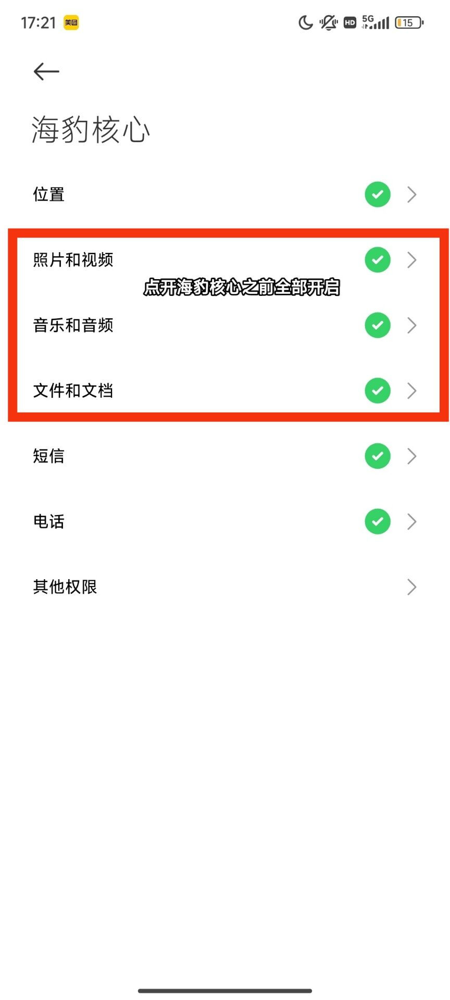

请始终开启「锁屏显示」「后台弹出界面」「显示悬浮窗」「动态壁纸服务」四项权限。

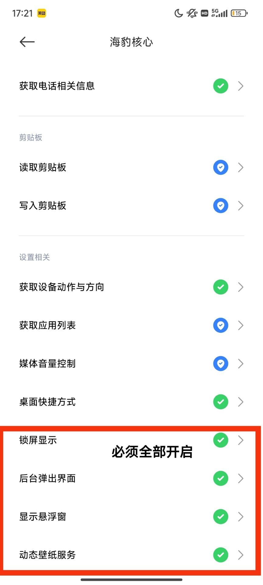

长按海豹核心的任务卡片，并点击锁图标。

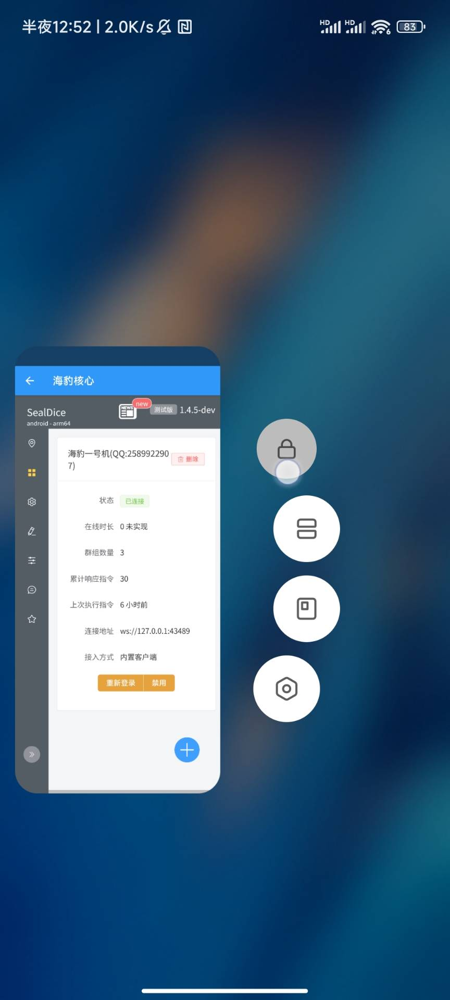

如果保活仍然失效，请尝试在应用信息界面中开启「自启动」。

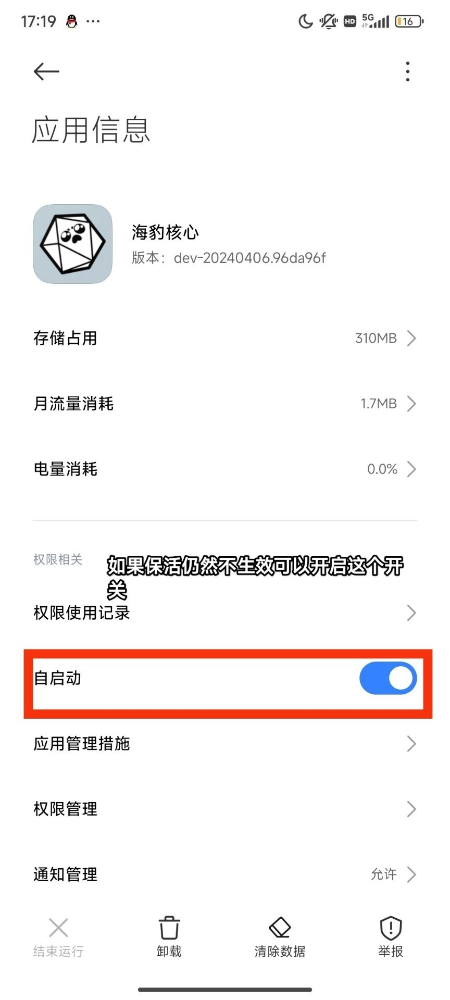

## MIUI

初次启动时提示是否运行“海豹核心”发送通知，选择「始终允许」。

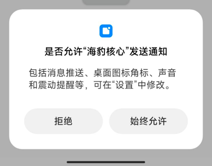

第二步，在海豹核心的后台配置中选择「无限制」。

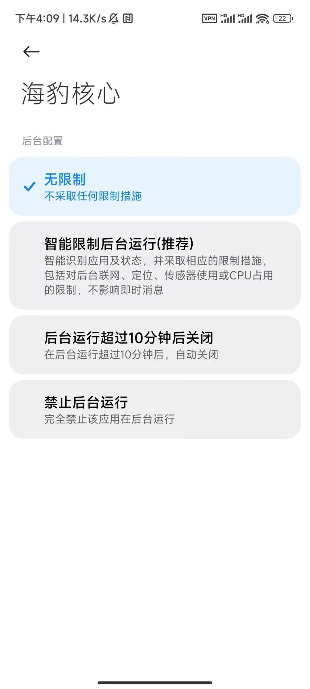

第三步，长按海豹核心的任务卡片，并点击锁图标。

## 鸿蒙系统

在「应用和服务」中，选择「应用启动管理」，找到海豹核心，关闭其「自动管理」开关，并允许自启动、关联启动和后台活动。

回到「设置」主页，选择「电池」项目，开启性能模式，并进入「更多电池设置」，在新界面中开启「休眠时始终保持网络连接」。

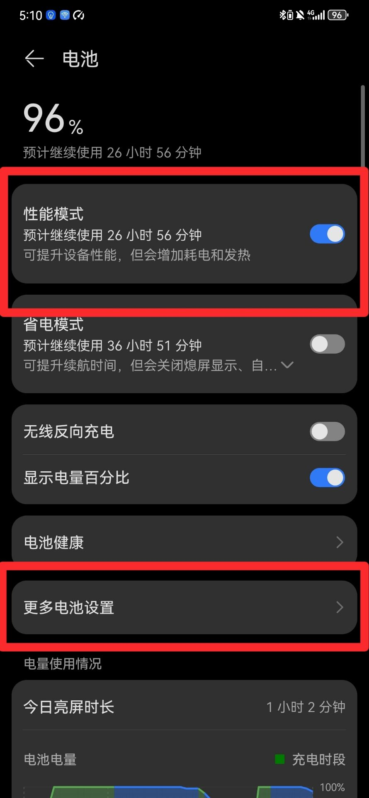

 

在「设置」>「隐私」>「权限管理」>「特殊访问权限」>「电池优化」项目找到海豹核心，选择「不允许」。

将海豹核心的任务卡片下拉并释放，见到卡片右上角出现锁图标即可。

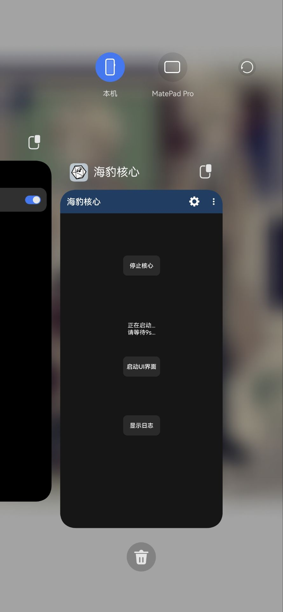

## ColorOS

选择「耗电管理」，优先开启所有选项。

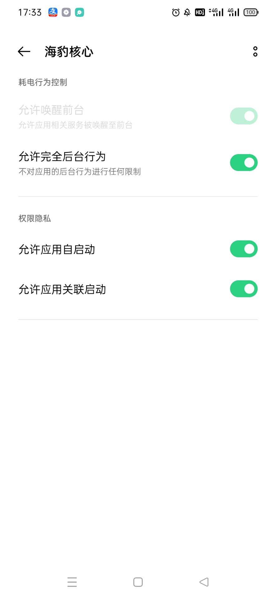

已知护眼模式可能会导致海豹核心意外关闭，请不要开启。

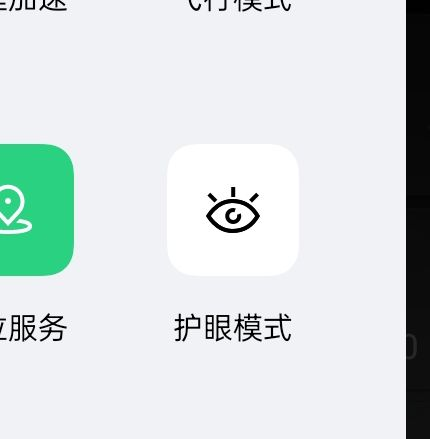

选择海豹核心任务卡片右上角的三个点，并选择「锁定」。

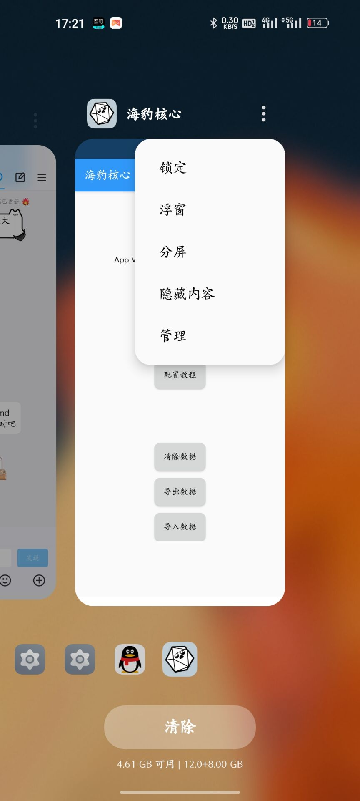

::::

为了海豹持续运行，请不要将海豹从任务列表中划除。或者，你可以在海豹核心的设置中选择「从任务列表隐藏」。

## 通用设置

### 存储权限

在**初次启动海豹核心前**，你必须允许海豹核心访问存储空间，这通常在安装应用时就已经默认开启。没有相关权限，海豹核心将无法正常运行。

如果你的系统没有自动允许海豹核心访问存储空间，请在「应用信息」中选择「权限管理」（你可能需要选择「显示所有权限」），并允许「访问存储空间」权限。

### 通知权限

首次启动海豹核心时，你可能会收到「是否允许海豹核心发送通知」的对话框。请**始终允许**海豹核心发送通知，此后你可能会在通知栏看到「海豹核心正在运行」的消息，这是保活策略的一部分。

如果你不慎拒绝通知权限，可以稍后在系统设置中授予海豹核心相关权限。

### 应用内设置

在海豹核心应用中，选择右上角的设置图标，可以看到一些保活策略。通常来说，启用上面的系统设置已经足够，但如果你发现海豹核心仍然时常掉线，可以考虑这里的额外手段。

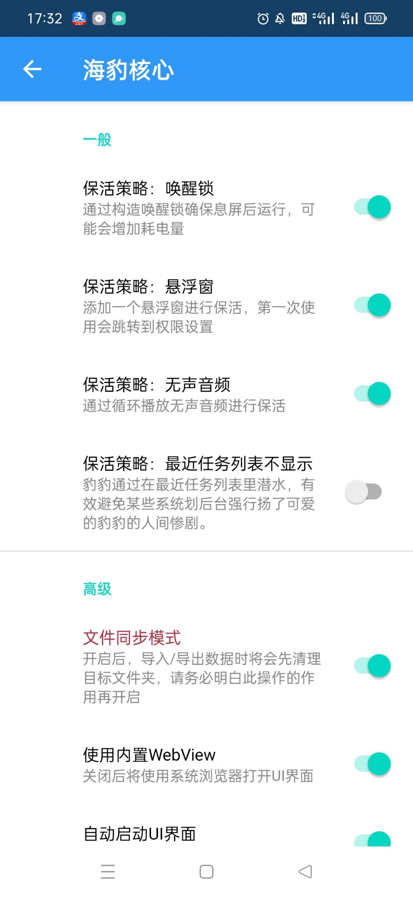

前三个策略可能需要相应权限才能生效。
