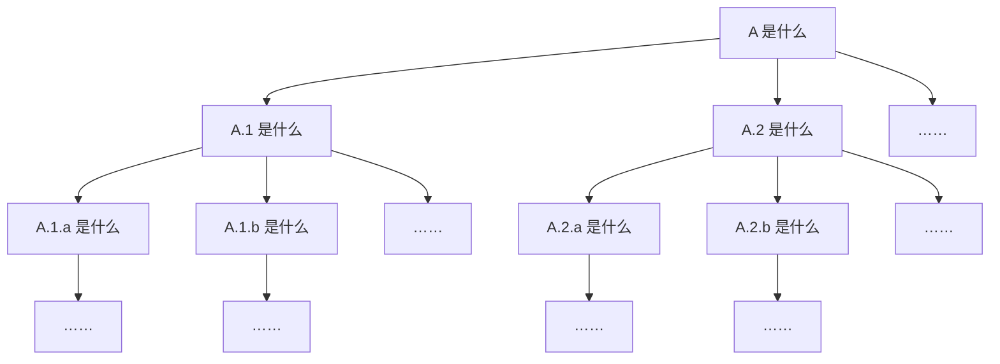

# 如何高效学习

::: info 本节内容

本节为计算机小白指南中的第二部分。

本节旨在帮助先前未曾接触过计算机以及服务器，或者对计算机及服务器知之甚少的用户在遇到不理解的教程、名词或操作时，能够高效学习上手相关知识。

关于如何正确地提问，请看 [如何正确提问](./newbie_question)；关于一些小白常见的问题，请看 [计算机小白常见问题](./newbie_faq.md)；关于特定的名词术语解释，请看 [名词/术语速查表](./newbie_terms.md)。

:::

## 前言

如果你从未接触过计算机以及服务器，那么不免会对本手册中的大量概念感到陌生。一些看起来详尽的指导细细读来却可能完全看不懂。我们不希望你就此放弃，以至于错失了一个全新的、有趣的世界；我们也不希望你放弃自己思考的权利，将一切不明了的问题诉诸他人的帮助。因此，我们撰写了本篇文档，希望能够帮助你掌握一些快速学习新知识的小技巧。

## 掌握语言

无论是帮助文档、程序日志还是网络资源，英语目前是，并且在未来很长一段时间里仍将是，主流的语言。因此，提高你的英文水平，不仅可以帮助你看懂程序日志上的故障原因（这样你就能自己解决问题），还可以让你看到更高效地获取那些有用的信息（比如下文里写到的那些）。

因此，如果你仍在上学，英语学习得再努力一点，终将有所回报。如果你不得不在短时间内理解特定的英文内容，那常备翻译器显然是一个好选择。

## 寻求资源

当遇到不理解的概念时，我们的第一反应往往是去搜索引擎寻求答案。但是，如果你正在解决特定项目中遇到的问题，不妨先看看此项目的帮助文档、常见问题（FAQ）和 GitHUb 上的 [Issue](./newbie_terms#issue)。

一个合理的开源项目，往往都具备相对详尽的帮助文档，描述了使用这个项目的过程中可能涉及的方方面面。例如，你正在阅读的就是海豹骰点核心的用户手册，亦即帮助文档。帮助文档通常包含了各个项目从部署到使用的一系列教程，在你具备相关背景的情况下，阅读帮助文档远比直接使用搜素引擎高效得多，因为帮助文档中提供的信息都是服务于特定项目的，而搜索引擎往往只能找到泛化的知识。

常见问题也是众多开源项目都拥有的页面，例如本手册中的 [计算机小白常见问题](./newbie_faq.md) 和 [常见问题](../use/faq.md) 两个页面。这些页面中，通常包含使用此项目的用户高频提出的问题，而你遇到的情况，很有可能在其中就有所描述。因此，如果在手册的一般教程中没能找到答案，访问常见问题页面或许可以解决你的问题。

如果你不知道 Issue 是什么，可以点击本部分第一段中的超链接查看。Issue 通常包含了此开源项目的用户所遇到的问题、发现的可能的 Bug 和提出的功能请求。Issue 页面就像一个讨论区，你很可能找到一些使用上的问题，大多数情况下都会有热心的网友在页面下方给出他们的解决方案。如果你发现你的问题在 Issue 列表中存在，并且存在 Bug 的字样，那么很有可能你遇到的是此项目的已知问题。安心等待开发者解决就好，或者你也可以学习编程，为修复此 Bug 做出贡献。如果你发现你的问题在 Issue 列表中存在，并且存在 Feature Request 或 Enahncement 的字样，那么说明你需要的功能目前尚未实现，并且已经有其他用户向开发者请求加入此功能。你可以给此 Issue 点赞或评论，或许可以增加此功能的优先级，但切忌评论轰炸。在 Issue 中反复刷屏同样的内容只会带来负面后果。同样地，或许你也可以学习编程，为提供此功能做出贡献。

另外，你可能已经注意到了，本手册特别提供了 [名词/术语速查表](./newbie_terms)。在求助搜索引擎或用户群之前，可以看看里面是否已经包含了你想了解的概念。在速查表中，我们尽力提供了深度恰到好处的知识，不至于过于专业，但又足够你解决问题。如果你想改进速查表的内容，你可以提出一个 PR。如果你不知道 PR 是什么，那么可以按照本页后续的内容，将这作为你的第一个新知识开始学习。

## 高效搜索

如果你知道如何访问 Google，那么请使用 Google 进行搜索。如果你英文足够熟练，那么请使用英文进行搜索。

百度（还有 CSDN）永远不会是你学习计算机领域知识的最佳选择。一个更高效、搜索结果偏见更少的搜索引擎能显著提高你的信息获取效率。当然，如果你无法访问 Google，那么必应（Bing）**海外版**或许是一个尚可接受的选择。

如果你无法访问上述资源，那么在国内众多的内容平台中，学会筛选更可靠的平台也将大大提高你的知识获取效率。通常来说，技术型的个人博客和知乎平台具有相对优质的内容。如果你发现某个页面包含你需要的信息，但排版混乱或内容过于老旧已经不再适用，你可以尝试在内容的开头和结尾去寻找原文链接。通常这类文章是搬运而来，而其出处往往具有更优质的排版，有时原作者也会对其进行更新。

另一方面，互联网上的英文内容数量是具有压倒性的优势的，如果你能用英文提出问题，那么就有更大的概率直接检索到问题的解决方案。从类似 Stack Overflow 的问答网站到个人博客，你在中文互联网上找到的技术性信息，许多都源于对这些外文内容的翻译和多次搬运。因此，与其拾人牙慧，不如直抵源头。

随着大语言模型的兴起，AI 也可以是你「搜索」的对象。它们往往能比传统搜索更快地获得信息。但是，你应该永远对 AI 生成的内容心存警惕。在「幻觉」问题尚未得到有效解决之前，AI 的每一个回复都有可能是真材实料的信息，也有可能是胡编乱造。因此，在严肃场合，你不应该不加校验地使用 AI 生成的内容。

## 实践学习

### 深度优先学习

在学习新概念的过程中，我们很可能遇到用于解释新概念的描述中，也包含着我们不理解的知识的情况。如图所示，深度优先的学习即是每遇到一个新概念，都重新去查找学习这个概念所包含的下属知识，直到对每一个细节再无疑惑的方式。

例如：

::: info 一个小例子

你可能想编写一个能够在用户发出符合某种规则的消息时，针对性地进行自定义回复的功能。通过搜素自定义回复，你找到了海豹手册的 [自定义回复教程](../advanced/edit_reply)。

在触发条件部分，你发现你可能需要学习正则表达式，于是你访问了教程开头的链接，或者在搜索引擎中查找了正则表达式教程。

在正则表达式教程中，你发现 `\s` 可以用于匹配 whitespace，于是你搜索引擎中开始查找 what does whitespace mean……

:::

如果你只使用深度优先的方式学习知识，那么当你最终回到一开始的目的（比如写一个自定义回复）时，你应该已经掌握了隐藏在触发条件与回复结果背后的全部知识，从此只要是自定义回复能实现的功能，对你来说都不再有任何困难。

然而，可以预见的，随着学习的不断深入，你需要学习的内容会爆炸式增长。所以，皓首穷经地学习每一个细节真的值得么……？

### 广度优先学习

与深度优先学习相反，广度优先的学习即是在遇到新概念时，大致了解其含义，便开始学习下一项内容。

例如：

::: info 又一个小例子

你遇到了一些故障，在用户群里有人和你说

> 你在运行海豹的终端把日志截图一下。

你不知道终端是什么意思，于是你在 [名词/术语速查表](./newbie_terms) 中翻阅了一下。虽然你对什么是 Shell、什么是命令行一知半解，但是你差不多知道他指的是那个在电脑上弹出来的黑框框。

于是你又看了一眼日志是什么意思。虽让你搞不懂什么 Warning 与 Error,但你知道黑框框里那堆文字就是日志。

最后，因为你从没在电脑上截屏过，你去搜索了一下，找到了 Snipaste 这一截图工具。把黑框框里的文字截图发了出去。

:::

如果你只使用广度优先的方式学习知识，那么可能你很快就能达成一开始的目的。

然而，你对所有涉及的概念都一知半解。如果再遇到类似的问题，尽管可能只需要你做相似的操作，由于你并没有领会每一个细节，你依然不得不求助于人。所以，这样草草浏览知识真的正确么……？

### 所以……

在实际学习新知的过程中，两种方法往往是相辅相成的，另外，实践永远是学习的最佳方法。

你通常需要以深度优先的方式，了解一个概念背后的一些细节，直到这些细节足够你应对眼前的问题和未来可能遇到的相似的问题，然后转向下一个概念进行学习。执着于过于深入的细节只会拖慢你的学习速度，因此，在合适的位置停下是最为高效的方案。

同时，在脑海中思考千遍，不如把手放在键盘上，尝试敲出你理解的方案。程序实际运行时给出的反馈，会大大帮助你找到正确的方向，而闭门造车只会延长你设计方案到发现错误的时间

## 结语

以上就是我们总结出的，要在使用 SealDice 时**更快地学习新概念**的办法。希望通过这样的办法，能让你更有效率地解决在部署 SealDice 的过程中遇到的问题。

**也希望你通过本系列科普有所收获。**
