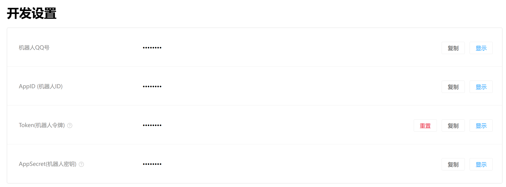
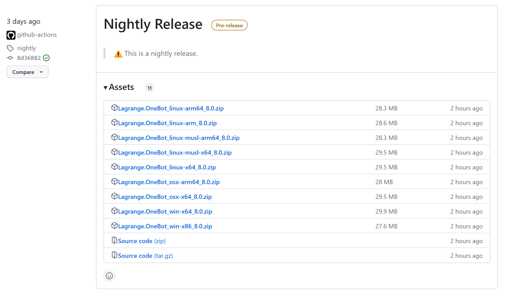
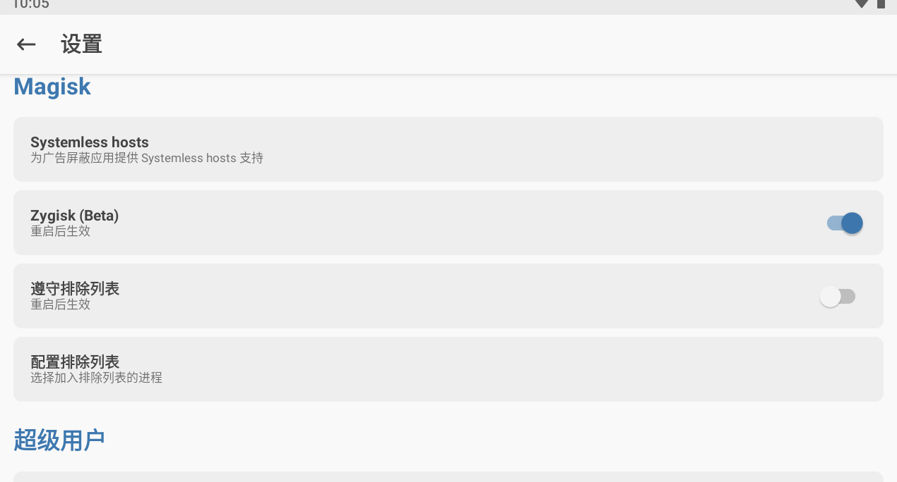
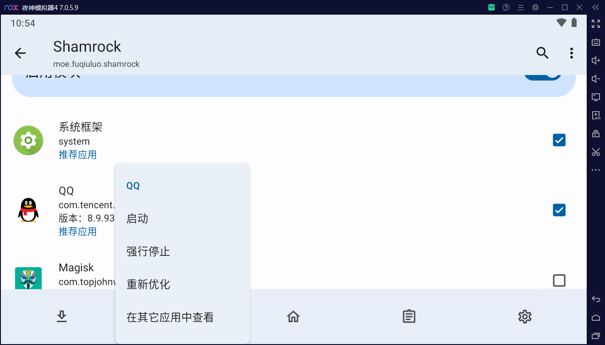
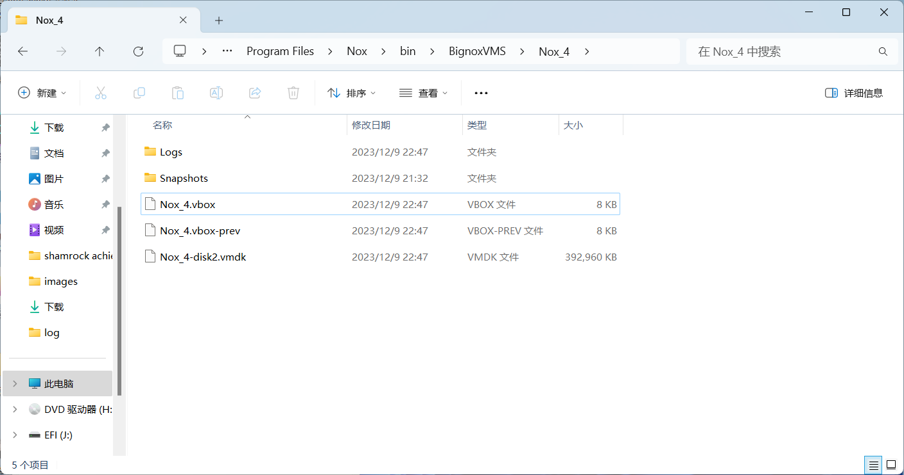
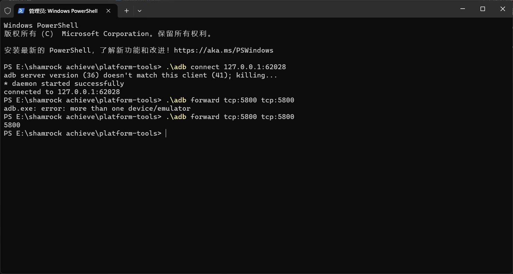
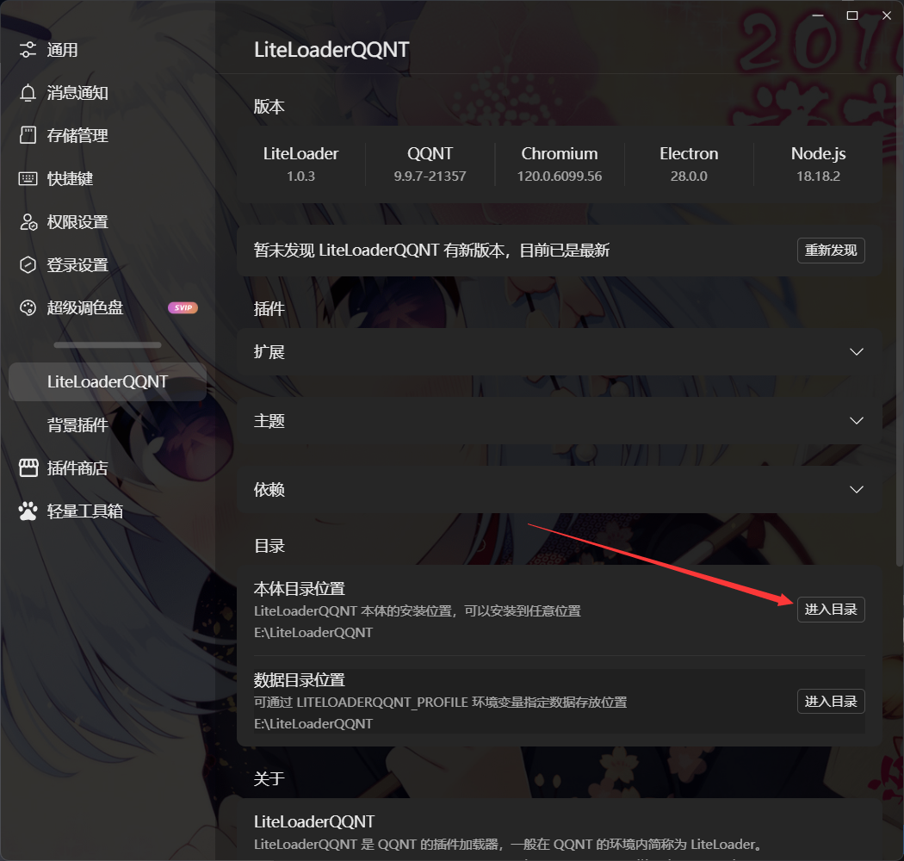
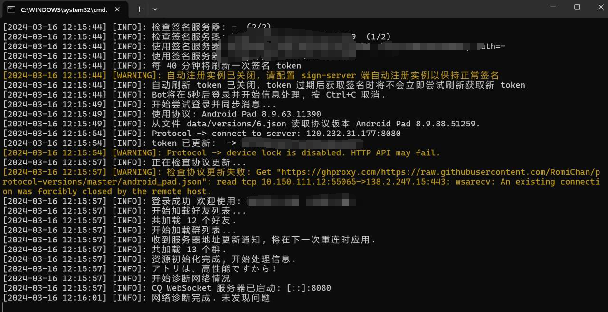
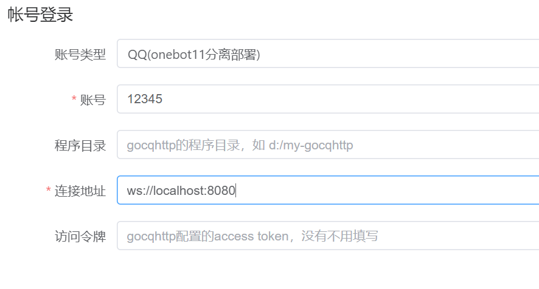

# QQ

::: info 本节内容

本节将包含你在 QQ 平台接入海豹核心需要了解的特定内容。

由于众所周知的原因，在 QQ 平台部署机器人目前有一定难度。所有支持的途径参见侧边目录，本节提供了多种对接途径的引导：

- 如果你有 QQ 官方机器人权限，见 [官方机器人](#官方机器人)；
- 需要比较简单的部署流程的，见 [LLOneBot API](#llonebot-api)；
- 需要比较简单的部署流程，且有能力上 Telegram 的，见 [Lagrange](#lagrange)；
- 能接受复杂部署流程，有能力自行部署 QSign，需要功能支持完整的，见 [Go-cqhttp](#go-cqhttp--mirai)。该部署方式中的常见问题解答见 [FAQ](#gocqhttp-faq)；
- Android 手机/模拟器用户见 [Shamrock](#shamrock)（需要 Root）或 [Shamrock LSPatch](#shamrock-lspatch)。

不同的对接方式适应不同的情况，可能会存在途径特有的功能缺失和其它问题，请根据自己的情况选择适合的方式。

:::

## 官方机器人 <Badge type="tip" text="v1.4.2" vertical="middle" />

海豹从 `v1.4.2` 开始支持对接 QQ 官方的机器人服务。

::: warning QQ 机器人

QQ 官方目前已开放了机器人功能，可进入 [QQ 开放平台](https://q.qq.com/#/) 进行申请。

但截止到目前，**QQ 官方机器人的群聊权限并未对所有人开放**。我们也希望在未来，每个人都能轻松地对接上官方提供的机器人服务。

同时，由于 QQ 官方对机器人能力的严格限制（包括获取 QQ 号、昵称，非 @ 时响应，私聊，群控等大量功能目前不支持），目前**对接官方接口的骰子很多功能无法支持**（如跑团 Log，暗骰，对抗等）。

:::

### 尝试一下

如果你想尝试一下这样的机器人，非常欢迎你使用海豹官方的骰子：


### 获取连接所需信息

要获取用于连接海豹的信息之前，你需要建立好一个 QQ 机器人应用。可前往 [QQ 开放平台](https://q.qq.com/#/) 进行申请，进行**实名**注册后，创建一个机器人应用。

创建完成后，进入机器人管理后台，切换到「开发设置」页面：


在页面中你可以看到这样的信息，其中「机器人ID」「机器人令牌」「机器人密钥」这三项是海豹进行连接所需要的。



### 连接海豹

登录海豹并添加账号，选择「QQ(官方bot)」。填写对应的信息点击连接。你的海豹应该可以正常连接官方机器人运作了！


### 使用海豹

::: warning 注意

目前官方机器人只响应包含 `@` 的消息，操作时请注意。

:::

## Lagrange <Badge type="tip" text="v1.4.2" vertical="middle" />

海豹从 `v1.4.2` 开始适配了 Lagrange（拉格兰）的连接。

::: info Lagrange

Lagrange（拉格兰） 是一个 NTQQ 协议相关的开源项目。其包括目前实现了 Linux NTQQ 协议的 Lagrange.Core，和提供 OneBot-V11 Api 的 Lagrange.Onebot 两部分。

与 GoCqhttp 类似，Lagrange 可以很方便的在多个平台（Windows、Linux、Mac）部署，海豹核心可以对接其提供的 OneBot-V11 Api 来提供 QQ 骰子服务。

:::

### 准备 Lagrange

可以在 [Lagrange Github Release](https://github.com/LagrangeDev/Lagrange.Core/releases) 中获取到 Nightly 版程序，根据你的系统选择相应版本下载，例如：

- Windows 通常选择 `win-x64` 版本；
- Mac（Intel 芯片）选择 `osx-x64` 的版本；
- Mac（Arm 芯片，如 M1、M2、M3 等）选择 `osx-arm64` 的版本；
- ……



::: details 使用 Lagrange Action 版本

你还可以选择使用 Lagrange 在 Action 中自动构建的版本，这些版本是 **最新** 的构建。在使用这些版本时，你需要安装对应版本的 .Net SDK。

**除特殊情况外，我们始终建议你选择前面提到的 Nightly 版本。**

可以在 [Lagrange Github 仓库](https://github.com/LagrangeDev/Lagrange.Core) 中的 Action 页面，进入位于列表最前一条的最新制品页面，根据你的系统选择相应版本。


点击进入页面后拉到最下方，选择相应版本下载。


:::

### 运行 Lagrange

解压下载的 Nightly 版的 Lagrange 压缩文件，你可以看见名如 `Lagrange.OneBot.exe` 的应用程序，双击启动即可。启动时有可能会先弹出如下警告，按步骤允许即可：


成功启动后可以发现打开了如下的命令行窗口，其中提示已创建了一个配置文件：


可以发现，在程序所在的文件夹中多出了一个 `appsettings.json`，这是 [Lagrange 的配置文件](#lagrange-配置文件)，你需要打开并修改其中的一些项。也可以在启动前直接手动新建 `appsettings.json` 并写入内容。

修改后内容大致如下：

`appsettings.json`：

```json
{
  "Logging": {
    "LogLevel": {
      "Default": "Information",
      "Microsoft": "Warning",
      "Microsoft.Hosting.Lifetime": "Information"
    }
  },
  "SignServerUrl": "",
  "Account": {
    "Uin": 0,
    "Password": "",
    "Protocol": "Linux",
    "AutoReconnect": true,
    "GetOptimumServer": true
  },
  "Message": {
    "IgnoreSelf": true
  },
  "Implementations": [
    {
      "Type": "ForwardWebSocket",
      "Host": "127.0.0.1",
      "Port": 8081,
      "HeartBeatInterval": 5000,
      "AccessToken": ""
    }
  ]
}
```

其中有几个重要的设置项需要填写和注意：

- `Password` 为空时为扫码，这里请留空。
- `SignServerUrl`：NTQQ 的签名服务地址，**注意此处的签名服务需要是 Linux NTQQ 签名服务，不可以使用 QSign、Shamrock 等提供的 Android QQ 签名服务**；
- `Implementations`：这是 Lagrange 的连接配置，海豹将使用 `ForwardWebSocket`，即正向 WebSocket 方式连接 Lagrange，该方式下的 `Host` 和 `Port` 是 Lagrange 将提供的 **OneBot-V11 正向 WS 服务地址**，记下以供后续使用。如果对应端口已占用请自行调整。

::: info Linux NTQQ 的签名服务

由于众所周知的原因，Lagrange 不能提供公共签名服务，海豹官方也不会对相关信息进行说明。请在 Lagrange 的 README 中自行寻找相应 TG 群，寻找由海外热心网友提供的一些帮助。

:::

修改配置完成后的文件夹如下：


在配置文件按需要正确修改后，在命令行中按任意键，Lagrange 将正式运行。在同一文件夹下会出现一张登录二维码图片 `qr-0.png`，在二维码过期前尽快使用手机 QQ 扫码连接。

::: details Action 版 Lagrange 与 .Net SDK

Action 中获取的 Lagrange 依赖 .Net SDK，如果你在运行 Lagrange 时出现报错，需要去下载 [.Net SDK](https://dotnet.microsoft.com/zh-cn/download) 并安装。

在下载 Lagrange 时，后缀中的数字说明了其对 .Net 版本的需求，请根据说明下载对应版本（例如后面是 8.0，则需安装 SDK 的版本为 8.0）。

此外，与 Nightly 下载后解压的单文件版本的 Lagrange 不同，在解压 Action 制品压缩文件后，你可以看见 `Lagrange.OneBot.exe` 等多个文件，这些文件都是运行必不可少的。

包括生成的配置文件在内，一个正确的 Action 版 Lagrange 文件夹如下：


:::

### 海豹连接 Lagrange

进入海豹 Web UI 的「账号设置」新增链接，选择账号类型「QQ(onebot11分离部署)」。

账号填写骰子的 QQ 号，连接地址使用上面记下的 WS 正向服务地址 `ws://{Host}:{Port}`，如 `ws://127.0.0.1:8081`。


成功连接后即可使用。

### Lagrange 配置文件

与可执行文件在同级目录下的 `appsettings.json` 文件，是 Lagrange 的配置文件。

最新的 Lagrange 会在没有该文件时自动创建默认配置，如果没有生成该文件，你可以按照 [官方仓库的最新说明](https://github.com/LagrangeDev/Lagrange.Core) 手动创建这一文件。

#### 旧版 Lagrange 配置

::: warning 使用最新的 Lagrange

**我们始终建议你升级到程序的最新版本，而不是为了沿用旧配置而保持旧版本。**

:::

::: warning Lagrange 配置文件版本

Lagrange 项目对其配置文件的格式进行过更改。如果你是在 2024 年 2 月 18 日或之前下载的 Lagrange 程序，请你参考下面的版本。

目前最新的 Lagrange 可以识别两个版本的配置文件，但依然建议修改为最新格式。

:::

如果你使用的是 2024 年 2 月 18 日或之前下载的 Lagrange 程序，或使用前面提到的配置出现问题，请尝试替换为以下配置：

```json
{
  "Logging": {
    "LogLevel": {
      "Default": "Trace",
      "Microsoft": "Warning",
      "Microsoft.Hosting.Lifetime": "Information"
    }
  },
  "SignServerUrl": "",
  "Account": {
    "Uin": 0,
    "Password": "",
    "Protocol": "Linux",
    "AutoReconnect": true,
    "GetOptimumServer": true
  },
  "Message": {
    "IgnoreSelf": true
  },
  "Implementation": {
    "ForwardWebSocket": {
      "Host": "127.0.0.1",
      "Port": 8081,
      "HeartBeatInterval": 5000,
      "AccessToken": ""
    }
  }
}
```

配置项的含义与之前的说明相同，可以做相同处理。

## Shamrock <Badge type="tip" text="v1.4.2" vertical="middle" />

海豹从 `v1.4.2` 开始适配了 Shamrock 的连接。

::: warning 有难度的操作

此方式存在一定难度，你可能需要对Root，使用命令行程序等有所了解。

:::

::: info Shamrock

[Shamrock](https://whitechi73.github.io/OpenShamrock/) 是一个基于 [LSPosed](https://github.com/LSPosed/LSPosed)/Xposed 框架，实现劫持 QQ 以对外暴露 Onebot Api 的软件。你可以在 Android 手机/模拟器中使用 Shamrock 代替已经停止开发的 gocq。

遗憾的是，Shamrock 的使用依赖于 Android 的 root 权限，而手机厂商对 root 管控愈加严格，实体手机获取 root 权限的门槛很高，而模拟器中使用 Shamrock 的效果也不是很可观。因此，这种解决方案适合个人与朋友使用骰子的场景。

此外，如果你想使用 Shamrock 代替 gocq，请确保你有良好的计算机使用能力。

本节主要讲解如何使用模拟器实现 Shamrock，如果你有一台已经 root 的手机，也可以参考本节内容，**本教程不涉及说明如何 root 手机**，海豹官方也不对 root 手机造成的后果负责，请自行斟酌。

:::

::: tip 如何 Root 手机

Root 手机可以参阅 [小米手机安装面具教程](https://magiskcn.com)。也可以前往 [酷安](https://www.coolapk.com/) 寻找更详细的教程。

:::

::: warning 低配置设备可能无法使用 Shamrock！

在尝试通过模拟器使用 Shamrock 的场景下，由于模拟器对性能要求较高，包括 **轻量级服务器**、旧电脑、小主机等配置较低的设备可能无法支持使用。

:::

### 准备模拟器

下面将使用 [夜神模拟器](https://www.yeshen.com/) 作为示例。

使用时，确保安卓版本在安卓 8 以上，而在安卓 11 以下，最好使用安卓 9。

### 获取 Root 权限

::: tip Magisk

Magisk（面具）是一套开源的 Android 自定义工具，通常用于获取 root 权限。

Root 即 Android 的超级用户权限，如对 QQ 应用进行注入等的危险操作需要 root 权限。

:::

*在使用之前，请在模拟器设置中打开 root 选项，软件中获取的一切权限都给予 **通过**，包括 **root 权限**。*

使用 [面具安装工具](https://cowtransfer.com/s/9794ead1113d47)，把它安装到模拟器。

然后启动软件，输入 `m` 回车，再输入 `y` 回车，会索取超级用户权限，给予，然后输入 `1` 回车，再输入 `a` 回车，输入 `1` 回车，此时面具就安装到你的模拟器上了。

打开面具模块，此时面具会索取超级用户权限，给予，此时你会发现你的超级用户权限那里是灰的，**关闭你的超级用户权限**，重新启动你的模拟器。

**此时你会发现你的超级用户模块已经激活**。在面具的设置里启动 `zygisk` 模块，随后你需要再次重启模拟器，使得 `zygisk` 模块生效。



### 安装 LSPosed 模块

::: tip 使用 xposed/edxposed

理论上，使用更为老旧的 xposed/edxposed 或在手机上运行虚拟机的 virtualXposed 的方案也是可行的，但我们不推荐也未尝试过使用它们。

**任何不按教程的行动请自行处理疑难问题**，海豹官方不对此提供帮助。

:::

请于 [LSPosed Releases](https://github.com/LSPosed/LSPosed/releases) 页下载模块。

::: warning zygisk

**务必**选择以 `zygisk` 结尾的包。

:::

下载完成后，把文件上传到模拟器中。一般情况下，直接把文件拖动到模拟器就可以传文件了，且文件一般在 `picture` 文件夹中，如果没有请参照你使用的模拟器说明。

在你传完文件之后，在最右侧切换到「模块」页后，你可以看到从本地安装的选项。单击你刚刚传到模拟器里的文件，等待安装完成即可，随后你可以在右下角看到重启按钮，点击等待重启。

安装完成后应该如下所示：


### 安装 Shamrock

请于 [Shamrock Releases](https://github.com/whitechi73/OpenShamrock/actions/workflows/build-apk.yml) 下载 Shamrock 的 apk 安装包，直接将 apk 文件拖动到模拟器即可进行安装。

如果模拟器中没有安装 QQ，此时你还需要将 [QQ](https://im.qq.com) 安装到模拟器中。

安装完成后，**首先启动 Shamrock**。在通知上，你可以打开 LSPosed 的页面，在**模块一栏中启用 Shamrock**。


选中 Shamrock，进入勾选 QQ，并长按 QQ 选择 **强行停止**。



随后再打开 QQ，你可以看到「加载 Shamrock 库成功」的提示，这代表 Shamrock 已经成功注入了 QQ。

成功注入后，打开 Shamrock 启用 ws 服务，通常情况下无需修改 Shamrock 的任何内容，如有其它需求请阅读 [Shamrock 文档](https://whitechi73.github.io/OpenShamrock/)。


### 开放模拟器端口供海豹对接

首先下载 [adb](https://developer.android.google.cn/studio/releases/platform-tools?hl=zh-cn) 工具，解压到电脑中任何可用的位置。

随后找到模拟器供 adb 连接的端口，夜神模拟器路径示例如下：



其中：
- `Nox` 是模拟器根路径。
- `Nox_4` 是模拟器的编号，你可以在多开助手中看到你的编号。
- 选中的文件就是要找的文件，在 vscode 中（或者其它文本编辑器）中打开。


`guestport` 值为 `5555` 的 `hostport` 即为所需端口，如示例中就是 **62028**，记住这个端口号。

在你解压的 `platform-tools` 里打开终端，或者把 `platform-tools` 加入环境变量后再启用终端。也可以在 `platform-tools` 里新建一个 `.bat` 文件，把下面的命令写到文件里面。

在打开的终端中输入命令：

```cmd
.\adb connect 127.0.0.1:端口
```

如替换为上面示例中的 **62828**:

```cmd
.\adb connect 127.0.0.1:62028
```

随后再执行：

```cmd
.\adb forward tcp:5800 tcp:5800
```

此时你已经成功开启端口了。



### 连接海豹

在账号添加中，选择「QQ 分离部署」，按照下面的格式进行填写：


成功连接后即可使用。

## Shamrock LSPatch <Badge type="tip" text="v1.4.2" vertical="middle" />

::: warning 有难度的操作

此方式存在一定难度，你可能需要对使用命令行程序有所了解。

:::

::: warning Andriod 版本要求

由于 LSPatch 要求安卓版本 9.0 以上，因此你的安卓手机版本必须超过安卓 9。

:::

::: info LSPatch

LSPatch 是在无 root 环境下使用 Shamrock 的一种途径，原理是利用 Shizuku 安装经 LSPatch 修补后的 QQ，再使用 Shamrock 劫持 QQ 并对外开放 API。

:::

### 安装 Shizuku

::: info Shizuku

[Shizuku](https://github.com/RikkaApps/Shizuku/releases) 是一个帮助其他应用直接使用系统 API 的应用，而 Shizuku 本身则需要通过电脑使用 adb 工具赋予权限。

Adb 即 [Android 调试桥](https://developer.android.com/studio/command-line/adb?hl=zh-cn)，是安卓官方提供的帮助在电脑端调试 Android 设备的命令行工具。

:::

首先需要在你的手机安装 Shizuku，安装后需要在电脑中使用 adb 命令为其赋予权限。

::: tabs

@tab Windows#windows

**在 Windows 中使用 cmd 执行 adb 命令：**

1. 安装 adb，工具下载见 [上文](#开放模拟器端口供海豹对接)；
2. 打开 cmd 窗口；
  - 如果你的电脑是 Window 11 操作系统，你可以直接右键 `platform-tools` 文件夹单击 **在此处打开命令行**；
  - 其它版本的打开方式请自行搜索。
3. 你有多种方式使用 adb：
  - 将 adb 添加至系统环境变量，在系统开始一栏中可以直接搜索到该功能，随后将 **解压好的** `platform-tools` 路径填入至系统变量中的 `path`，例如，adb 在 `E:/shamrock achieve/platform-tools` 文件夹中，那么你只需要将该路径填入 `path` 即可。
  
    - 如果你是旧版本 Window（如 Win 7），系统未提供对应的 GUI，你需要使用 **`;`** 隔开不同的路径。
  - 也可以选择使用 `cd` 命令切换至 adb 目录，使用此方法请将 adb 放在 C 盘；（由于 Windows 权限问题，使用运行开启的 cmd 实例无法访问 C 盘之外的路径。）
    - `win + R` 键启动「运行」；
    - 在运行中输入 `cmd` 并回车；
    - 在打开的黑框框中输入命令 `cd <替换为对应路径>`。
  
- 还可以选择在 `platform-tools` 文件夹中新建`.bat` 文件。

:::

在手机中，你需要开启 **USB 调试** ，在手机设置中，选择「更多设置—关于手机」，多次点击软件版本号，即可进入开发者模式。

随后在「更多设置—开发者选项」中打开 **USB 调试**，使用数据线连接电脑和手机，随后在你的手机中出现指纹调试弹框，给予通过。

在电脑中使用命令：

```cmd
adb shell sh /storage/emulated/0/Android/data/moe.shizuku.privileged.api/start.sh
```


### 安装 LSPatch

:::info LSPatch

[LSPatch](https://github.com/LSPosed/LSPatch/releases) 可以在无 root 环境使用 LSPosed 框架。

可以参看 [LSPatch 使用教程](https://duzhaokun123.github.io/2022/05/06/simple-lspatch-guide.html) 了解更多。

:::

1. 你需要在 Shizuku 中启用 LSPatch，并重启 Shizuku。
2. 在管理中，单击加号，选择已经下载的 QQ apk 文件，选择本地修补，等待一会，然后就可以安装了。

### 安装并激活 Shamrock

安装方式 [上文](#安装-shamrock) 有提及，此处不予重复。

在 LSPatch 中，长按修补后的 QQ 出现模块作用域，允许 Shamrock 然后重启 LSPatch。

激活 Shamrock 模块有三个前提，即 QQ 进程，Shamrock 进程和 LSPatch 进程存活，请自行配置保活策略，例如允许自启动，允许后台存活和关闭后台高耗电等。

### 对接海豹

首先安装海豹安卓端。

::: warning 确认海豹版本

请使用版本为 1.4.2 以上的安卓端海豹。

:::

建议使用 **反向 ws** 设置。在海豹中，账号添加中选择「onebot v11 反向 ws」，填入骰子 QQ 号和要开放的 ws 端口（例如 `:6544`）。

随后在 Shamrock 中的被动 ws 连接地址中写 `ws://localhost:6544/ws`。

## Chronocat <Badge type="tip" text="v1.4.2" vertical="middle" />

海豹从 `v1.4.2` 开始适配了 Chronocat（超时空猫猫）中 Red 协议的连接。

在账号添加中，选择「QQ Red 协议」，填写相应信息进行连接。

::: warning Chronocat 已停更

[Chronocat](https://chronocat.vercel.app/) 已经停止更新，同时作者也不希望互联网上再有其相关教程。因此，海豹核心手册将不提供任何详细说明，请自行寻找相关内容。

:::

## LLOneBot API <Badge type="tip" text="v1.4.2" vertical="middle" />

海豹从 `v1.4.2` 版本开始支持通过 OneBot 协议连接 LLOneBot API。

::: info LLOneBot API

[LiteLoaderQQNT](https://github.com/LiteLoaderQQNT/LiteLoaderQQNT)（LiteLoader）是 NTQQ 的插件加载器，允许通过插件注入 QQ 实现某些特定的功能。

[LLOneBot API](https://github.com/LLOneBot/LLOneBot) 则是 Liteloader 的插件之一，可以实现劫持客户端对外开放 API ，可以理解为装在 PC 上的 Shamrock。

:::

### 安装 LiteLoader

社区提供了非常简便的 [安装脚本](https://github.com/Mzdyl/LiteLoaderQQNT_Install/)，安装方法中在文档中，请自行查看。

::: warning 注意

- 使用 Windows 部署时脚本要使用管理员模式运行。
- 由于脚本使用了 git，请在系统中安装 [git](https://git-scm.com/)。
- 一定要在安装 QQ 客户端的主机上使用安装脚本。
- **由于 Windows 平台的 QQ 被添加了文件完整性验证，你需要额外步骤来解除限制，请自行前往 [LLQQNT 文档](https://liteloaderqqnt.github.io/guide/install.html#修补) 查阅方法。**

:::

### 安装 LLOneBot API

在 LiteLoader 中安装 OneBotAPI，具体方法请参考 [LLOneBot API](https://github.com/LLOneBot/LLOneBot) 仓库中的说明。

::: info plugins 文件夹位置

安装完成 LiteLoader 后，如图所示：



所指处即插件文件夹，打开这个文件夹并且在 plugins 新建一个文件夹，把 LLOneBot API **Release** 版本的 4 个文件解压到新建的文件夹处，重启 QQ 即可。

:::

### 配置海豹

安装完成后重新登录 QQ，进入 LLOneBot 的设置页：


支持两种方式与海豹对接：

- 正向连接：默认开放的正向 ws 端口为 3001，在海豹的新添账号选择「OneBot 分离部署」，账号处随便填写，连接地址填 `ws://localhost:3001`。
- 反向连接：关闭正向连接开关，打开反向连接，点击「添加」，输入 `ws://127.0.0.1:4001/ws`，在海豹的新添账号选择「OneBot 反向连接」，输入账号。

::: warning 注意事项

- 如若想修改端口请在 LLOneBot 的设置 UI 自行修改。
- 请注意设置中的正向连接和反向连接请 **不要同时打开**，否则会发不出消息。
- 由于采用劫持路线，暂不清楚多账号登录情况。

:::

## Go-cqhttp / Mirai

::: danger 不被 QQ 官方欢迎的第三方机器人

Go-cqhttp 的开发者已无力维护项目（见 [go-cqhttp/issue#2471](https://github.com/Mrs4s/go-cqhttp/issues/2471)）。在未来 sign-server 方案彻底被官方封死之后，Go-cqhttp 将无法继续使用。

直至目前，绝大部分群聊中的 QQ 机器人采用「**假用户**」方式，即通过第三方软件接入注册的另一个 QQ 。**QQ 官方一直在对第三方实现进行技术与非技术层面的多重打击。**

从目前的表现看来，QQ 官方会对账号行为进行检测，来区分出账号是否是正常用户（如不正常的登录方式，以不合理的速度在多地区登录等等）。我们无法得知具体的检测细节，但已证实的是，当 QQ 账号用作机器人并被检测到时，该 QQ 会视为风险账号，被官方予以警告，封禁，甚至 **永久冻结** 的惩罚。

因此，*是否在 QQ 平台搭建这样的非官方机器人取决于你的慎重考虑*，复杂的部署方式是**现状下几乎唯一的选择**。海豹官方无法做出任何保证。倘若出现账号被封禁等情况，海豹官方无力解决此类问题，也不对相应后果负责。

如果有可能，建议迁移到其它平台，或者使用 [QQ 官方提供的机器人服务](#官方机器人服务)。

:::

### 使用签名服务

::: danger qsign 已停止维护

原 qsign 作者已因「不可抗力」无法再维护此项目，对应原代码仓库也已删除，该方法会在未来逐渐失效，请做好预期准备。

:::

部署签名服务，即使用开源签名服务 [qsign](https://github.com/fuqiuluo/unidbg-fetch-qsign)，是目前用来绕过检测的最有效手段。

#### 怎么使用签名服务？

你可以自己在本地搭一个 qsign 服务，也可以使用别人搭好的。

::: warning 自行搭建签名服务

如果你的动手能力足够强或者有足够的电脑知识，**强烈推荐** 自己搭建本地签名服务器。

使用他人的签名服务可能会泄漏以下信息 *（截取自 qsign 的说明）*：
> - 登录账号
> - 登录时间
> - 登录后发送的消息内容
> - 登录后发送消息的群号/好友 ID

不会泄露的信息：
> - 账号密码
> - 账号 `session`
> - 群列表/好友列表
> - 接收的消息
> - 除发送消息外的任何历史记录

使用共享签名服务可能会提高账号被封禁的概率。

:::

在登录账号的时候会看到这样一个界面：


点击下面的「签名服务」一栏的「简易配置」，可以看到如下配置项：


- 服务 url：你要链接的 qsign url
- 服务 key：密码
- 服务鉴权：默认为空，如果有的服务器要求特定的鉴权，就填上吧

::: note 默认的 qsign 配置

没有特殊设置的话，qsign 的 url 通常默认为 `http://localhost:13579`，key 通常默认为 `114514`。

:::

#### 如何搭建签名服务

::: tip 有能力的用户可以自行搭建服务。
:::

::: warning

由于项目的特殊性，下面的方法随时可能失效，我们不对信息的及时性做任何保证。可以加入海豹官方群寻求帮助。

:::

::: tabs#os

@tab Windows#windows

可以尝试使用 [一键qsign](https://github.com/rhwong/unidbg-fetch-qsign-onekey)。

引用自说明：
> 点开以后删掉文件夹里的 `go-cqhttp.bat` 及 `go-cqhttp_windows_386.exe`，然后运行里面的 `Start_Qsign.bat` 启动qsign，按照提示依次键入 `txlib_version` 参数、设定 `host`、`port`、`key`的值。（如果不知道这些是干什么的，请直接依次按下 Enter）

@tab Linux#linux

参阅 qsign 提供的完整教程，看 [这里](https://github.com/fuqiuluo/unidbg-fetch-qsign/wiki/%E9%83%A8%E7%BD%B2%E5%9C%A8Linux)。

@tab MacOS#macos

可以尝试使用 [AutoQSignForMac](https://github.com/Verplitic/AutoQSignForMac)。

在终端运行 `start.sh` 即可配置和启动签名服务器。如果提示 `zsh: access denied`，需要先运行 `chmod -x start.sh` 来给予权限。

初次启动会选择 txlib 版本，及运行 QSign 的主机、端口和 API Key。通常情况下，可以回车跳过而使用默认配置。

:::

### 手动抓取ticket

目前，Gocq 的过验证码网站已经停止服务，你需要自行抓取 ticket 进行登录。

步骤如下：

#### 前置工作

启动海豹，打开海豹的管理ui ，账号设置，添加账号；

账号类型选 QQ 账号，设备选「Android Pad-可共存」（此协议登录手机可同时在线，qsign 仅 Android 协议和 Android Pad 协议可用）：


版本选择 8.9.70 （如果你的 qsign 是其它版本，请选择对应版本）：


填写 QQ 账号密码：


选择简易配置：


服务 url 填你的 qsign 服务地址。

服务 key 填你的 qsign 服务密码，没有可以不填。

服务鉴权不填写。


接着点击登录，然后退出海豹（结束进程）。

#### 分离部署登录流程

1. 将 `go-cqhttp\go-cqhttp.exe` 文件复制到 `海豹目录/data/default/extra/gocqQQ号(你登录骰娘的qq号)` 这个文件夹下。

   

2. 双击运行 `go-cqhttp.exe`，两次确认后出现 `go-cqhttp.bat` 文件。

    

3. 双击运行 `go-cqhttp.bat`，出现以下消息后输入 `2`，回车，复制链接到浏览器（终端选中后右键即可复制粘贴，没有选项）。

   

   ::: tip 出现 `open image cache db failed`

   出现该报错的原因很可能是因为 gocq 的缓存数据库损坏，可以尝试删除 gocq 的 data 目录后重新运行 gocq。（注意是 gocq 的 data 而不是海豹的！）

   :::

4. 按照 [手动抓取ticket教程-哔哩哔哩](https://b23.tv/GRGg4GR) 视频教程操作，成功滑条后（需要抓 ticket，不只是滑条）复制 ticket 到终端后回车。

   

5. 如果登录成功，你应当能看到一条类似于 `2022-05-06 20:00:00 [INFO] 登录成功，欢迎使用：XXX` 的日志。

   

   同时你应当在下方看到一条类似于 `2022-05-06 20:00:00 [INFO] CQ Websocket 服务器已启动：[::]:8080` 的日志。
   
   结尾的 `8080` 即为 gocq 的 ws 端口。你的端口号可能不同，总之请记住这个端口号。

6. 打开海豹，删除之前添加的账号，然后重新添加账号，选择 QQ(OneBot11分离部署) 

   

   在连接地址中填写 `ws://localhost:8080`（请把`8080`替换为你的 gocq 端口号）。填写完成后点击下一步。
7. 你的账号应当已经成功连接。

   

### GoCqhttp FAQ

#### 1. 出现 Code 1

1. 账号密码错误，输入正确的账号密码。

#### 2. QSign 闪退

1. 确认没有启动多个 qsign（多个 qsign 需要端口不重复）；
2. 确认端口没有重复。若重复，请重新配置 qsign，修改 port；
3. 将 qsign 文件夹放到硬盘根目录试试（如 D盘、C盘）。

#### 3. 出现 Code 45

1. 没连上 qsign，重启 qsign，重新登录；
2. QSign 协议版本和 gocq 协议版本没对应，切换对应协议后重新登录；
3. 该版本 qsign 已失效，升级版本。

#### 4. 出现 Code 235

1. Ticket 复制错误（多复制了 `""` 或少复制了内容），重新登录；
2. 更换网络进行滑条，如电脑连手机热点，复制链接发给手机滑条，换台电脑等；
3. 登录频繁，过段时间重新尝试登录（时间不确定）。

#### 5. 出现 Code 237

1. 登录过于频繁 ，请等待一段时间继续；
2. 内置的 ticket 抓取工具失效，需要手动抓取；
3. 让他人帮助你滑条。

#### 5. 如何启动多个 qsign？（仅当需要备用签名或不同协议版本的时候有此需求）

解压一个新的 qsign 文件，重新配置，端口需要输入不同于前面的端口。

#### 6. 什么是 go-cqhttp？（通常简称 gocq）

登录 QQ 的程序，现各大骰系都用此程序，此外还有 mirai 等其他程序。

#### 7. 什么是签名？

- 手机 QQ 有内置的签名程序，可以不太准确的简单理解为会生成一些密码发给腾讯，让它识别是不是人；
- qsign 把手机 QQ 的签名程序偷了出来，提供了让我们自己生成密码的功能；
- gocq 在配置后可以对接 qsign，那样骰子也可以证明自己是正常人了。
