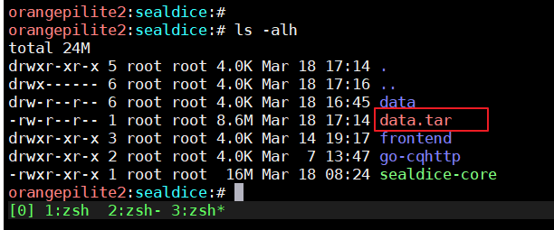

# 迁移

::: info 本节内容

本节将会指导你如何迁移现有的海豹核心。

:::

## Windows间迁移

来到海豹目录，右键添加为压缩包，带走。


## Windows往Linux迁移

来到海豹目录，右键data文件夹，添加为zip压缩包。

到Linux服务器上事先准备好的海豹程序文件夹，执行:

```shell
unzip ./data.zip
```

将其解压，然后运行海豹核心

```
./sealdice-core
```

## Linux服务器间跨平台迁移(arm64->amd64)

首先在你的旧服务器上，关闭海豹进程，随后来到海豹的工作目录，执行

```
tar -zcvf ./data.tar ./data
```

将data目录打包。




现在你多拥有了一个data.tar，复制到新的服务器，预先准备好的海豹程序目录，执行这条命令解压:

```
tar --no-same-owner -zxvf data.tar
```

然后启动海豹即可。

```
./sealdice-core
```

如果文件权限不正确，可以在目录下执行这两条:

```
find . -type f | xargs chmod 644
find . -type d | xargs chmod 755
```

## 迁移数据到手机

如果你需要把旧的电脑海豹的数据转移到手机海豹上，那么你需要转移旧海豹的data文件夹。步骤如下：

1. 关闭你的电脑海豹，复制电脑海豹的data文件夹发送到手机上。
2. 点击手机海豹的“导出数据”按钮，在设置中勾选“文件同步模式”（平时推荐关闭这个选项，这里只是为了替换数据库特别地需要开启）。
3. 在你习惯的手机文件管理软件中找到`根目录/document/com.sealdice.dice/sealdice`，用之前发送过来的你的电脑海豹的data文件夹替换这里面的data文件夹
4. 回到手机海豹的界面中点击“导入数据”。导入完成后再点击启动核心，这时你的手机海豹里就应该是你的旧海豹的数据了。同时导入完成后也可以把“文件同步模式”关闭了。

海豹的data文件夹全平台通用，反过来把手机海豹的data文件夹导出后发到电脑上也是可以用的

建议手机海豹每次导入数据前都点一次导出数据，因为手机海豹不能直接操作里面的文件，必须导出修改后再导入。如果使用了一段时间后没有导出就再次点击导入，会导致海豹的数据被之前导出的数据覆盖，丢失这段时间以来录入的角色卡、log、修改的自定义文案等海豹内部的数据。