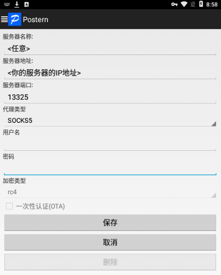
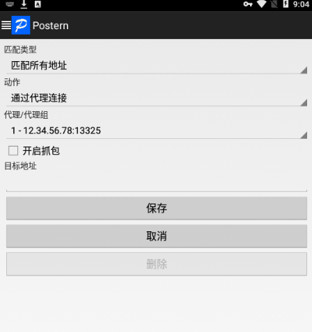

# 常见问题

::: info 本节内容

本节将提供一些常见问题的解决方式，方便快速解决。如果你的问题并没有在这里得到答案，欢迎加入官方群寻求帮助。

:::

## 为啥海豹不理我？

可能性一：你尝试私聊海豹核心，但并非是海豹账号的好友；

可能性二：如果是 QQ 平台，骰子账号遭到了风控；

可能性三：你使用的指令/扩展被关闭了。例如当 coc7 扩展关闭时，sc 等指令是不会回应的；这时需要执行 `.ext coc7 on` 开启对应扩展。

如果你是骰主，可以在 WebUI 查看日志，以确定海豹核心是否收到了指令、是否正确做出了响应。

如果你无法理解发生了什么，或者需要更多帮助，欢迎加入官方答疑群。

## 可以关闭暗骰吗？

海豹核心不支持关闭暗骰。但是，海豹不会与非好友帐号私聊，所以不必担心暗骰会影响帐号安全。

## 退群指令？

以下指令均可：

```text
.bot bye
.bot exit
.dismiss
```

骰主也可以 WebUI 的群组管理中操作退群。

## 登录服务器开浏览器使用好麻烦！能远程直接访问 WebUI 吗？

对于大部分**有公网 IP** 的服务器都可以，但是需要你进行一些配置。

1. 在 WebUI 修改配置，让海豹 WebUI 运行在公开端口而不是本地端口；

2. 在基本设置中设置 WebUI 访问密码；

3. 修改你服务器的防火墙（根据服务提供商，也可能称为「安全组」等），以允许远程 TCP 访问海豹端口。

   1. 如果你使用的是 Oracle Linux 或类似服务器，还需要在服务器系统中放行端口：

      ```bash
      sudo iptables -I INPUT -s 0.0.0.0/0 -p tcp --dport 3211  -j ACCEPT
      ```

   2. 如果你使用 Windows 服务器，需要关闭系统内置防火墙或设置端口放行。

4. 使用 `http://<服务器IP地址>:3211` 访问 WebUI。

## 在服务器上登录时说「需要在同一 WIFI 下扫码」怎么办

首先确认使用安卓协议，并且输入密码登录（不要使用无密码的扫码登录，现在已经很不好用了）。

有几种办法：

### 1. \[首选\] 让手机跟服务器真的处于同一个网络

1. **配置防火墙**

   配置你的服务器，允许外部访问 13325 端口。

   ::: details

   以腾讯云轻量服务器为例，点入「服务器」，再点击卡片。

   

   进入后点击「防火墙」，随后「添加规则」，这里选择 TCP 协议，端口输入 13325（演示图片中为 13326），点击确定。

   

   搞定，其他服务商大同小异。

   特别的，如果是 Windows Server 2012R2 及以上系统，请再**额外关闭系统防火墙**或设置规则放行。具体做法搜索关键字 `Windows server 关闭防火墙`。

   :::

2. **服务器端运行工具**

   在海豹骰中集成了 socks 工具，点击图中「辅助工具 -13325 端口」按钮。

   

   稍等片刻后，出现如下窗口。

   

   点击 OK。

   运行起来之后，显示一串这样的文本：

   ```text
   http/socks5简易工具©sealdice.com
   将在服务器上开启一个 socks5 服务，端口 13325，默认持续时长为 25 分钟
   将在服务器上开启一个 HTTP 代理服务，端口 13326，默认持续时长为 25 分钟

   可能的公网 IP:  12.34.56.78
   请于服务器管理面板放行你要用的端口 (一般为 13325 即 socks)，协议 TCP
   如果是 Windows Server 2012R2 及以上系统，请再额外关闭系统防火墙或设置规则放行

   正在启动服务：0.0.0.0:13326
   正在启动服务：0.0.0.0:13325
   ```

3. **手机端连接**

你需要一个代理软件，比如 postern，如果可能的话你可以从 Google Play 下载，你也可以在用户群里找到它。

然后在你将要扫码的手机上启动它，弹出的窗口都点击**确定**。

点击默认存在在的代理，将他**删除**，然后点击**添加代理服务器**，按照下图填写。



**保存**后点击左上角 Postern 的图标，点击**配置规则**，类似前文删除代理，**删除**掉默认的规则 1 和规则 2，然后点击**添加规则**。如图选择匹配类型和动作，之后会自动填入代理/代理组。



**保存**后重启软件。

现在就配置完成了。手机上打开浏览器进入 <https://ip138.com/>，如果显示的 IP 地址和服务器一样，那么配置正确。

如果打不开网页或提示「当前 WiFi 不能访问网络」，可能是防火墙没配置好。如果 IP 不一样，可能是代理没配置上。

如果你使用 iOS 手机，可以使用 Potatso 替代 Postern。

现在可以进入海豹 WebUI，重新进行登录流程了。如果以后再出类似情况，直接重复步骤 2、3 即可。

### 2. 本机上完成扫码登录，然后将登录过的配置文件覆盖到服务器上

具体目录是 **data/default/extra/go-cqhttp-qq12345**

当然如果你没做过自定义配置，可以整个复制。

使用密码登录，重试 3 次左右，有概率直接上号

## AT 其他骰子做检定的时候，海豹也会回应，怎么办

使用这个指令将其他骰子进行标记：

```text
.botlist add @骰子A @骰子B
```

会有如下效果：

1. 当有人@该骰发指令，海豹不会做出回应
2. 该骰发出的指令和消息，海豹不会回应，这可以有效避免关键词触发的无限复读

## 为啥好像反应慢一拍

首先确定是否为网络问题。如果你是骰主，可在后台的日志中检查收到指令的实际时间和发出响应的实际时间。

对于 QQ 平台，发送消息会有**随机延迟**，这是为了防止引起企鹅的警惕。随机延迟间隔 0.4 - 0.9 秒，可以在设置中调整。

## 我希望在我的骰子进群或者被踢出时通知我

在 WebUI 的「综合设置 - 基本设置」页面。在「消息通知列表」中可以添加消息通知的接收者。支持个人、群聊、电子邮箱作为接收者。

在海豹核心发生 收到加群邀请、收到好友邀请、进入群组、被踢出群、被禁言、自动激活、指令退群 时，会给消息通知列表的各个接收者发送通知。

## 支持 QQ 频道吗？

支持，默认不记录频道消息，也不自动开启。邀请入频道后 @骰子 `.bot on` 即可开启。

在 WebUI 的「综合设置 - 基本设置」可以进行配置。特别的，骰子不会自动同意频道邀请，需要骰主上号同意。

<!-- ## 为什么总是不出二维码就登录失败，或者提示 `message：not found`？

请将软件完全解压后使用！ -->

## 怎么同时运行多个海豹？

### Windows 系统

在 Windows 系统运行两个是很简单的：

我们假设你的第一只海豹已经配置好了，当前正在运行，端口为默认的 3211。

现在，你需要使用安装包，在另一个目录再解压一份海豹核心。

进入新的目录，像运行第一只海豹一样直接双击执行。它会自动检测端口，因为 3211 端口已经被占用，会弹窗询问是否更换端口，直接点是就可以了。

#### 如果你想在 Windows 系统指定端口，需要一点操作

在每一个你需要指定端口的海豹核心目录下创建一个 `启动.cmd`，用文本编辑器编辑，内容为：

```bash
sealdice-core --address=0.0.0.0:<端口号> -m
```

其中的 `<端口号>` 替换成你希望指定的端口号。然后双击 `启动.cmd` 运行。

你只需在第一次启动时这样做，这个端口号会被写入配置中供后续启动使用。

### 除 Android 外的其他系统

通常来说，你在这些系统上是通过命令行（终端）来启动海豹核心。

将安装包解压到你为新海豹准备的目录，在初次启动海豹时，使用以下命令：

```bash
./sealdice-core --address=127.0.0.1:<端口号>
```

将在你系统上，占用指定的端口号，启动一个不向互联网公开的新海豹核心。

## 我机器上启动非常慢，而且托盘点不出来右键菜单？

请确认你的硬盘状态是否还好，一般来说是磁盘 I/O 性能过低导致的，常见于软路由设备。

这种情况可以删除 `data/helpdoc/` 目录来提速，代价是无法使用查询指令。

## 能在手机上搭建吗？

手机海豹已经公测啦！详见 [搭建](../deploy/quick-start.md#启动) 章节。

## 我是 Master，怎么帮人取出 Log？

详见 [这一章节](log.md#骰主代取log)。

骰主具有很大的权限，所以还请各位选择自己信任的骰主，也请各位骰主谨慎对待大家的信任！

## 我忘了 WebUI 密码

首先**彻底关闭**海豹。

用文本编辑器打开 `dice/dice.yaml`，删除 `uiPasswordHash` 一行，保存。

重新启动海豹。
