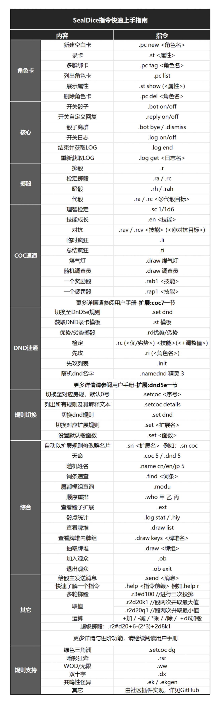

# 快速上手

::: info 本节内容

本节将展示 TRPG 跑团过程玩家使用海豹骰的常用指令和一般流程，请善用搜索，按需阅读文档。

:::

## 常用指令



## 经典

游戏主持人 邀请你进群/频道，并完成了人物卡。

你之后可能使用的指令：

- st 设置人物卡属性
- nn 命名人物卡【可选】
- sn coc 设置昵称自动管理【可选】
- 各个规则的相关指令（以 COC 为例）：
  - r 需要单扔骰子的时候，例如伤害
  - rc 故事发展到了需要检定的时候
  - sc 故事发展到了需要理智检定的时候
  - en 故事暂时结束，幕间成长

如果还需要使用这张人物卡，并且不在这个聊天窗口使用：

- pc save 保存到角色卡列表
- pc load 加载角色对应窗口

## 秘密团

即，在不同聊天窗口使用一张人物卡情景，假定窗口 A 为大家共同使用的，窗口 B 是你私人使用的。

- pc new 角色名 额外创建一张人物卡并绑定到窗口 A
- pc tag 角色名 绑定人物卡到窗口 B
- 此后流程与经典流程相同

当然也有可能出现窗口 C、D，这时重复 pc tag 即可。

## COC 玩家

开启COC模式(默认开启): 

```
.set coc // 注意中间有空格
``` 

### 车卡录卡

临时创建人物/天命

```
.coc5
```

录卡 - 常规团

```
// 海豹各群数据独立，如果单群跑完全程，不需要开团前存卡！！！

.nn 角色名
.st 力量70str70敏捷70dex70意志70pow70体质70con70外貌50app50教育70知识70edu70体型70siz70智力70灵感70int70san55san值55理智55理智值55幸运50运气50

// 开始跑团 ....
// 模组跑完了，想在别的群用此人物，就存卡，否则不需要：
.pc save 角色名
```


录卡 - 秘密团

```
// 小群录卡
.pc new 角色名
.st 力量70str70敏捷70dex70意志70pow70体质70con70外貌50app50教育70知识70edu70体型70siz70智力70灵感70int70san55san值55理智55理智值55幸运50运气50

// 大群绑定人物
.pc tag 角色名
```


改群名片(骰子必须有管理员权限)

```
.sn coc
```


### 骰点

```
.r 3d6*5
```


### 检定

```
.ra 聆听
.ra 幸运70
.ra 3#p射击
```

### 理智检定、掉血

```
.sc 0/1d4
.st hp-1d4
```

## DND 玩家

开启dnd模式: 

```
.set dnd
```

### 录卡

```
.st 模板 // 或 .dst 模板

// 根据模板录入数值，下面只是示例。冒号不好写的话，可以写为等号
.dst 力量:10 体质:10 敏捷:10 智力:10 感知:10 魅力:10 hp:10 hpmax:10 ....
```


### 骰点

.rd  //掷一个默认骰（默认20面）

.rd+(<数量>)  //掷一个默认骰，并+(<数量>)

.rd(<数量>)  //投掷一颗数量指定面术的骰子

.r(<数量>) d(<数量>)  //投掷指定数量、指定面数的骰子

.rd优势  //投掷两次骰子取优势

.rd劣势  //投掷两次骰子取劣势

.r(<数量>)#(<数量>) d(<数量>) +(<数量>)   //掷指定数量、指定数值的骰子指定次


```.rd
.rd
Dice:<木落>掷出了 d+1=3[1d20=3] + 1=4

.rd+1
Dice:<木落>掷出了 d+1=3[1d20=3] + 1=4

.r2d8+1
Dice:<木落>掷出了 2d8+1=3[2d8=3, 2+1] + 1=4

.rd8优势+1
Dice:<木落>d8优势+1=4[{4 | 3 }] + 1=5

.r 5#2d8+1
<木落>掷骰5次:
2d8+1=13[2d8=13, 7+6] + 1=14
2d8+1=13[2d8=13, 7+6] + 1=14
2d8+1=11[2d8=11, 3+8] + 1=12
2d8+1=11[2d8=11, 3+8] + 1=12
2d8+1=8[2d8=8, 7+1] + 1=9
```

### 检定

```
.rc 运动 // 结果为: 8[1d20=8] + 6[运动=6] = 14
.rc 优势 力量+4 // 结果为: 17[{17 | 11 }] + 12[力量=12] + 4 = 33
```


更多详情请参阅 [扩展-dnd5e](#扩展-dnd5e) 一节，如死亡豁免、法术位、长休等指令。